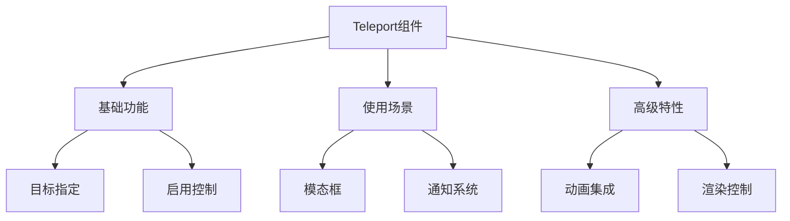

# Teleport传送门组件

## 基本概念

### 基础示例

```vue:c:\project\kphub\src\components\teleport\BasicTeleport.vue
<script setup>
import { ref } from 'vue'

const show = ref(false)

function toggleModal() {
  show.value = !show.value
}
</script>

<template>
  <div class="container">
    <button @click="toggleModal">
      打开模态框
    </button>
    
    <!-- 使用Teleport将内容传送到body -->
    <Teleport to="body">
      <div v-if="show" class="modal">
        <h3>模态框标题</h3>
        <p>这是模态框内容</p>
        <button @click="toggleModal">关闭</button>
      </div>
    </Teleport>
  </div>
</template>

<style scoped>
.modal {
  position: fixed;
  top: 50%;
  left: 50%;
  transform: translate(-50%, -50%);
  background: white;
  padding: 20px;
  border-radius: 8px;
  box-shadow: 0 2px 8px rgba(0, 0, 0, 0.15);
  z-index: 1000;
}
</style>
```

### 动态目标控制

```vue:c:\project\kphub\src\components\teleport\DynamicTeleport.vue
<script setup>
import { ref, computed } from 'vue'

const currentTarget = ref('#app')
const isEnabled = ref(true)

const targets = ['#app', '#modal-container', 'body']

// 计算目标是否有效
const isValidTarget = computed(() => {
  return document.querySelector(currentTarget.value) !== null
})
</script>

<template>
  <div class="controls">
    <select v-model="currentTarget">
      <option v-for="target in targets" :key="target">
        {{ target }}
      </option>
    </select>
    
    <label>
      <input type="checkbox" v-model="isEnabled">
      启用传送
    </label>
    
    <Teleport
      :to="currentTarget"
      :disabled="!isEnabled || !isValidTarget"
    >
      <div class="teleported-content">
        传送的内容
      </div>
    </Teleport>
  </div>
</template>
```

## 实际应用场景

### 模态框组件

```vue:c:\project\kphub\src\components\teleport\ModalComponent.vue
<script setup lang="ts">
import { ref, watch } from 'vue'

interface Props {
  modelValue: boolean
  title?: string
  width?: string | number
}

const props = withDefaults(defineProps<Props>(), {
  title: '提示',
  width: '500px'
})

const emit = defineEmits(['update:modelValue', 'confirm', 'cancel'])

// 处理ESC关闭
function handleKeydown(e: KeyboardEvent) {
  if (e.key === 'Escape') {
    emit('update:modelValue', false)
  }
}

// 监听显示状态
watch(() => props.modelValue, (value) => {
  if (value) {
    document.addEventListener('keydown', handleKeydown)
  } else {
    document.removeEventListener('keydown', handleKeydown)
  }
})
</script>

<template>
  <Teleport to="body">
    <Transition name="modal">
      <div
        v-if="modelValue"
        class="modal-overlay"
        @click="emit('update:modelValue', false)"
      >
        <div
          class="modal-content"
          :style="{ width }"
          @click.stop
        >
          <div class="modal-header">
            <h3>{{ title }}</h3>
            <button
              class="close-btn"
              @click="emit('update:modelValue', false)"
            >
              ×
            </button>
          </div>
          
          <div class="modal-body">
            <slot></slot>
          </div>
          
          <div class="modal-footer">
            <slot name="footer">
              <button
                class="cancel-btn"
                @click="emit('cancel')"
              >
                取消
              </button>
              <button
                class="confirm-btn"
                @click="emit('confirm')"
              >
                确认
              </button>
            </slot>
          </div>
        </div>
      </div>
    </Transition>
  </Teleport>
</template>

<style scoped>
.modal-overlay {
  position: fixed;
  top: 0;
  left: 0;
  width: 100%;
  height: 100%;
  background: rgba(0, 0, 0, 0.5);
  display: flex;
  align-items: center;
  justify-content: center;
  z-index: 1000;
}

.modal-content {
  background: white;
  border-radius: 8px;
  padding: 20px;
  max-height: 80vh;
  overflow-y: auto;
}

/* 过渡动画 */
.modal-enter-active,
.modal-leave-active {
  transition: opacity 0.3s ease;
}

.modal-enter-from,
.modal-leave-to {
  opacity: 0;
}
</style>
```

### 通知提示组件

```vue:c:\project\kphub\src\components\teleport\NotificationSystem.vue
<script setup>
import { ref, onMounted } from 'vue'

const notifications = ref([])

// 创建通知容器
onMounted(() => {
  const container = document.createElement('div')
  container.id = 'notification-container'
  document.body.appendChild(container)
})

// 添加通知
function addNotification(message, type = 'info') {
  const id = Date.now()
  notifications.value.push({
    id,
    message,
    type
  })
  
  // 自动移除
  setTimeout(() => {
    removeNotification(id)
  }, 3000)
}

function removeNotification(id) {
  const index = notifications.value.findIndex(n => n.id === id)
  if (index > -1) {
    notifications.value.splice(index, 1)
  }
}
</script>

<template>
  <Teleport to="#notification-container">
    <TransitionGroup
      name="notification"
      tag="div"
      class="notification-wrapper"
    >
      <div
        v-for="notification in notifications"
        :key="notification.id"
        :class="['notification', notification.type]"
      >
        {{ notification.message }}
      </div>
    </TransitionGroup>
  </Teleport>
</template>

<style scoped>
.notification-wrapper {
  position: fixed;
  top: 20px;
  right: 20px;
  z-index: 1000;
}

.notification {
  padding: 10px 20px;
  margin-bottom: 10px;
  border-radius: 4px;
  background: white;
  box-shadow: 0 2px 8px rgba(0, 0, 0, 0.15);
  min-width: 200px;
}

.notification.info {
  background: #e3f2fd;
  border-left: 4px solid #2196f3;
}

.notification.success {
  background: #e8f5e9;
  border-left: 4px solid #4caf50;
}

.notification.error {
  background: #ffebee;
  border-left: 4px solid #f44336;
}

/* 过渡动画 */
.notification-enter-active,
.notification-leave-active {
  transition: all 0.3s ease;
}

.notification-enter-from {
  opacity: 0;
  transform: translateX(100%);
}

.notification-leave-to {
  opacity: 0;
  transform: translateX(100%);
}
</style>
```

Teleport组件是Vue3提供的一个强大的传送门功能，主要包括：

1. 基本概念：
   - 将组件渲染到指定DOM位置
   - 解决固定定位和z-index问题
   - 保持组件逻辑关系

2. 使用方式：
   - to属性指定目标
   - disabled控制启用
   - 动态目标切换
   - 多个传送组件管理

3. 应用场景：
   - 模态框
   - 通知提示
   - 下拉菜单
   - 全局加载器

4. 高级特性：
   - 过渡动画
   - 条件渲染
   - 组件通信
   - SSR支持



使用建议：

1. 基础使用：
   - 选择合适的目标容器
   - 注意目标存在性
   - 控制传送时机

2. 实际应用：
   - 结合过渡动画
   - 处理键盘事件
   - 管理多个实例

3. 性能考虑：
   - 合理使用条件渲染
   - 及时清理事件监听
   - 控制传送数量

通过合理使用Teleport，我们可以构建出更好的用户界面和交互体验。