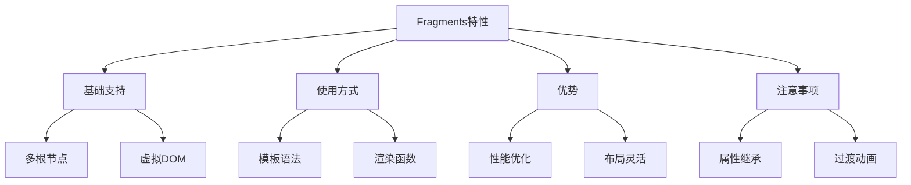

# Fragments片段支持

## 基本概念

### 多根节点示例

```vue:c:\project\kphub\src\components\fragments\BasicFragment.vue
<script setup>
import { ref } from 'vue'

const items = ref([
  { id: 1, text: '第一项' },
  { id: 2, text: '第二项' },
  { id: 3, text: '第三项' }
])
</script>

<template>
  <!-- Vue3支持多根节点，无需包装容器 -->
  <header>
    <h1>标题</h1>
    <nav>导航</nav>
  </header>
  
  <main>
    <ul>
      <li v-for="item in items" :key="item.id">
        {{ item.text }}
      </li>
    </ul>
  </main>
  
  <footer>
    <p>页脚内容</p>
  </footer>
</template>
```

### 渲染函数中使用

```vue:c:\project\kphub\src\components\fragments\RenderFragment.vue
<script>
import { h, Fragment } from 'vue'

export default {
  render() {
    return h(Fragment, [
      h('header', [
        h('h1', '标题'),
        h('nav', '导航')
      ]),
      h('main', [
        h('p', '主要内容')
      ]),
      h('footer', [
        h('p', '页脚')
      ])
    ])
  }
}
</script>
```

## 使用方式

### JSX中的Fragments

```tsx:c:\project\kphub\src\components\fragments\JsxFragment.tsx
import { defineComponent, Fragment } from 'vue'

export default defineComponent({
  name: 'JsxFragment',
  props: {
    items: {
      type: Array as PropType<string[]>,
      default: () => []
    }
  },
  
  setup(props) {
    return () => (
      <>
        <header>JSX Header</header>
        <main>
          {props.items.map(item => (
            <div key={item}>{item}</div>
          ))}
        </main>
        <footer>JSX Footer</footer>
      </>
    )
  }
})
```

### 虚拟DOM结构

```typescript:c:\project\kphub\src\components\fragments\VirtualDom.ts
import { h, Fragment } from 'vue'

// Fragment的虚拟DOM表示
const vnode = h(Fragment, [
  h('div', 'First'),
  h('div', 'Second'),
  h('div', 'Third')
])
```

## 带来的优势

### 灵活布局示例

```vue:c:\project\kphub\src\components\fragments\LayoutFragment.vue
<script setup>
import { ref } from 'vue'

const layout = ref('grid')
</script>

<template>
  <div class="controls">
    <button @click="layout = 'grid'">网格布局</button>
    <button @click="layout = 'flex'">弹性布局</button>
  </div>
  
  <!-- 根据布局类型渲染不同结构 -->
  <template v-if="layout === 'grid'">
    <div class="grid-item">1</div>
    <div class="grid-item">2</div>
    <div class="grid-item">3</div>
  </template>
  
  <template v-else>
    <div class="flex-item">1</div>
    <div class="flex-item">2</div>
    <div class="flex-item">3</div>
  </template>
</template>

<style scoped>
.grid-item {
  display: inline-block;
  width: 100px;
  height: 100px;
  margin: 5px;
  background: #eee;
}

.flex-item {
  flex: 1;
  margin: 5px;
  padding: 20px;
  background: #eee;
}
</style>
```

## 注意事项

### 属性继承与过渡

```vue:c:\project\kphub\src\components\fragments\FragmentTransition.vue
<script setup>
import { ref } from 'vue'

const show = ref(true)
</script>

<template>
  <button @click="show = !show">
    切换显示
  </button>
  
  <!-- 使用transition-group处理多个元素 -->
  <TransitionGroup name="list">
    <template v-if="show">
      <!-- 每个根元素需要key -->
      <div key="header" class="item">
        Header
      </div>
      <div key="content" class="item">
        Content
      </div>
      <div key="footer" class="item">
        Footer
      </div>
    </template>
  </TransitionGroup>
</template>

<style scoped>
.list-enter-active,
.list-leave-active {
  transition: all 0.5s ease;
}

.list-enter-from,
.list-leave-to {
  opacity: 0;
  transform: translateX(30px);
}

.item {
  margin: 10px;
  padding: 10px;
  background: #f5f5f5;
}
</style>
```

Fragments是Vue3的重要特性，主要包括：

1. 基本概念：
   - 支持多根节点
   - 无需包装容器
   - 虚拟DOM优化

2. 使用方式：
   - 模板语法
   - 渲染函数
   - JSX支持

3. 主要优势：
   - 减少DOM层级
   - 提升性能
   - 灵活布局

4. 使用注意：
   - 属性继承
   - 过渡处理
   - key管理



使用建议：

1. 基础使用：
   - 合理使用多根节点
   - 注意key的管理
   - 考虑样式影响

2. 性能优化：
   - 减少不必要的包装
   - 优化DOM结构
   - 合理使用过渡

3. 开发实践：
   - 保持结构清晰
   - 注意属性继承
   - 合理组织布局

通过合理使用Fragments，我们可以构建出更简洁、高效的Vue3组件。