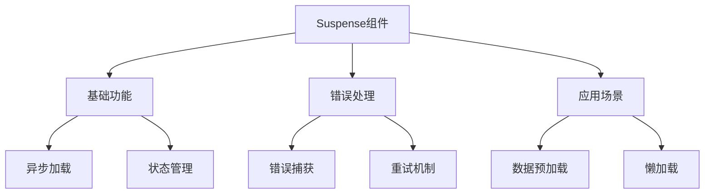

# Suspense异步加载组件

## 基本概念

### 基础异步组件

```vue:c:\project\kphub\src\components\suspense\AsyncComponent.vue
<script setup>
import { ref } from 'vue'

// 模拟异步数据加载
const asyncData = await fetch('/api/data')
  .then(res => res.json())

const message = ref(asyncData.message)
</script>

<template>
  <div class="async-component">
    <h2>异步加载的内容</h2>
    <p>{{ message }}</p>
  </div>
</template>
```

### Suspense基本使用

```vue:c:\project\kphub\src\components\suspense\BasicSuspense.vue
<script setup>
import { defineAsyncComponent } from 'vue'

// 异步导入组件
const AsyncComponent = defineAsyncComponent(() =>
  import('./AsyncComponent.vue')
)
</script>

<template>
  <Suspense>
    <!-- 默认内容 -->
    <template #default>
      <AsyncComponent />
    </template>
    
    <!-- 加载状态 -->
    <template #fallback>
      <div class="loading">
        加载中...
      </div>
    </template>
  </Suspense>
</template>
```

## 使用方式

### 多层异步组件

```vue:c:\project\kphub\src\components\suspense\NestedSuspense.vue
<script setup>
import { ref } from 'vue'

const AsyncParent = defineAsyncComponent(() =>
  import('./AsyncParent.vue')
)

const AsyncChild = defineAsyncComponent(() =>
  import('./AsyncChild.vue')
)

const showChild = ref(false)
</script>

<template>
  <Suspense>
    <template #default>
      <div class="nested-components">
        <AsyncParent>
          <Suspense>
            <template #default>
              <AsyncChild v-if="showChild" />
            </template>
            
            <template #fallback>
              <div>子组件加载中...</div>
            </template>
          </Suspense>
        </AsyncParent>
      </div>
    </template>
    
    <template #fallback>
      <div>父组件加载中...</div>
    </template>
  </Suspense>
  
  <button @click="showChild = !showChild">
    切换子组件
  </button>
</template>
```

## 错误处理

### 错误边界实现

```vue:c:\project\kphub\src\components\suspense\ErrorBoundary.vue
<script setup>
import { ref, onErrorCaptured } from 'vue'

const error = ref(null)
const currentComponent = ref(null)

// 错误处理
onErrorCaptured((err, instance, info) => {
  error.value = {
    message: err.message,
    component: instance?.type?.name,
    info
  }
  return false // 阻止错误继续传播
})

// 重试机制
function retry() {
  error.value = null
  currentComponent.value = null
  // 重新加载组件
  setTimeout(() => {
    currentComponent.value = defineAsyncComponent(() =>
      import('./AsyncComponent.vue')
    )
  }, 100)
}
</script>

<template>
  <div class="error-boundary">
    <Suspense v-if="!error">
      <template #default>
        <component
          :is="currentComponent"
          v-if="currentComponent"
        />
      </template>
      
      <template #fallback>
        <div class="loading">加载中...</div>
      </template>
    </Suspense>
    
    <!-- 错误展示 -->
    <div v-else class="error-message">
      <h3>出错了！</h3>
      <p>{{ error.message }}</p>
      <button @click="retry">重试</button>
    </div>
  </div>
</template>

<style scoped>
.error-message {
  padding: 20px;
  border: 1px solid #ff4d4f;
  border-radius: 4px;
  background: #fff2f0;
}
</style>
```

## 实际应用场景

### 数据预加载组件

```vue:c:\project\kphub\src\components\suspense\DataPreload.vue
<script setup>
import { ref, onMounted } from 'vue'

// 模拟API调用
async function fetchUserData() {
  return new Promise(resolve => {
    setTimeout(() => {
      resolve({
        name: '张三',
        email: 'zhangsan@example.com'
      })
    }, 1000)
  })
}

async function fetchUserPosts() {
  return new Promise(resolve => {
    setTimeout(() => {
      resolve([
        { id: 1, title: '文章1' },
        { id: 2, title: '文章2' }
      ])
    }, 1500)
  })
}

// 并行加载数据
const userData = await fetchUserData()
const userPosts = await fetchUserPosts()

const isLoading = ref(false)

// 刷新数据
async function refreshData() {
  isLoading.value = true
  try {
    const [newUserData, newUserPosts] = await Promise.all([
      fetchUserData(),
      fetchUserPosts()
    ])
    userData.value = newUserData
    userPosts.value = newUserPosts
  } finally {
    isLoading.value = false
  }
}
</script>

<template>
  <div class="user-profile">
    <div class="user-info">
      <h2>{{ userData.name }}</h2>
      <p>{{ userData.email }}</p>
    </div>
    
    <div class="user-posts">
      <h3>用户文章</h3>
      <ul>
        <li v-for="post in userPosts" :key="post.id">
          {{ post.title }}
        </li>
      </ul>
    </div>
    
    <button
      @click="refreshData"
      :disabled="isLoading"
    >
      {{ isLoading ? '刷新中...' : '刷新数据' }}
    </button>
  </div>
</template>
```

Suspense是Vue3提供的异步组件加载机制，主要包括：

1. 基本概念：
   - 异步组件加载
   - 加载状态管理
   - 错误处理机制

2. 使用方式：
   - 基础语法
   - 嵌套使用
   - 状态切换

3. 错误处理：
   - 错误捕获
   - 优雅降级
   - 重试机制

4. 应用场景：
   - 数据预加载
   - 组件懒加载
   - 分步渲染



使用建议：

1. 基础使用：
   - 合理设置加载状态
   - 处理嵌套场景
   - 控制加载时机

2. 错误处理：
   - 实现错误边界
   - 提供重试选项
   - 优雅降级显示

3. 性能优化：
   - 并行数据加载
   - 合理的加载策略
   - 缓存机制使用

通过合理使用Suspense，我们可以构建出更好的异步加载体验。