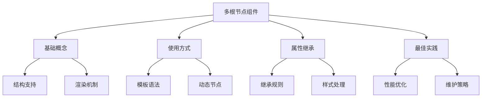

# 多根节点组件

## 基本概念

### 基础多根节点示例

```vue:c:\project\kphub\src\components\multi-root\BasicMultiRoot.vue
<script setup>
import { ref } from 'vue'

const title = ref('多根节点示例')
const content = ref('这是内容')
</script>

<template>
  <header class="header">
    <h1>{{ title }}</h1>
    <nav>
      <a href="#home">首页</a>
      <a href="#about">关于</a>
    </nav>
  </header>

  <main class="content">
    <p>{{ content }}</p>
  </main>

  <footer class="footer">
    <p>页脚信息</p>
  </footer>
</template>
```

### 渲染函数实现

```vue:c:\project\kphub\src\components\multi-root\RenderMultiRoot.vue
<script>
import { h, Fragment } from 'vue'

export default {
  props: {
    items: Array
  },
  
  render() {
    return [
      h('header', { class: 'header' }, [
        h('h1', '标题'),
        h('nav', [
          h('a', { href: '#' }, '链接1'),
          h('a', { href: '#' }, '链接2')
        ])
      ]),
      
      h('main', { class: 'content' },
        this.items?.map(item =>
          h('div', { key: item.id }, item.text)
        )
      ),
      
      h('footer', { class: 'footer' }, '页脚')
    ]
  }
}
</script>
```

## 使用方式

### JSX多根节点

```tsx:c:\project\kphub\src\components\multi-root\JsxMultiRoot.tsx
import { defineComponent } from 'vue'

export default defineComponent({
  name: 'JsxMultiRoot',
  props: {
    header: String,
    content: String,
    footer: String
  },
  
  setup(props) {
    return () => (
      <>
        <header class="header">
          <h1>{props.header}</h1>
        </header>
        
        <main class="content">
          <p>{props.content}</p>
        </main>
        
        <footer class="footer">
          <p>{props.footer}</p>
        </footer>
      </>
    )
  }
})
```

### 动态多根节点

```vue:c:\project\kphub\src\components\multi-root\DynamicMultiRoot.vue
<script setup>
import { ref, computed } from 'vue'

const sections = ref([
  { id: 1, type: 'header', content: '标题' },
  { id: 2, type: 'content', content: '内容' },
  { id: 3, type: 'footer', content: '页脚' }
])

const visibleSections = computed(() =>
  sections.value.filter(section => !section.hidden)
)

function toggleSection(id) {
  const section = sections.value.find(s => s.id === id)
  if (section) {
    section.hidden = !section.hidden
  }
}
</script>

<template>
  <template v-for="section in visibleSections" :key="section.id">
    <header v-if="section.type === 'header'" class="header">
      {{ section.content }}
      <button @click="toggleSection(section.id)">隐藏</button>
    </header>
    
    <main v-else-if="section.type === 'content'" class="content">
      {{ section.content }}
      <button @click="toggleSection(section.id)">隐藏</button>
    </main>
    
    <footer v-else class="footer">
      {{ section.content }}
      <button @click="toggleSection(section.id)">隐藏</button>
    </footer>
  </template>
</template>
```

## 属性继承行为

### 属性分发控制

```vue:c:\project\kphub\src\components\multi-root\AttributeInheritance.vue
<script setup>
defineOptions({
  inheritAttrs: false
})

const attrs = useAttrs()
</script>

<template>
  <!-- 手动控制属性分发 -->
  <header v-bind="attrs">
    <slot name="header"></slot>
  </header>
  
  <main>
    <!-- 不继承属性 -->
    <slot></slot>
  </main>
  
  <footer class="footer">
    <slot name="footer"></slot>
  </footer>
</template>
```

### 样式处理

```vue:c:\project\kphub\src\components\multi-root\StyleHandling.vue
<script setup>
import { computed } from 'vue'

const props = defineProps({
  theme: {
    type: String,
    default: 'light'
  }
})

// 计算样式类
const headerClass = computed(() => ({
  header: true,
  [`theme-${props.theme}`]: true
}))

const contentClass = computed(() => ({
  content: true,
  [`theme-${props.theme}`]: true
}))
</script>

<template>
  <header :class="headerClass">
    <slot name="header"></slot>
  </header>
  
  <main :class="contentClass">
    <slot></slot>
  </main>
  
  <footer :class="['footer', `theme-${theme}`]">
    <slot name="footer"></slot>
  </footer>
</template>

<style scoped>
.theme-light {
  background: #fff;
  color: #333;
}

.theme-dark {
  background: #333;
  color: #fff;
}
</style>
```

多根节点组件是Vue3的重要特性，主要包括：

1. 基本概念：
   - 支持多个顶层元素
   - 无需包装容器
   - 灵活的结构组织

2. 使用方式：
   - 模板语法
   - 渲染函数
   - JSX支持
   - 动态节点

3. 属性继承：
   - 继承规则
   - 手动控制
   - 样式处理

4. 最佳实践：
   - 合理使用
   - 性能优化
   - 维护性考虑



使用建议：

1. 基础使用：
   - 合理组织结构
   - 控制节点数量
   - 注意属性继承

2. 性能优化：
   - 避免过多根节点
   - 合理使用动态节点
   - 控制更新范围

3. 维护策略：
   - 清晰的结构划分
   - 合理的样式管理
   - 文档说明完善

通过合理使用多根节点特性，我们可以构建出更灵活、高效的Vue3组件。