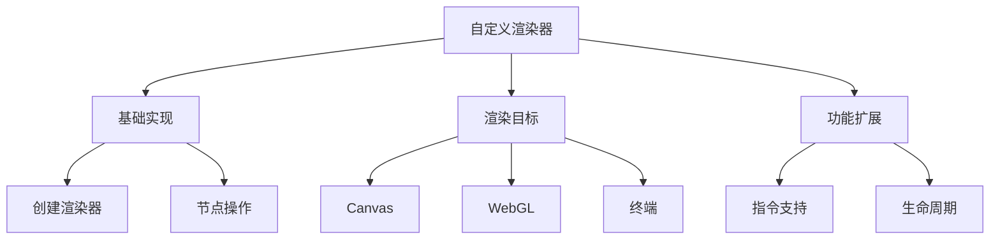

# 自定义渲染器API

## 基本概念

### 基础渲染器结构

```typescript:c:\project\kphub\src\renderers\basic\BasicRenderer.ts
import { createRenderer } from 'vue'

// 创建基础渲染器
const renderer = createRenderer({
  // 创建元素
  createElement(type: string) {
    return {
      type,
      children: [],
      props: {}
    }
  },
  
  // 设置元素文本
  setElementText(node, text: string) {
    node.text = text
  },
  
  // 插入元素
  insert(child, parent, anchor = null) {
    parent.children.push(child)
  },
  
  // 移除元素
  remove(child) {
    const parent = child.parent
    if (parent) {
      const index = parent.children.indexOf(child)
      if (index > -1) {
        parent.children.splice(index, 1)
      }
    }
  },
  
  // 属性处理
  patchProp(el, key, prevValue, nextValue) {
    el.props[key] = nextValue
  }
})
```

### Canvas渲染器示例

```typescript:c:\project\kphub\src\renderers\canvas\CanvasRenderer.ts
import { createRenderer } from 'vue'

interface CanvasElement {
  type: string
  x: number
  y: number
  width: number
  height: number
  fillStyle?: string
  strokeStyle?: string
}

// 创建Canvas渲染器
const canvasRenderer = createRenderer<CanvasElement>({
  createElement(type: string) {
    return {
      type,
      x: 0,
      y: 0,
      width: 0,
      height: 0
    }
  },
  
  insert(el, parent) {
    if (el.type === 'rect') {
      const ctx = parent.getContext('2d')
      ctx.fillStyle = el.fillStyle || 'black'
      ctx.fillRect(el.x, el.y, el.width, el.height)
    }
  },
  
  patchProp(el, key, prev, next) {
    el[key] = next
  }
})
```

## 创建自定义渲染器

### 完整渲染器实现

```typescript:c:\project\kphub\src\renderers\custom\CustomRenderer.ts
import { createRenderer } from 'vue'

interface CustomElement {
  type: string
  props: Record<string, any>
  children: CustomElement[]
  parent?: CustomElement
  el?: HTMLElement | null
}

const { render, createApp } = createRenderer<CustomElement>({
  createElement(type) {
    const element: CustomElement = {
      type,
      props: {},
      children: [],
      el: null
    }
    
    if (typeof document !== 'undefined') {
      element.el = document.createElement(type)
    }
    
    return element
  },
  
  setElementText(node, text) {
    if (node.el) {
      node.el.textContent = text
    }
  },
  
  insert(child, parent, anchor = null) {
    child.parent = parent
    parent.children.push(child)
    
    if (parent.el && child.el) {
      parent.el.appendChild(child.el)
    }
  },
  
  remove(child) {
    const parent = child.parent
    if (parent) {
      const index = parent.children.indexOf(child)
      if (index > -1) {
        parent.children.splice(index, 1)
      }
    }
    
    if (child.el?.parentNode) {
      child.el.parentNode.removeChild(child.el)
    }
  },
  
  patchProp(el, key, prevValue, nextValue) {
    if (key.startsWith('on')) {
      // 事件处理
      const eventName = key.slice(2).toLowerCase()
      if (prevValue) {
        el.el?.removeEventListener(eventName, prevValue)
      }
      if (nextValue) {
        el.el?.addEventListener(eventName, nextValue)
      }
    } else {
      // 属性处理
      if (el.el) {
        if (nextValue === null) {
          el.el.removeAttribute(key)
        } else {
          el.el.setAttribute(key, nextValue)
        }
      }
    }
    
    el.props[key] = nextValue
  }
})

export { render, createApp }
```

## 实际应用案例

### WebGL渲染器

```typescript:c:\project\kphub\src\renderers\webgl\WebGLRenderer.ts
import { createRenderer } from 'vue'
import * as THREE from 'three'

interface WebGLElement {
  type: string
  object: THREE.Object3D
  props: Record<string, any>
  children: WebGLElement[]
}

const renderer = new THREE.WebGLRenderer()
const scene = new THREE.Scene()
const camera = new THREE.PerspectiveCamera(75, window.innerWidth / window.innerHeight, 0.1, 1000)

const webglRenderer = createRenderer<WebGLElement>({
  createElement(type) {
    let object: THREE.Object3D
    
    switch (type) {
      case 'cube':
        const geometry = new THREE.BoxGeometry()
        const material = new THREE.MeshBasicMaterial({ color: 0x00ff00 })
        object = new THREE.Mesh(geometry, material)
        break
      default:
        object = new THREE.Object3D()
    }
    
    return {
      type,
      object,
      props: {},
      children: []
    }
  },
  
  insert(child, parent) {
    parent.object.add(child.object)
    parent.children.push(child)
  },
  
  patchProp(el, key, prev, next) {
    switch (key) {
      case 'position':
        el.object.position.set(next.x, next.y, next.z)
        break
      case 'rotation':
        el.object.rotation.set(next.x, next.y, next.z)
        break
    }
  }
})
```

### 命令行UI渲染器

```typescript:c:\project\kphub\src\renderers\terminal\TerminalRenderer.ts
import { createRenderer } from 'vue'
import chalk from 'chalk'

interface TerminalElement {
  type: string
  content: string
  style: {
    color?: string
    bold?: boolean
    indent?: number
  }
  children: TerminalElement[]
}

const terminalRenderer = createRenderer<TerminalElement>({
  createElement(type) {
    return {
      type,
      content: '',
      style: {},
      children: []
    }
  },
  
  setElementText(node, text) {
    node.content = text
  },
  
  insert(child, parent) {
    parent.children.push(child)
  },
  
  patchProp(el, key, prev, next) {
    if (key === 'style') {
      Object.assign(el.style, next)
    }
  },
  
  // 自定义渲染逻辑
  render(element) {
    let output = element.content
    
    if (element.style.color) {
      output = chalk[element.style.color](output)
    }
    
    if (element.style.bold) {
      output = chalk.bold(output)
    }
    
    if (element.style.indent) {
      output = ' '.repeat(element.style.indent) + output
    }
    
    console.log(output)
    
    element.children.forEach(child => this.render(child))
  }
})
```

自定义渲染器API是Vue3的高级特性，主要包括：

1. 基本概念：
   - 渲染器定义
   - 核心接口
   - 渲染流程
   - 适配机制

2. 实现方式：
   - createRenderer
   - 节点操作
   - 属性处理
   - 事件系统

3. 应用场景：
   - Canvas绘制
   - WebGL渲染
   - 终端UI
   - 跨平台渲染

4. 高级特性：
   - 自定义指令
   - 生命周期
   - 性能优化



使用建议：

1. 基础开发：
   - 理解核心接口
   - 实现必要方法
   - 处理边界情况

2. 性能优化：
   - 批量更新
   - 缓存机制
   - 按需渲染

3. 实践建议：
   - 合理抽象
   - 完善类型
   - 错误处理

通过自定义渲染器，我们可以将Vue的组件系统扩展到任何目标平台。