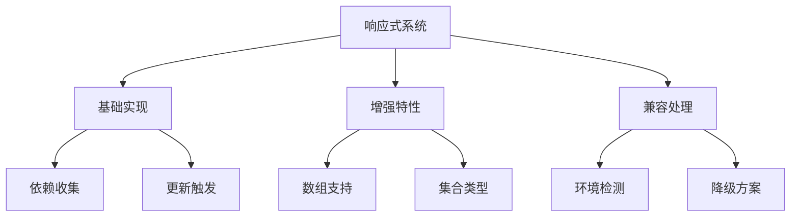

# 响应式系统升级(Proxy)

## 技术演进

### Vue2响应式回顾

```javascript:c:\project\kphub\src\reactivity\legacy\defineProperty.js
// Vue2 响应式实现
function defineReactive(obj, key, val) {
  const dep = new Dep()
  
  Object.defineProperty(obj, key, {
    get() {
      // 依赖收集
      if (Dep.target) {
        dep.depend()
      }
      return val
    },
    set(newVal) {
      if (newVal === val) return
      val = newVal
      // 触发更新
      dep.notify()
    }
  })
}

// 对象响应式处理
function observe(obj) {
  Object.keys(obj).forEach(key => {
    defineReactive(obj, key, obj[key])
  })
}
```

### Vue3 Proxy实现

```typescript:c:\project\kphub\src\reactivity\proxy\reactive.ts
import { track, trigger } from './effect'

export function reactive<T extends object>(target: T): T {
  return new Proxy(target, {
    get(target, key, receiver) {
      const res = Reflect.get(target, key, receiver)
      // 依赖收集
      track(target, key)
      
      // 处理嵌套对象
      if (typeof res === 'object' && res !== null) {
        return reactive(res)
      }
      
      return res
    },
    
    set(target, key, value, receiver) {
      const oldValue = target[key]
      const result = Reflect.set(target, key, value, receiver)
      
      if (oldValue !== value) {
        // 触发更新
        trigger(target, key)
      }
      
      return result
    },
    
    deleteProperty(target, key) {
      const hadKey = key in target
      const result = Reflect.deleteProperty(target, key)
      
      if (hadKey && result) {
        // 触发更新
        trigger(target, key)
      }
      
      return result
    }
  })
}
```

## Proxy优势

### 数组和集合类型处理

```typescript:c:\project\kphub\src\reactivity\proxy\collections.ts
import { track, trigger } from './effect'

// 数组方法拦截
const arrayInstrumentations = {
  push(...args) {
    const originalPush = Array.prototype.push
    const result = originalPush.apply(this, args)
    trigger(this, 'length')
    return result
  },
  pop() {
    const originalPop = Array.prototype.pop
    const result = originalPop.apply(this)
    trigger(this, 'length')
    return result
  }
}

// Map/Set处理
export function createCollectionHandlers() {
  return {
    get(target: Map<any, any> | Set<any>, key: string) {
      if (key === 'size') {
        track(target, 'size')
        return Reflect.get(target, key)
      }
      
      // 处理集合方法
      return function(...args: any[]) {
        track(target, key)
        const result = target[key].apply(target, args)
        trigger(target, key)
        return result
      }
    }
  }
}
```

## 实现原理

### 依赖收集与更新

```typescript:c:\project\kphub\src\reactivity\proxy\effect.ts
type Dep = Set<ReactiveEffect>
type KeyToDepMap = Map<any, Dep>
const targetMap = new WeakMap<object, KeyToDepMap>()

export class ReactiveEffect {
  active = true
  deps: Dep[] = []
  
  constructor(
    public fn: () => any,
    public scheduler?: (job: ReactiveEffect) => void
  ) {}
  
  run() {
    if (!this.active) {
      return this.fn()
    }
    
    try {
      // 设置当前活动的effect
      activeEffect = this
      return this.fn()
    } finally {
      activeEffect = null
    }
  }
  
  stop() {
    if (this.active) {
      this.active = false
      // 清理依赖
      this.deps.forEach(dep => {
        dep.delete(this)
      })
      this.deps.length = 0
    }
  }
}

// 依赖收集
export function track(target: object, key: unknown) {
  if (!activeEffect) return
  
  let depsMap = targetMap.get(target)
  if (!depsMap) {
    targetMap.set(target, (depsMap = new Map()))
  }
  
  let dep = depsMap.get(key)
  if (!dep) {
    depsMap.set(key, (dep = new Set()))
  }
  
  dep.add(activeEffect)
  activeEffect.deps.push(dep)
}

// 触发更新
export function trigger(target: object, key: unknown) {
  const depsMap = targetMap.get(target)
  if (!depsMap) return
  
  const dep = depsMap.get(key)
  if (dep) {
    dep.forEach(effect => {
      if (effect.scheduler) {
        effect.scheduler(effect)
      } else {
        effect.run()
      }
    })
  }
}
```

## 兼容性与降级

### 兼容性检测

```typescript:c:\project\kphub\src\reactivity\proxy\compat.ts
export function getReactivitySystem() {
  const hasProxy = typeof Proxy !== 'undefined'
  const hasSymbol = typeof Symbol !== 'undefined'
  
  // 特性检测
  if (hasProxy) {
    try {
      const proxy = new Proxy({}, {})
      return {
        reactive: createReactiveFunction(),
        ref: createRefFunction(),
        computed: createComputedFunction()
      }
    } catch (e) {
      console.warn('Proxy不完全支持，降级到Vue 2模式')
    }
  }
  
  // 降级到Vue 2模式
  return {
    reactive: createLegacyReactive(),
    ref: createLegacyRef(),
    computed: createLegacyComputed()
  }
}
```

Vue3的响应式系统是一次重要的技术升级，主要包括：

1. 技术演进：
   - Object.defineProperty到Proxy
   - 拦截能力增强
   - 性能提升

2. Proxy优势：
   - 完整对象操作监听
   - 数组原生支持
   - 动态属性响应
   - 集合类型支持

3. 实现原理：
   - 依赖收集
   - 更新触发
   - 嵌套处理
   - 集合处理

4. 兼容处理：
   - 环境检测
   - 降级方案
   - 迁移策略



使用建议：

1. 基础使用：
   - 了解响应式原理
   - 掌握API使用
   - 注意边界情况

2. 性能优化：
   - 合理使用响应式
   - 避免深层嵌套
   - 控制依赖数量

3. 兼容处理：
   - 检测运行环境
   - 准备降级方案
   - 渐进式迁移

通过合理使用Vue3的响应式系统，我们可以构建出更高效、可靠的应用。