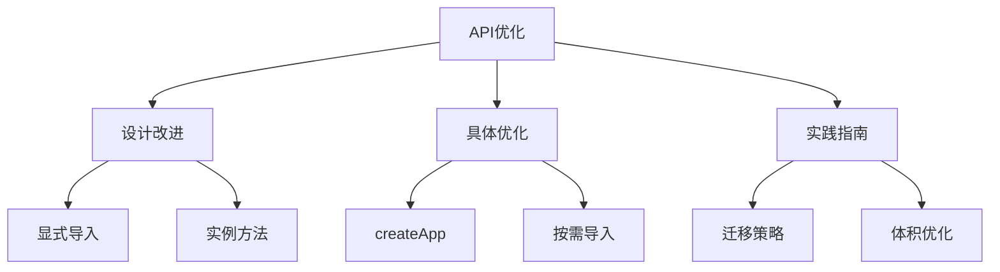

# 全局API树摇优化

## 基本概念

### Vue2全局API示例

```javascript:c:\project\kphub\src\examples\global-api\vue2-global.js
// Vue2 方式 - 所有API都在Vue全局对象上
import Vue from 'vue'

// 全局配置
Vue.config.productionTip = false
Vue.config.errorHandler = (err) => {
  console.error(err)
}

// 全局方法
Vue.extend({/* ... */})
Vue.nextTick(() => {/* ... */})

// 全局组件
Vue.component('MyComponent', {/* ... */})

// 全局指令
Vue.directive('focus', {/* ... */})

// 全局混入
Vue.mixin({/* ... */})

// 插件安装
Vue.use(VueRouter)
```

### Vue3优化方式

```typescript:c:\project\kphub\src\examples\global-api\vue3-imports.ts
// Vue3 方式 - 按需导入API
import { createApp } from 'vue'
import { 
  ref, 
  reactive, 
  computed,
  onMounted,
  nextTick 
} from 'vue'

// 创建应用实例
const app = createApp({
  setup() {
    const count = ref(0)
    const state = reactive({
      message: 'Hello'
    })
    
    // 生命周期钩子
    onMounted(() => {
      console.log('组件已挂载')
    })
    
    return { count, state }
  }
})

// 应用级配置
app.config.errorHandler = (err) => {
  console.error(err)
}

// 应用级API
app.component('MyComponent', {/* ... */})
app.directive('focus', {/* ... */})
app.mount('#app')
```

## API设计变化

### 插件系统改进

```typescript:c:\project\kphub\src\examples\global-api\plugin-system.ts
import { createApp, Plugin } from 'vue'

// 定义插件
const myPlugin: Plugin = {
  install(app, options) {
    // 注册全局组件
    app.component('GlobalComponent', {/* ... */})
    
    // 注册全局指令
    app.directive('custom', {/* ... */})
    
    // 注册全局属性
    app.config.globalProperties.$http = axios
    
    // 注册全局工具
    app.provide('utils', {
      format: (date: Date) => date.toLocaleDateString()
    })
  }
}

// 创建应用并使用插件
const app = createApp({})
app.use(myPlugin, {
  // 插件配置选项
})
```

## 具体优化项

### 按需导入示例

```typescript:c:\project\kphub\src\examples\global-api\tree-shaking.ts
// 1. 生命周期钩子
import { 
  onMounted,
  onUpdated,
  onUnmounted 
} from 'vue'

// 2. 响应式API
import { 
  ref,
  reactive,
  computed,
  watch 
} from 'vue'

// 3. 内置组件
import { 
  Transition,
  TransitionGroup,
  KeepAlive 
} from 'vue'

// 4. 工具函数
import { 
  nextTick,
  isRef,
  isProxy 
} from 'vue'

// 组件定义
export default {
  setup() {
    const count = ref(0)
    const doubled = computed(() => count.value * 2)
    
    onMounted(() => {
      // 初始化逻辑
    })
    
    watch(count, (newVal, oldVal) => {
      console.log(`count从${oldVal}变为${newVal}`)
    })
    
    return {
      count,
      doubled
    }
  }
}
```

### 打包分析工具

```typescript:c:\project\kphub\src\examples\global-api\bundle-analysis.ts
// vite.config.ts
import { defineConfig } from 'vite'
import vue from '@vitejs/plugin-vue'
import { visualizer } from 'rollup-plugin-visualizer'

export default defineConfig({
  plugins: [
    vue(),
    visualizer({
      open: true,
      gzipSize: true,
      brotliSize: true
    })
  ],
  build: {
    rollupOptions: {
      output: {
        manualChunks: {
          'vue-core': ['vue'],
          'vue-router': ['vue-router'],
          'vue-store': ['vuex']
        }
      }
    }
  }
})
```

Vue3的全局API优化主要包括：

1. 基本概念：
   - 树摇优化
   - API重构
   - 打包优化

2. API变化：
   - 显式导入
   - 应用实例
   - 插件系统

3. 优化项目：
   - createApp
   - 生命周期
   - 响应式API
   - 内置组件

4. 最佳实践：
   - 迁移策略
   - 代码优化
   - 体积分析



使用建议：

1. 基础使用：
   - 使用显式导入
   - 遵循新的API设计
   - 避免全局污染

2. 性能优化：
   - 按需导入
   - 分析打包体积
   - 优化依赖引入

3. 迁移策略：
   - 渐进式迁移
   - 使用兼容工具
   - 重构全局API

通过合理使用Vue3的API优化特性，我们可以构建出更轻量、高效的应用。