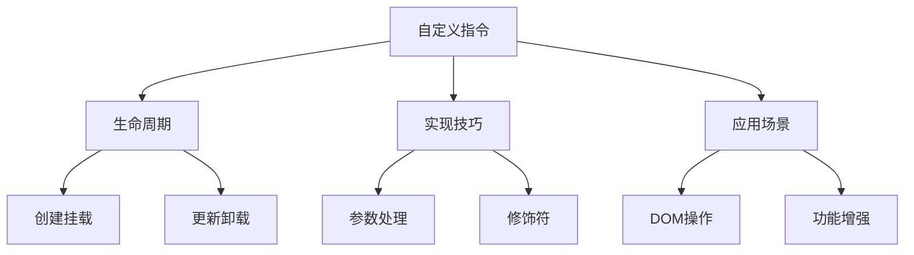

# 自定义指令升级

## 指令API变化

### Vue2与Vue3对比

```typescript:c:\project\kphub\src\directives\comparison\DirectiveComparison.ts
// Vue2 指令定义
const Vue2Directive = {
  bind(el, binding, vnode) {
    // 元素绑定时
  },
  inserted(el, binding, vnode) {
    // 元素插入时
  },
  update(el, binding, vnode, oldVnode) {
    // 组件更新时
  },
  componentUpdated(el, binding, vnode) {
    // 组件更新完成时
  },
  unbind(el, binding, vnode) {
    // 解绑时
  }
}

// Vue3 指令定义
const Vue3Directive = {
  created(el, binding, vnode) {
    // 元素初始化时
  },
  beforeMount(el, binding, vnode) {
    // 元素挂载前
  },
  mounted(el, binding, vnode) {
    // 元素挂载时
  },
  beforeUpdate(el, binding, vnode, prevVnode) {
    // 元素更新前
  },
  updated(el, binding, vnode, prevVnode) {
    // 元素更新后
  },
  beforeUnmount(el, binding, vnode) {
    // 元素卸载前
  },
  unmounted(el, binding, vnode) {
    // 元素卸载后
  }
}
```

## 新的生命周期钩子

### 基础指令实现

```typescript:c:\project\kphub\src\directives\basic\BasicDirective.ts
import { Directive } from 'vue'

export const myDirective: Directive = {
  created(el, binding) {
    console.log('指令创建')
    // 在这里可以设置初始状态
    el.dataset.directiveInitialized = 'true'
  },
  
  beforeMount(el, binding) {
    console.log('指令挂载前')
    // 可以进行DOM准备工作
    el.style.transition = 'opacity 0.3s'
  },
  
  mounted(el, binding) {
    console.log('指令挂载完成')
    // 元素已插入DOM，可以进行DOM操作
    el.style.opacity = binding.value ? '1' : '0.5'
  },
  
  beforeUpdate(el, binding) {
    console.log('指令更新前')
    // 可以保存更新前的状态
    el.dataset.previousValue = binding.oldValue
  },
  
  updated(el, binding) {
    console.log('指令更新后')
    // 根据新值更新DOM
    el.style.opacity = binding.value ? '1' : '0.5'
  },
  
  beforeUnmount(el, binding) {
    console.log('指令卸载前')
    // 可以进行清理工作
    el.style.opacity = '0'
  },
  
  unmounted(el, binding) {
    console.log('指令已卸载')
    // 完全清理
    delete el.dataset.directiveInitialized
  }
}
```

## 实现技巧

### 复合指令示例

```typescript:c:\project\kphub\src\directives\advanced\ComplexDirective.ts
import { Directive, DirectiveBinding } from 'vue'

interface ComplexDirectiveOptions {
  value: string | number
  modifiers: {
    animate?: boolean
    delay?: boolean
  }
  arg?: string
}

export const complexDirective: Directive = {
  mounted(el: HTMLElement, binding: DirectiveBinding<ComplexDirectiveOptions>) {
    // 获取指令值
    const value = binding.value
    
    // 获取修饰符
    const { animate, delay } = binding.modifiers
    
    // 获取参数
    const arg = binding.arg
    
    // 设置样式类
    if (animate) {
      el.classList.add('animate')
    }
    
    // 处理延迟
    if (delay) {
      setTimeout(() => {
        applyEffect(el, value, arg)
      }, 1000)
    } else {
      applyEffect(el, value, arg)
    }
  },
  
  updated(el: HTMLElement, binding: DirectiveBinding<ComplexDirectiveOptions>) {
    // 值变化时更新
    if (binding.value !== binding.oldValue) {
      applyEffect(el, binding.value, binding.arg)
    }
  }
}

function applyEffect(el: HTMLElement, value: any, arg?: string) {
  switch (arg) {
    case 'fade':
      el.style.opacity = String(value)
      break
    case 'scale':
      el.style.transform = `scale(${value})`
      break
    default:
      el.textContent = String(value)
  }
}
```

## 常用自定义指令示例

### 自动聚焦指令

```typescript:c:\project\kphub\src\directives\common\vFocus.ts
import { Directive } from 'vue'

export const vFocus: Directive = {
  mounted(el) {
    // 支持自定义元素
    const input = el instanceof HTMLInputElement ? el : el.querySelector('input')
    if (input) {
      input.focus()
    }
  }
}
```

### 点击外部指令

```typescript:c:\project\kphub\src\directives\common\vClickOutside.ts
import { Directive } from 'vue'

export const vClickOutside: Directive = {
  mounted(el, binding) {
    el._clickOutside = (event: MouseEvent) => {
      if (!(el === event.target || el.contains(event.target as Node))) {
        binding.value(event)
      }
    }
    document.addEventListener('click', el._clickOutside)
  },
  
  unmounted(el) {
    document.removeEventListener('click', el._clickOutside)
    delete el._clickOutside
  }
}
```

### 图片懒加载指令

```typescript:c:\project\kphub\src\directives\common\vLazy.ts
import { Directive } from 'vue'

export const vLazy: Directive = {
  mounted(el, binding) {
    const observer = new IntersectionObserver(entries => {
      entries.forEach(entry => {
        if (entry.isIntersecting) {
          el.src = binding.value
          observer.unobserve(el)
        }
      })
    })
    
    observer.observe(el)
    
    // 保存observer以便清理
    el._lazyLoadObserver = observer
  },
  
  unmounted(el) {
    el._lazyLoadObserver?.unobserve(el)
    delete el._lazyLoadObserver
  }
}
```

### 权限控制指令

```typescript:c:\project\kphub\src\directives\common\vPermission.ts
import { Directive } from 'vue'

export const vPermission: Directive = {
  mounted(el, binding) {
    const { value } = binding
    const userPermissions = getUserPermissions() // 获取用户权限
    
    if (!hasPermission(userPermissions, value)) {
      el.parentNode?.removeChild(el)
    }
  }
}

function getUserPermissions(): string[] {
  // 实际项目中从用户状态获取
  return ['admin', 'editor']
}

function hasPermission(userPermissions: string[], requiredPermission: string) {
  return userPermissions.includes(requiredPermission)
}
```

Vue3的自定义指令系统主要包括：

1. API变化：
   - 生命周期对齐
   - 参数结构优化
   - 命名规范更新

2. 生命周期：
   - created
   - beforeMount
   - mounted
   - beforeUpdate
   - updated
   - beforeUnmount
   - unmounted

3. 实现技巧：
   - 参数处理
   - 修饰符使用
   - 动态参数
   - 复合指令

4. 常用指令：
   - 自动聚焦
   - 点击外部
   - 懒加载
   - 权限控制



使用建议：

1. 基础使用：
   - 理解生命周期
   - 掌握参数用法
   - 注意清理工作

2. 开发技巧：
   - 合理使用修饰符
   - 处理边界情况
   - 优化性能

3. 最佳实践：
   - 职责单一
   - 可复用设计
   - 完善文档

通过合理使用自定义指令，我们可以优雅地扩展Vue组件的功能。