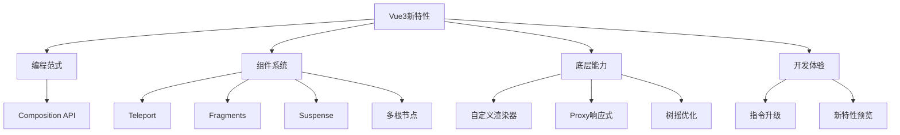

# Vue3特有功能与API

Vue3引入了多项革命性的特性和API改进，通过本章节的学习，您将全面掌握这些创新功能：

## 核心编程范式
- [Composition API vs Options API](./5.1-Composition-API-vs-Options-API.md)：深入对比两种API的设计理念和使用场景

## 组件系统增强
- [Teleport传送门组件](./5.2-Teleport传送门组件.md)：解决组件层级嵌套问题
- [Fragments片段支持](./5.3-Fragments片段支持.md)：移除单根节点限制
- [Suspense异步加载组件](./5.4-Suspense异步加载组件.md)：优雅处理异步依赖
- [多根节点组件](./5.5-多根节点组件.md)：更灵活的组件结构

## 底层能力提升
- [自定义渲染器API](./5.6-自定义渲染器API.md)：将Vue的组件模型扩展到任何平台
- [响应式系统升级(Proxy)](./5.7-响应式系统升级(Proxy).md)：更强大的响应式能力
- [全局API树摇优化](./5.8-全局API树摇优化.md)：更小的打包体积

## 开发体验优化
- [自定义指令升级](./5.9-自定义指令升级.md)：更直观的指令开发体验
- [实验性新特性预览](./5.10-实验性新特性预览.md)：了解未来发展方向

本章节的学习路径：

1. 首先理解Vue3的核心编程范式转变
2. 掌握增强的组件系统特性
3. 了解底层能力的提升
4. 体验优化的开发体验

通过系统学习这些内容，您将能够：

- 使用Composition API组织更清晰的代码
- 构建更灵活的组件结构
- 优化应用的性能和体积
- 扩展Vue到更多平台

建议按照以下顺序学习：

1. 从Composition API开始，这是Vue3最重要的变革
2. 依次学习组件系统的新特性
3. 了解底层能力的提升
4. 掌握开发体验的改进

每个主题都包含了从基础到进阶的完整内容，同时配有详细的示例代码和最佳实践建议。通过循序渐进的学习，您将全面掌握Vue3的创新特性。