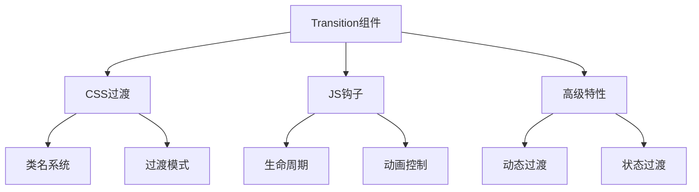

# Transition过渡动画

## 基本概念

### 基础过渡示例

```vue:c:\project\kphub\src\components\transition\BasicTransition.vue
<script setup>
import { ref } from 'vue'

const show = ref(true)

function toggleShow() {
  show.value = !show.value
}
</script>

<template>
  <button @click="toggleShow">
    切换显示
  </button>
  
  <Transition name="fade">
    <div v-if="show" class="content">
      过渡内容
    </div>
  </Transition>
</template>

<style scoped>
.fade-enter-active,
.fade-leave-active {
  transition: opacity 0.5s ease;
}

.fade-enter-from,
.fade-leave-to {
  opacity: 0;
}
</style>
```

## CSS过渡

### 自定义过渡类名

```vue:c:\project\kphub\src\components\transition\CustomTransition.vue
<script setup>
import { ref } from 'vue'
import 'animate.css'

const show = ref(true)
</script>

<template>
  <Transition
    enter-active-class="animate__animated animate__fadeIn"
    leave-active-class="animate__animated animate__fadeOut"
    :duration="{ enter: 500, leave: 800 }"
  >
    <div v-if="show" class="content">
      自定义过渡
    </div>
  </Transition>
</template>
```

### 过渡模式示例

```vue:c:\project\kphub\src\components\transition\TransitionModes.vue
<script setup>
import { ref } from 'vue'

const currentView = ref('A')

function toggleView() {
  currentView.value = currentView.value === 'A' ? 'B' : 'A'
}
</script>

<template>
  <button @click="toggleView">
    切换视图
  </button>
  
  <Transition name="fade" mode="out-in">
    <component :is="currentView">
      <div v-if="currentView === 'A'" key="a">
        视图A
      </div>
      <div v-else key="b">
        视图B
      </div>
    </component>
  </Transition>
</template>

<style scoped>
.fade-enter-active,
.fade-leave-active {
  transition: opacity 0.3s ease;
}

.fade-enter-from,
.fade-leave-to {
  opacity: 0;
}
</style>
```

## JavaScript钩子

### 完整钩子示例

```vue:c:\project\kphub\src\components\transition\JavaScriptHooks.vue
<script setup>
import { ref } from 'vue'
import gsap from 'gsap'

const show = ref(true)

// 进入过渡钩子
const onBeforeEnter = (el) => {
  gsap.set(el, {
    opacity: 0,
    scale: 0.8
  })
}

const onEnter = (el, done) => {
  gsap.to(el, {
    duration: 0.5,
    opacity: 1,
    scale: 1,
    onComplete: done
  })
}

const onAfterEnter = (el) => {
  console.log('进入过渡完成')
}

// 离开过渡钩子
const onLeave = (el, done) => {
  gsap.to(el, {
    duration: 0.5,
    opacity: 0,
    scale: 0.8,
    onComplete: done
  })
}
</script>

<template>
  <button @click="show = !show">
    切换显示
  </button>
  
  <Transition
    @before-enter="onBeforeEnter"
    @enter="onEnter"
    @after-enter="onAfterEnter"
    @leave="onLeave"
  >
    <div v-if="show" class="content">
      JavaScript控制的过渡
    </div>
  </Transition>
</template>
```

## 高级用法

### 动态过渡

```vue:c:\project\kphub\src\components\transition\DynamicTransition.vue
<script setup>
import { ref, computed } from 'vue'

const show = ref(true)
const velocity = ref(1)

// 计算过渡时间
const duration = computed(() => 300 / velocity.value)

// 动态过渡类名
const transitionName = computed(() => {
  return velocity.value > 1 ? 'fast-fade' : 'slow-fade'
})
</script>

<template>
  <div class="controls">
    <button @click="show = !show">
      切换显示
    </button>
    
    <input
      type="range"
      v-model="velocity"
      min="0.5"
      max="3"
      step="0.5"
    >
    <span>速度: {{ velocity }}x</span>
  </div>
  
  <Transition
    :name="transitionName"
    :duration="duration"
  >
    <div v-if="show" class="content">
      动态过渡效果
    </div>
  </Transition>
</template>

<style scoped>
.fast-fade-enter-active,
.fast-fade-leave-active {
  transition: all 0.15s ease;
}

.slow-fade-enter-active,
.slow-fade-leave-active {
  transition: all 0.6s ease;
}

.fast-fade-enter-from,
.fast-fade-leave-to,
.slow-fade-enter-from,
.slow-fade-leave-to {
  opacity: 0;
  transform: translateY(20px);
}
</style>
```

### 状态过渡

```vue:c:\project\kphub\src\components\transition\StateTransition.vue
<script setup>
import { ref, watch } from 'vue'
import gsap from 'gsap'

const number = ref(0)
const tweenedNumber = ref(0)

watch(number, (newValue) => {
  gsap.to(tweenedNumber, {
    duration: 0.5,
    value: newValue
  })
})

function randomize() {
  number.value = Math.floor(Math.random() * 100)
}
</script>

<template>
  <div class="demo">
    <div class="number">
      {{ Math.floor(tweenedNumber) }}
    </div>
    
    <button @click="randomize">
      随机数字
    </button>
  </div>
</template>

<style scoped>
.number {
  font-size: 48px;
  font-weight: bold;
  margin: 20px 0;
}
</style>
```

Transition组件是Vue3中的动画系统核心，主要包括：

1. 基本概念：
   - CSS过渡
   - JavaScript动画
   - 过渡模式
   - 性能优化

2. CSS过渡：
   - 进入/离开类名
   - 自定义类名
   - 过渡模式
   - 显式持续时间

3. JavaScript钩子：
   - 生命周期钩子
   - 动画控制
   - 状态管理
   - 取消处理

4. 高级特性：
   - 动态过渡
   - 状态过渡
   - 复用组件
   - 性能优化



使用建议：

1. 基础使用：
   - 选择合适的过渡方式
   - 理解类名系统
   - 掌握过渡模式

2. 性能优化：
   - 使用CSS硬件加速
   - 控制动画范围
   - 避免不必要的动画

3. 最佳实践：
   - 合理使用过渡模式
   - 处理边界情况
   - 优化动画性能

通过合理使用Transition组件，我们可以创建流畅、优雅的用户界面过渡效果。