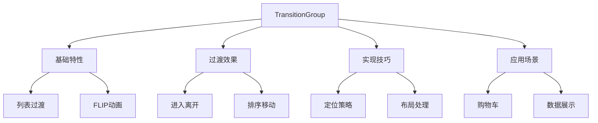

# TransitionGroup列表过渡

## 基本概念

### 基础列表过渡

```vue:c:\project\kphub\src\components\transition-group\BasicListTransition.vue
<script setup>
import { ref } from 'vue'

const items = ref([1, 2, 3, 4, 5])

function addItem() {
  items.value.push(items.value.length + 1)
}

function removeItem(index) {
  items.value.splice(index, 1)
}
</script>

<template>
  <button @click="addItem">添加项目</button>
  
  <TransitionGroup name="list" tag="ul">
    <li v-for="(item, index) in items" 
        :key="item"
        class="list-item"
        @click="removeItem(index)"
    >
      {{ item }}
    </li>
  </TransitionGroup>
</template>

<style scoped>
.list-item {
  display: inline-block;
  margin-right: 10px;
  padding: 10px 20px;
  background: #42b883;
  color: white;
  cursor: pointer;
}

.list-enter-active,
.list-leave-active {
  transition: all 0.5s ease;
}

.list-enter-from,
.list-leave-to {
  opacity: 0;
  transform: translateX(30px);
}

/* FLIP动画 */
.list-move {
  transition: transform 0.5s ease;
}
</style>
```

## 基础用法

### 列表排序过渡

```vue:c:\project\kphub\src\components\transition-group\SortableList.vue
<script setup>
import { ref } from 'vue'

const items = ref([
  { id: 1, text: '项目 1' },
  { id: 2, text: '项目 2' },
  { id: 3, text: '项目 3' },
  { id: 4, text: '项目 4' }
])

function shuffle() {
  items.value = items.value.sort(() => Math.random() - 0.5)
}

function sortByText() {
  items.value = [...items.value].sort((a, b) => a.text.localeCompare(b.text))
}
</script>

<template>
  <div class="controls">
    <button @click="shuffle">随机排序</button>
    <button @click="sortByText">文本排序</button>
  </div>
  
  <TransitionGroup 
    name="list" 
    tag="div"
    class="list-container"
  >
    <div
      v-for="item in items"
      :key="item.id"
      class="list-item"
    >
      {{ item.text }}
    </div>
  </TransitionGroup>
</template>

<style scoped>
.list-container {
  display: flex;
  flex-wrap: wrap;
  gap: 10px;
}

.list-item {
  padding: 15px;
  background: #f0f0f0;
  border-radius: 4px;
}

.list-move {
  transition: transform 0.5s ease;
}
</style>
```

## CSS实现技巧

### 交错过渡效果

```vue:c:\project\kphub\src\components\transition-group\StaggeredList.vue
<script setup>
import { ref, computed } from 'vue'

const items = ref([])
const query = ref('')

const filteredItems = computed(() => {
  return items.value.filter(item => 
    item.text.toLowerCase().includes(query.value.toLowerCase())
  )
})

// 生成初始数据
for (let i = 0; i < 20; i++) {
  items.value.push({
    id: i,
    text: `项目 ${i + 1}`
  })
}
</script>

<template>
  <input
    v-model="query"
    placeholder="搜索项目..."
  >
  
  <TransitionGroup
    name="staggered-fade"
    tag="ul"
    class="staggered-list"
    :css="false"
    @before-enter="el => el.style.opacity = 0"
    @enter="(el, done) => {
      gsap.to(el, {
        opacity: 1,
        duration: 0.5,
        delay: el.dataset.index * 0.1,
        onComplete: done
      })
    }"
  >
    <li
      v-for="(item, index) in filteredItems"
      :key="item.id"
      class="staggered-item"
      :data-index="index"
    >
      {{ item.text }}
    </li>
  </TransitionGroup>
</template>

<style scoped>
.staggered-list {
  list-style: none;
  padding: 0;
}

.staggered-item {
  padding: 10px;
  margin: 5px 0;
  background: #f9f9f9;
  border-radius: 4px;
}
</style>
```

## 实际应用案例

### 购物车动画

```vue:c:\project\kphub\src\components\transition-group\ShoppingCart.vue
<script setup>
import { ref, computed } from 'vue'

const cartItems = ref([
  { id: 1, name: '商品1', price: 99, quantity: 1 },
  { id: 2, name: '商品2', price: 199, quantity: 1 }
])

const total = computed(() => {
  return cartItems.value.reduce((sum, item) => 
    sum + item.price * item.quantity, 0
  )
})

function updateQuantity(item, delta) {
  const index = cartItems.value.indexOf(item)
  if (index > -1) {
    const newQuantity = item.quantity + delta
    if (newQuantity > 0) {
      cartItems.value[index] = {
        ...item,
        quantity: newQuantity
      }
    } else {
      removeItem(item)
    }
  }
}

function removeItem(item) {
  const index = cartItems.value.indexOf(item)
  if (index > -1) {
    cartItems.value.splice(index, 1)
  }
}
</script>

<template>
  <div class="cart">
    <TransitionGroup name="list" tag="div" class="items">
      <div
        v-for="item in cartItems"
        :key="item.id"
        class="cart-item"
      >
        <span class="name">{{ item.name }}</span>
        <span class="price">¥{{ item.price }}</span>
        <div class="quantity">
          <button @click="updateQuantity(item, -1)">-</button>
          <span>{{ item.quantity }}</span>
          <button @click="updateQuantity(item, 1)">+</button>
        </div>
        <button class="remove" @click="removeItem(item)">
          删除
        </button>
      </div>
    </TransitionGroup>
    
    <div class="cart-footer">
      <div class="total">
        总计: ¥{{ total }}
      </div>
    </div>
  </div>
</template>

<style scoped>
.cart-item {
  display: flex;
  align-items: center;
  padding: 15px;
  margin: 10px 0;
  background: white;
  border-radius: 8px;
  box-shadow: 0 2px 8px rgba(0,0,0,0.1);
}

.list-enter-active,
.list-leave-active {
  transition: all 0.5s ease;
}

.list-enter-from {
  opacity: 0;
  transform: translateX(30px);
}

.list-leave-to {
  opacity: 0;
  transform: translateX(-30px);
}

.list-move {
  transition: transform 0.5s ease;
}
</style>
```

TransitionGroup组件主要用于处理列表的过渡效果，包括：

1. 基本概念：
   - 列表项过渡
   - FLIP动画
   - 性能优化
   - DOM操作

2. 使用方式：
   - 进入离开过渡
   - 排序过渡
   - 交错效果
   - 包装元素

3. 实现技巧：
   - move类处理
   - 定位策略
   - 布局过渡
   - 尺寸变化

4. 应用场景：
   - 购物车
   - 列表过滤
   - 排序动画
   - 数据可视化



使用建议：

1. 基础使用：
   - 理解FLIP原理
   - 掌握过渡类型
   - 处理key管理

2. 性能优化：
   - 控制列表规模
   - 使用CSS硬件加速
   - 避免不必要的过渡

3. 最佳实践：
   - 合理使用key
   - 优化动画性能
   - 处理边界情况

通过合理使用TransitionGroup，我们可以创建流畅的列表动画效果。