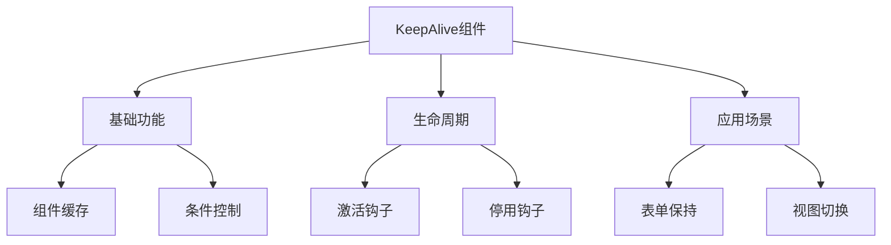

# KeepAlive缓存组件

## 基本概念

### 基础缓存示例

```vue:c:\project\kphub\src\components\keep-alive\BasicKeepAlive.vue
<script setup>
import { ref } from 'vue'
import ComponentA from './ComponentA.vue'
import ComponentB from './ComponentB.vue'

const currentComponent = ref('ComponentA')

function toggleComponent() {
  currentComponent.value = 
    currentComponent.value === 'ComponentA' ? 'ComponentB' : 'ComponentA'
}
</script>

<template>
  <button @click="toggleComponent">
    切换组件
  </button>
  
  <KeepAlive>
    <component :is="currentComponent" />
  </KeepAlive>
</template>
```

### 缓存组件示例

```vue:c:\project\kphub\src\components\keep-alive\ComponentA.vue
<script setup>
import { ref, onMounted, onActivated, onDeactivated } from 'vue'

const count = ref(0)

onMounted(() => {
  console.log('ComponentA mounted')
})

onActivated(() => {
  console.log('ComponentA activated')
})

onDeactivated(() => {
  console.log('ComponentA deactivated')
})
</script>

<template>
  <div class="component-a">
    <h2>组件A</h2>
    <p>计数: {{ count }}</p>
    <button @click="count++">增加</button>
  </div>
</template>
```

## 基础用法

### 条件缓存控制

```vue:c:\project\kphub\src\components\keep-alive\ConditionalCache.vue
<script setup>
import { ref } from 'vue'

const currentTab = ref('home')
const tabs = ['home', 'about', 'contact']

// 缓存配置
const cacheConfig = {
  include: ['HomePage', 'AboutPage'],
  max: 10
}
</script>

<template>
  <div class="tabs">
    <button 
      v-for="tab in tabs"
      :key="tab"
      :class="{ active: currentTab === tab }"
      @click="currentTab = tab"
    >
      {{ tab }}
    </button>
  </div>
  
  <KeepAlive
    :include="cacheConfig.include"
    :max="cacheConfig.max"
  >
    <component :is="`${currentTab}Page`" />
  </KeepAlive>
</template>

<style scoped>
.tabs {
  margin-bottom: 20px;
}

.active {
  background: #42b883;
  color: white;
}
</style>
```

## 生命周期钩子

### 完整生命周期示例

```vue:c:\project\kphub\src\components\keep-alive\LifecycleHooks.vue
<script setup>
import { ref, onMounted, onUnmounted, onActivated, onDeactivated } from 'vue'

const count = ref(0)
const mountCount = ref(0)
const activateCount = ref(0)

// 常规生命周期
onMounted(() => {
  console.log('组件首次挂载')
  mountCount.value++
})

onUnmounted(() => {
  console.log('组件被销毁')
})

// KeepAlive特有生命周期
onActivated(() => {
  console.log('组件被激活')
  activateCount.value++
})

onDeactivated(() => {
  console.log('组件被停用')
})
</script>

<template>
  <div class="lifecycle-demo">
    <h3>生命周期演示</h3>
    <p>计数: {{ count }}</p>
    <p>挂载次数: {{ mountCount }}</p>
    <p>激活次数: {{ activateCount }}</p>
    <button @click="count++">增加</button>
  </div>
</template>
```

## 实际应用场景

### 表单数据缓存

```vue:c:\project\kphub\src\components\keep-alive\CachedForm.vue
<script setup>
import { ref, reactive } from 'vue'

const formData = reactive({
  name: '',
  email: '',
  message: ''
})

const submitted = ref(false)

function handleSubmit() {
  submitted.value = true
  // 提交处理
  console.log('提交表单:', formData)
}

function resetForm() {
  Object.assign(formData, {
    name: '',
    email: '',
    message: ''
  })
  submitted.value = false
}
</script>

<template>
  <div class="form-container">
    <form @submit.prevent="handleSubmit">
      <div class="form-group">
        <label>姓名:</label>
        <input v-model="formData.name" required>
      </div>
      
      <div class="form-group">
        <label>邮箱:</label>
        <input 
          type="email"
          v-model="formData.email"
          required
        >
      </div>
      
      <div class="form-group">
        <label>留言:</label>
        <textarea 
          v-model="formData.message"
          required
        ></textarea>
      </div>
      
      <div class="form-actions">
        <button type="submit">提交</button>
        <button type="button" @click="resetForm">
          重置
        </button>
      </div>
    </form>
    
    <div v-if="submitted" class="success-message">
      表单已提交！
    </div>
  </div>
</template>

<style scoped>
.form-group {
  margin-bottom: 15px;
}

.form-actions {
  margin-top: 20px;
}

.success-message {
  margin-top: 20px;
  padding: 10px;
  background: #e6f7e6;
  color: #2c7a2c;
  border-radius: 4px;
}
</style>
```

KeepAlive组件是Vue3中的缓存管理工具，主要包括：

1. 基本概念：
   - 组件缓存
   - 内存管理
   - 生命周期
   - 性能优化

2. 使用方式：
   - 基础缓存
   - 条件缓存
   - 最大数量
   - 缓存键

3. 生命周期：
   - activated
   - deactivated
   - 常规周期
   - 组合式API

4. 应用场景：
   - 表单缓存
   - 标签切换
   - 路由视图
   - 性能优化



使用建议：

1. 基础使用：
   - 理解缓存机制
   - 控制缓存范围
   - 管理内存占用

2. 性能优化：
   - 合理使用max
   - 及时清理缓存
   - 避免过度缓存

3. 最佳实践：
   - 选择性缓存
   - 生命周期处理
   - 状态管理

通过合理使用KeepAlive，我们可以优化应用性能并提升用户体验。