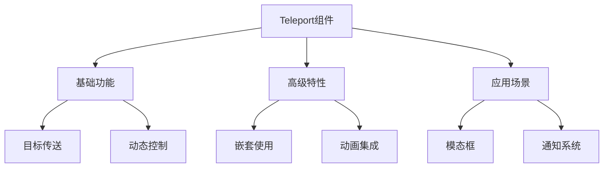

# Teleport传送门

## 基本概念

### 基础传送示例

```vue:c:\project\kphub\src\components\teleport\BasicTeleport.vue
<script setup>
import { ref } from 'vue'

const isOpen = ref(false)

function toggleModal() {
  isOpen.value = !isOpen.value
}
</script>

<template>
  <button @click="toggleModal">
    打开模态框
  </button>
  
  <Teleport to="body">
    <div v-if="isOpen" class="modal">
      <div class="modal-content">
        <h3>模态框标题</h3>
        <p>这是一个传送到body的模态框</p>
        <button @click="toggleModal">关闭</button>
      </div>
    </div>
  </Teleport>
</template>

<style scoped>
.modal {
  position: fixed;
  top: 0;
  left: 0;
  width: 100%;
  height: 100%;
  background: rgba(0, 0, 0, 0.5);
  display: flex;
  justify-content: center;
  align-items: center;
}

.modal-content {
  background: white;
  padding: 20px;
  border-radius: 8px;
  min-width: 300px;
}
</style>
```

## 基础用法

### 动态目标处理

```vue:c:\project\kphub\src\components\teleport\DynamicTeleport.vue
<script setup>
import { ref, onMounted } from 'vue'

const target = ref(null)
const isOpen = ref(false)
const containers = ['modal-container', 'notification-container']
const currentContainer = ref(containers[0])

onMounted(() => {
  // 创建目标容器
  containers.forEach(id => {
    const container = document.createElement('div')
    container.id = id
    document.body.appendChild(container)
  })
})

function toggleDialog() {
  isOpen.value = !isOpen.value
}

function switchContainer() {
  currentContainer.value = 
    currentContainer.value === containers[0] ? containers[1] : containers[0]
}
</script>

<template>
  <div class="controls">
    <button @click="toggleDialog">
      切换显示
    </button>
    <button @click="switchContainer">
      切换容器
    </button>
  </div>
  
  <Teleport :to="`#${currentContainer}`">
    <div v-if="isOpen" class="dialog">
      当前容器: {{ currentContainer }}
      <button @click="toggleDialog">关闭</button>
    </div>
  </Teleport>
</template>
```

## 高级用法

### 嵌套传送与动画

```vue:c:\project\kphub\src\components\teleport\NestedTeleport.vue
<script setup>
import { ref } from 'vue'

const showOuter = ref(false)
const showInner = ref(false)

function toggleOuter() {
  showOuter.value = !showOuter.value
}

function toggleInner() {
  showInner.value = !showInner.value
}
</script>

<template>
  <button @click="toggleOuter">
    打开外层
  </button>
  
  <Teleport to="body">
    <Transition name="fade">
      <div v-if="showOuter" class="outer-modal">
        <div class="modal-content">
          <h3>外层模态框</h3>
          <button @click="toggleInner">
            打开内层
          </button>
          
          <Teleport to=".outer-modal">
            <Transition name="slide">
              <div v-if="showInner" class="inner-modal">
                <div class="modal-content">
                  <h4>内层模态框</h4>
                  <button @click="toggleInner">关闭</button>
                </div>
              </div>
            </Transition>
          </Teleport>
          
          <button @click="toggleOuter">关闭</button>
        </div>
      </div>
    </Transition>
  </Teleport>
</template>

<style scoped>
.fade-enter-active,
.fade-leave-active {
  transition: opacity 0.3s ease;
}

.fade-enter-from,
.fade-leave-to {
  opacity: 0;
}

.slide-enter-active,
.slide-leave-active {
  transition: transform 0.3s ease;
}

.slide-enter-from,
.slide-leave-to {
  transform: translateY(100%);
}
</style>
```

## 实际应用场景

### 全局通知系统

```vue:c:\project\kphub\src\components\teleport\NotificationSystem.vue
<script setup>
import { ref, reactive } from 'vue'

const notifications = reactive([])
let notificationId = 0

function addNotification(type, message) {
  const id = notificationId++
  const notification = {
    id,
    type,
    message,
    timestamp: Date.now()
  }
  
  notifications.push(notification)
  
  // 自动移除
  setTimeout(() => {
    removeNotification(id)
  }, 3000)
}

function removeNotification(id) {
  const index = notifications.findIndex(n => n.id === id)
  if (index > -1) {
    notifications.splice(index, 1)
  }
}
</script>

<template>
  <div class="controls">
    <button @click="addNotification('info', '这是一条信息')">
      添加信息
    </button>
    <button @click="addNotification('success', '操作成功')">
      添加成功
    </button>
    <button @click="addNotification('error', '发生错误')">
      添加错误
    </button>
  </div>
  
  <Teleport to="body">
    <div class="notification-container">
      <TransitionGroup name="notification">
        <div
          v-for="notification in notifications"
          :key="notification.id"
          :class="['notification', notification.type]"
        >
          {{ notification.message }}
          <button 
            class="close"
            @click="removeNotification(notification.id)"
          >
            ×
          </button>
        </div>
      </TransitionGroup>
    </div>
  </Teleport>
</template>

<style scoped>
.notification-container {
  position: fixed;
  top: 20px;
  right: 20px;
  z-index: 1000;
}

.notification {
  padding: 15px;
  margin-bottom: 10px;
  border-radius: 4px;
  min-width: 200px;
  position: relative;
}

.info {
  background: #e6f7ff;
  border: 1px solid #91d5ff;
}

.success {
  background: #f6ffed;
  border: 1px solid #b7eb8f;
}

.error {
  background: #fff2f0;
  border: 1px solid #ffccc7;
}

.notification-enter-active,
.notification-leave-active {
  transition: all 0.3s ease;
}

.notification-enter-from,
.notification-leave-to {
  opacity: 0;
  transform: translateX(100%);
}
</style>
```

Teleport组件是Vue3中的传送门功能，主要包括：

1. 基本概念：
   - 元素传送
   - 渲染机制
   - 目标管理
   - 上下文继承

2. 使用方式：
   - 基础传送
   - 动态目标
   - 条件控制
   - 多重传送

3. 高级特性：
   - 嵌套传送
   - 动画集成
   - 上下文处理
   - 组件通信

4. 应用场景：
   - 模态框
   - 通知系统
   - 浮层菜单
   - 加载指示器



使用建议：

1. 基础使用：
   - 选择合适目标
   - 控制传送时机
   - 管理目标容器

2. 性能优化：
   - 合理使用条件渲染
   - 控制传送数量
   - 及时清理资源

3. 最佳实践：
   - 统一管理目标
   - 处理上下文关系
   - 优化用户体验

通过合理使用Teleport，我们可以构建更灵活的页面布局和交互体验。