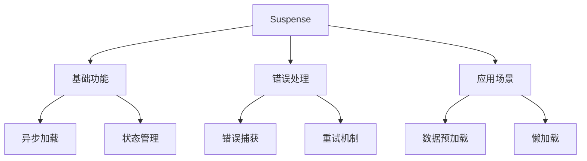

# Suspense异步加载

## 基本概念

### 基础异步组件

```vue:c:\project\kphub\src\components\suspense\BasicSuspense.vue
<script setup>
import { ref } from 'vue'

// 模拟异步数据获取
const fetchData = async () => {
  return new Promise(resolve => {
    setTimeout(() => {
      resolve({
        title: '异步数据',
        content: '这是通过异步加载的内容'
      })
    }, 1000)
  })
}

const data = await fetchData()
</script>

<template>
  <div class="async-component">
    <h2>{{ data.title }}</h2>
    <p>{{ data.content }}</p>
  </div>
</template>
```

### Suspense包装器

```vue:c:\project\kphub\src\components\suspense\SuspenseWrapper.vue
<script setup>
import { defineAsyncComponent } from 'vue'

const AsyncComponent = defineAsyncComponent(() =>
  import('./BasicSuspense.vue')
)
</script>

<template>
  <Suspense>
    <!-- 默认内容 -->
    <template #default>
      <AsyncComponent />
    </template>
    
    <!-- 加载状态 -->
    <template #fallback>
      <div class="loading">
        <span class="spinner"></span>
        <p>加载中...</p>
      </div>
    </template>
  </Suspense>
</template>

<style scoped>
.loading {
  text-align: center;
  padding: 20px;
}

.spinner {
  display: inline-block;
  width: 20px;
  height: 20px;
  border: 2px solid #f3f3f3;
  border-top: 2px solid #3498db;
  border-radius: 50%;
  animation: spin 1s linear infinite;
}

@keyframes spin {
  0% { transform: rotate(0deg); }
  100% { transform: rotate(360deg); }
}
</style>
```

## 基础用法

### 嵌套Suspense

```vue:c:\project\kphub\src\components\suspense\NestedSuspense.vue
<script setup>
import { ref } from 'vue'

const ParentComponent = defineAsyncComponent(() =>
  import('./ParentComponent.vue')
)

const ChildComponent = defineAsyncComponent(() =>
  import('./ChildComponent.vue')
)

const showChild = ref(false)
</script>

<template>
  <Suspense>
    <template #default>
      <ParentComponent>
        <Suspense>
          <template #default>
            <ChildComponent v-if="showChild" />
          </template>
          
          <template #fallback>
            <div>子组件加载中...</div>
          </template>
        </Suspense>
      </ParentComponent>
    </template>
    
    <template #fallback>
      <div>父组件加载中...</div>
    </template>
  </Suspense>
  
  <button @click="showChild = !showChild">
    切换子组件
  </button>
</template>
```

## 错误处理

### 错误边界实现

```vue:c:\project\kphub\src\components\suspense\ErrorBoundary.vue
<script setup>
import { ref, onErrorCaptured } from 'vue'

const error = ref(null)
const retryCount = ref(0)

onErrorCaptured((err, instance, info) => {
  error.value = {
    message: err.message,
    component: instance?.type?.name,
    info
  }
  return false // 阻止错误继续传播
})

async function retryLoad() {
  error.value = null
  retryCount.value++
  
  try {
    await new Promise(resolve => setTimeout(resolve, 1000))
    // 重新加载组件
  } catch (err) {
    error.value = {
      message: '重试失败',
      error: err
    }
  }
}
</script>

<template>
  <div class="error-boundary">
    <template v-if="error">
      <div class="error-message">
        <h3>出错了！</h3>
        <p>{{ error.message }}</p>
        <button @click="retryLoad">
          重试 (已重试{{ retryCount }}次)
        </button>
      </div>
    </template>
    
    <template v-else>
      <slot></slot>
    </template>
  </div>
</template>

<style scoped>
.error-message {
  padding: 20px;
  border: 1px solid #ff4d4f;
  border-radius: 4px;
  background: #fff2f0;
}
</style>
```

## 实际应用场景

### 数据预加载

```vue:c:\project\kphub\src\components\suspense\DataPreload.vue
<script setup>
import { ref } from 'vue'

// 模拟API调用
async function fetchUserData() {
  return new Promise(resolve => {
    setTimeout(() => {
      resolve({
        name: '张三',
        email: 'zhangsan@example.com'
      })
    }, 1000)
  })
}

async function fetchUserPosts() {
  return new Promise(resolve => {
    setTimeout(() => {
      resolve([
        { id: 1, title: '文章1' },
        { id: 2, title: '文章2' }
      ])
    }, 1500)
  })
}

// 并行加载数据
const [userData, userPosts] = await Promise.all([
  fetchUserData(),
  fetchUserPosts()
])

const isRefreshing = ref(false)

async function refreshData() {
  isRefreshing.value = true
  try {
    const [newUserData, newUserPosts] = await Promise.all([
      fetchUserData(),
      fetchUserPosts()
    ])
    // 更新数据
    Object.assign(userData, newUserData)
    userPosts.value = newUserPosts
  } finally {
    isRefreshing.value = false
  }
}
</script>

<template>
  <div class="user-profile">
    <div class="user-info">
      <h2>{{ userData.name }}</h2>
      <p>{{ userData.email }}</p>
    </div>
    
    <div class="user-posts">
      <h3>用户文章</h3>
      <ul>
        <li v-for="post in userPosts" :key="post.id">
          {{ post.title }}
        </li>
      </ul>
    </div>
    
    <button
      @click="refreshData"
      :disabled="isRefreshing"
    >
      {{ isRefreshing ? '刷新中...' : '刷新数据' }}
    </button>
  </div>
</template>
```

Suspense是Vue3的异步加载机制，主要包括：

1. 基本概念：
   - 异步依赖处理
   - 加载状态管理
   - 错误处理
   - 性能优化

2. 使用方式：
   - 插槽配置
   - 异步组件
   - 嵌套使用
   - 状态管理

3. 错误处理：
   - 错误捕获
   - 优雅降级
   - 重试机制
   - 用户反馈

4. 应用场景：
   - 数据预加载
   - 懒加载组件
   - 分步渲染
   - 资源管理



使用建议：

1. 基础使用：
   - 合理设置加载状态
   - 处理嵌套场景
   - 控制加载时机

2. 错误处理：
   - 实现错误边界
   - 提供重试选项
   - 优雅降级显示

3. 性能优化：
   - 并行数据加载
   - 合理的加载策略
   - 缓存机制使用

通过合理使用Suspense，我们可以构建出更好的异步加载体验。