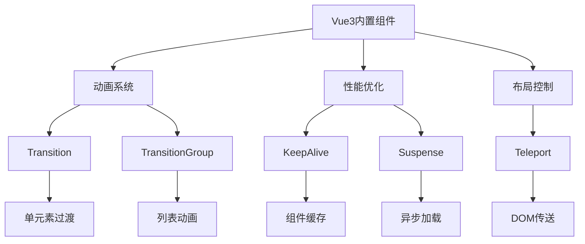

# Vue3内置组件详解

Vue3提供了一系列功能强大的内置组件，用于处理常见的开发场景：

## 动画与过渡
- [Transition过渡动画](./6.1-Transition过渡动画.md)：实现单元素/组件的进入、离开和状态切换动画
- [TransitionGroup列表过渡](./6.2-TransitionGroup列表过渡.md)：处理列表项的动态添加、删除和重新排序动画

## 性能优化
- [KeepAlive缓存组件](./6.3-KeepAlive缓存组件.md)：缓存不活动的组件实例，避免重复渲染
- [Suspense异步加载](./6.5-Suspense异步加载.md)：优雅处理异步依赖，提供加载状态

## 布局控制
- [Teleport传送门](./6.4-Teleport传送门.md)：将内容渲染到任意DOM位置，突破组件层级限制

这些内置组件的主要特点：

1. 动画系统
   - Transition：处理单个元素的过渡效果
   - TransitionGroup：处理列表和网格的动态变化

2. 性能优化
   - KeepAlive：智能缓存组件状态
   - Suspense：优雅处理异步依赖

3. 布局控制
   - Teleport：灵活控制内容渲染位置

学习路径建议：

1. 首先掌握Transition的基本用法，这是最常用的动画组件
2. 学习TransitionGroup处理列表动画
3. 理解KeepAlive的缓存机制
4. 掌握Teleport的传送功能
5. 最后学习Suspense的异步处理

使用场景：

1. Transition
   - 模态框动画
   - 路由过渡
   - 状态切换

2. TransitionGroup
   - 列表排序
   - 购物车动画
   - 网格布局变化

3. KeepAlive
   - 标签页切换
   - 表单状态保持
   - 列表缓存

4. Teleport
   - 模态框
   - 通知提示
   - 悬浮菜单

5. Suspense
   - 数据加载
   - 组件懒加载
   - 路由组件

通过系统学习这些内置组件，您将能够：
- 创建流畅的用户界面动画
- 优化应用性能
- 构建复杂的布局结构
- 处理异步加载场景

每个组件都提供了强大而灵活的API，可以根据具体需求进行配置和扩展。建议在实际项目中多加练习，逐步掌握这些组件的高级用法。