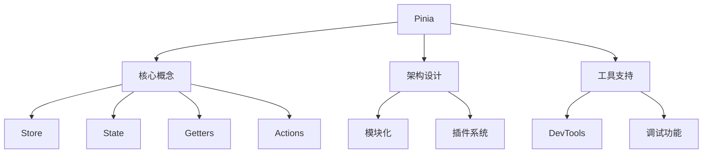

# Pinia核心概念

## 基本介绍

### Store基础结构

```typescript:c:\project\kphub\src\stores\basic\basicStore.ts
import { defineStore } from 'pinia'

// 定义Store
export const useBasicStore = defineStore('basic', {
  // 状态
  state: () => ({
    count: 0,
    name: 'Pinia Store',
    items: [] as string[]
  }),

  // 计算属性
  getters: {
    doubleCount: (state) => state.count * 2,
    itemCount: (state) => state.items.length
  },

  // 操作方法
  actions: {
    increment() {
      this.count++
    },
    addItem(item: string) {
      this.items.push(item)
    }
  }
})
```

### 组合式API风格

```typescript:c:\project\kphub\src\stores\composition\userStore.ts
import { defineStore } from 'pinia'
import { ref, computed } from 'vue'

export const useUserStore = defineStore('user', () => {
  // 状态
  const user = ref({
    id: '',
    name: '',
    email: ''
  })
  const isLoggedIn = ref(false)

  // 计算属性
  const userFullName = computed(() => {
    return user.value.name ? `${user.value.name} (${user.value.email})` : ''
  })

  // 操作方法
  function login(userData: typeof user.value) {
    user.value = userData
    isLoggedIn.value = true
  }

  function logout() {
    user.value = {
      id: '',
      name: '',
      email: ''
    }
    isLoggedIn.value = false
  }

  return {
    user,
    isLoggedIn,
    userFullName,
    login,
    logout
  }
})
```

## 核心概念

### 状态管理示例

```typescript:c:\project\kphub\src\stores\cart\cartStore.ts
import { defineStore } from 'pinia'
import { computed } from 'vue'

interface Product {
  id: number
  name: string
  price: number
}

interface CartItem extends Product {
  quantity: number
}

export const useCartStore = defineStore('cart', {
  state: () => ({
    items: [] as CartItem[],
    isCheckingOut: false
  }),

  getters: {
    totalItems: (state) => state.items.reduce((sum, item) => sum + item.quantity, 0),
    totalAmount: (state) => state.items.reduce((sum, item) => sum + item.price * item.quantity, 0),
    
    // 带参数的getter
    getItemById: (state) => {
      return (productId: number) => state.items.find(item => item.id === productId)
    }
  },

  actions: {
    addToCart(product: Product) {
      const existingItem = this.items.find(item => item.id === product.id)
      
      if (existingItem) {
        existingItem.quantity++
      } else {
        this.items.push({
          ...product,
          quantity: 1
        })
      }
    },

    removeFromCart(productId: number) {
      const index = this.items.findIndex(item => item.id === productId)
      if (index > -1) {
        this.items.splice(index, 1)
      }
    },

    async checkout() {
      this.isCheckingOut = true
      try {
        // 模拟API调用
        await new Promise(resolve => setTimeout(resolve, 1000))
        this.items = []
      } finally {
        this.isCheckingOut = false
      }
    }
  }
})
```

## 基础架构

### 模块化Store示例

```typescript:c:\project\kphub\src\stores\modules\index.ts
// 用户模块
export const useUserStore = defineStore('user', {
  state: () => ({
    profile: null,
    preferences: {}
  })
})

// 产品模块
export const useProductStore = defineStore('product', {
  state: () => ({
    list: [],
    categories: []
  })
})

// 订单模块
export const useOrderStore = defineStore('order', {
  state: () => ({
    current: null,
    history: []
  })
})

// Store组合示例
export function useShoppingSystem() {
  const user = useUserStore()
  const product = useProductStore()
  const order = useOrderStore()

  return {
    user,
    product,
    order
  }
}
```

### 插件系统示例

```typescript:c:\project\kphub\src\stores\plugins\persistencePlugin.ts
import { PiniaPluginContext } from 'pinia'

export function persistencePlugin({ store }: PiniaPluginContext) {
  // 从localStorage恢复状态
  const savedState = localStorage.getItem(`store-${store.$id}`)
  if (savedState) {
    store.$patch(JSON.parse(savedState))
  }

  // 监听状态变化并保存
  store.$subscribe(
    (mutation, state) => {
      localStorage.setItem(`store-${store.$id}`, JSON.stringify(state))
    },
    { detached: true }
  )
}
```

Pinia是Vue3的官方状态管理库，主要特点包括：

1. 核心概念：
   - Store定义
   - 状态管理
   - 计算属性
   - 操作方法

2. 设计特点：
   - TypeScript支持
   - 模块化设计
   - 插件系统
   - 开发工具

3. 使用方式：
   - 选项式API
   - 组合式API
   - Store组合
   - 状态持久化

4. 开发支持：
   - DevTools
   - 状态追踪
   - 性能监控
   - 调试工具



使用建议：

1. 基础使用：
   - 理解Store概念
   - 掌握状态管理
   - 使用计算属性
   - 实现业务逻辑

2. 进阶技巧：
   - 模块化组织
   - 插件开发
   - 性能优化
   - 状态持久化

3. 最佳实践：
   - 合理拆分Store
   - 使用TypeScript
   - 做好错误处理
   - 优化用户体验

通过合理使用Pinia，我们可以构建出可维护、高性能的Vue应用。