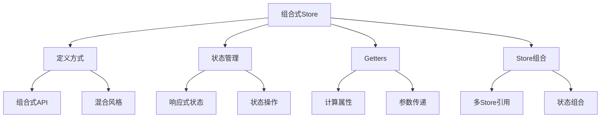

# 组合式API风格的Store

## 定义Store

### 基础Store定义

```typescript:c:\project\kphub\src\stores\composition\basicStore.ts
import { defineStore } from 'pinia'
import { ref, computed } from 'vue'

// 组合式API风格
export const useCounterStore = defineStore('counter', () => {
  // 状态定义
  const count = ref(0)
  const name = ref('counter')

  // 计算属性
  const doubleCount = computed(() => count.value * 2)

  // 操作方法
  function increment() {
    count.value++
  }

  function reset() {
    count.value = 0
  }

  return {
    count,
    name,
    doubleCount,
    increment,
    reset
  }
})
```

### 混合风格示例

```typescript:c:\project\kphub\src\stores\composition\hybridStore.ts
import { defineStore } from 'pinia'
import { ref } from 'vue'

// 选项式与组合式混合使用
export const useHybridStore = defineStore({
  id: 'hybrid',
  state: () => ({
    items: [] as string[]
  }),
  getters: {
    itemCount: (state) => state.items.length
  },
  actions: {
    addItem(item: string) {
      this.items.push(item)
    }
  },
  // 通过setup扩展额外的组合式API逻辑
  setup() {
    const searchTerm = ref('')
    
    function search(term: string) {
      searchTerm.value = term
    }
    
    return {
      searchTerm,
      search
    }
  }
})
```

## 状态定义与访问

### 响应式状态管理

```typescript:c:\project\kphub\src\stores\composition\userStore.ts
import { defineStore } from 'pinia'
import { ref, reactive, watch } from 'vue'

export const useUserStore = defineStore('user', () => {
  // ref方式定义
  const userId = ref('')
  const username = ref('')
  
  // reactive方式定义
  const profile = reactive({
    email: '',
    avatar: '',
    preferences: {}
  })
  
  // 状态重置
  function resetState() {
    userId.value = ''
    username.value = ''
    Object.assign(profile, {
      email: '',
      avatar: '',
      preferences: {}
    })
  }
  
  // 状态变更监听
  watch(userId, (newId) => {
    console.log('用户ID变更:', newId)
  })
  
  // 批量状态更新
  function updateProfile(data: Partial<typeof profile>) {
    Object.assign(profile, data)
  }
  
  return {
    userId,
    username,
    profile,
    resetState,
    updateProfile
  }
})
```

## Getters使用

### 高级Getters示例

```typescript:c:\project\kphub\src\stores\composition\productStore.ts
import { defineStore } from 'pinia'
import { ref, computed } from 'vue'

interface Product {
  id: number
  name: string
  price: number
  category: string
}

export const useProductStore = defineStore('product', () => {
  const products = ref<Product[]>([])
  const selectedCategory = ref('')
  
  // 基础getter
  const totalProducts = computed(() => products.value.length)
  
  // 访问其他getter的getter
  const categorizedProducts = computed(() => 
    selectedCategory.value
      ? products.value.filter(p => p.category === selectedCategory.value)
      : products.value
  )
  
  // 带参数的getter
  function getProductById(id: number) {
    return computed(() => products.value.find(p => p.id === id))
  }
  
  // 组合多个getter
  const categoryStats = computed(() => {
    const stats = new Map<string, number>()
    products.value.forEach(product => {
      const count = stats.get(product.category) || 0
      stats.set(product.category, count + 1)
    })
    return stats
  })
  
  return {
    products,
    selectedCategory,
    totalProducts,
    categorizedProducts,
    getProductById,
    categoryStats
  }
})
```

## 组合多个Store

### Store组合示例

```typescript:c:\project\kphub\src\stores\composition\composedStore.ts
import { defineStore } from 'pinia'
import { computed } from 'vue'
import { useUserStore } from './userStore'
import { useProductStore } from './productStore'

export const useOrderStore = defineStore('order', () => {
  // 引用其他store
  const userStore = useUserStore()
  const productStore = useProductStore()
  
  // 组合多个store的状态
  const canPlaceOrder = computed(() => 
    userStore.userId && productStore.categorizedProducts.length > 0
  )
  
  // 跨store操作
  async function placeOrder(productIds: number[]) {
    if (!canPlaceOrder.value) {
      throw new Error('不能下单')
    }
    
    const orderData = {
      userId: userStore.userId,
      products: productIds.map(id => ({
        id,
        product: productStore.getProductById(id).value
      }))
    }
    
    // 处理订单逻辑
    console.log('提交订单:', orderData)
  }
  
  return {
    canPlaceOrder,
    placeOrder
  }
})
```

组合式API风格的Store主要包括：

1. 定义方式：
   - 组合式API
   - 混合风格
   - 状态管理
   - 方法定义

2. 状态处理：
   - ref/reactive
   - 状态访问
   - 状态重置
   - 变更监听

3. Getters使用：
   - 计算属性
   - 参数传递
   - Getter组合
   - 状态派生

4. Store组合：
   - 多Store引用
   - 状态组合
   - 逻辑复用
   - 依赖管理



使用建议：

1. 基础使用：
   - 选择合适的定义方式
   - 规范状态管理
   - 合理使用计算属性
   - 注意代码组织

2. 进阶技巧：
   - Store逻辑复用
   - 状态派生优化
   - 依赖关系管理
   - 性能优化

3. 最佳实践：
   - 模块化设计
   - 类型支持
   - 错误处理
   - 测试策略

通过合理使用组合式API风格的Store，我们可以构建出更易维护、更灵活的状态管理系统。