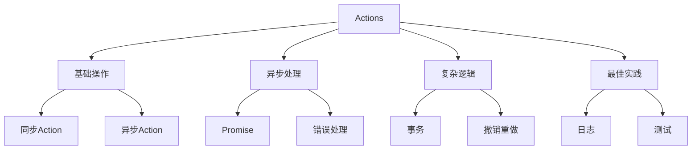

# Actions与异步操作

## Actions基础

### 基础Action定义

```typescript:c:\project\kphub\src\stores\actions\basicActions.ts
import { defineStore } from 'pinia'
import { ref } from 'vue'

export const useTaskStore = defineStore('task', () => {
  const tasks = ref<string[]>([])
  const isLoading = ref(false)

  // 同步Action
  function addTask(task: string) {
    tasks.value.push(task)
  }

  // 异步Action
  async function fetchTasks() {
    isLoading.value = true
    try {
      const response = await fetch('/api/tasks')
      const data = await response.json()
      tasks.value = data
      return data
    } catch (error) {
      console.error('获取任务失败:', error)
      throw error
    } finally {
      isLoading.value = false
    }
  }

  return {
    tasks,
    isLoading,
    addTask,
    fetchTasks
  }
})
```

### 组件中使用Actions

```vue:c:\project\kphub\src\components\TaskList.vue
<script setup lang="ts">
import { onMounted } from 'vue'
import { useTaskStore } from '../stores/actions/basicActions'
import { storeToRefs } from 'pinia'

const taskStore = useTaskStore()
const { tasks, isLoading } = storeToRefs(taskStore)

onMounted(async () => {
  try {
    await taskStore.fetchTasks()
  } catch (error) {
    console.error('加载任务失败')
  }
})

async function handleAddTask(taskName: string) {
  taskStore.addTask(taskName)
}
</script>

<template>
  <div class="task-list">
    <div v-if="isLoading">加载中...</div>
    <ul v-else>
      <li v-for="task in tasks" :key="task">
        {{ task }}
      </li>
    </ul>
    <button @click="handleAddTask('新任务')">
      添加任务
    </button>
  </div>
</template>
```

## 异步操作处理

### 复杂异步操作

```typescript:c:\project\kphub\src\stores\actions\asyncActions.ts
import { defineStore } from 'pinia'
import { ref } from 'vue'

interface User {
  id: string
  name: string
}

interface Task {
  id: string
  title: string
  userId: string
}

export const useUserTaskStore = defineStore('userTask', () => {
  const currentUser = ref<User | null>(null)
  const userTasks = ref<Task[]>([])
  const loadingStates = ref({
    user: false,
    tasks: false
  })

  // Promise链式调用
  function loadUserAndTasks(userId: string) {
    return fetchUser(userId)
      .then(user => {
        return fetchUserTasks(user.id)
      })
      .catch(error => {
        console.error('加载用户和任务失败:', error)
        throw error
      })
  }

  // async/await方式
  async function fetchUser(userId: string) {
    loadingStates.value.user = true
    try {
      const response = await fetch(`/api/users/${userId}`)
      const user = await response.json()
      currentUser.value = user
      return user
    } finally {
      loadingStates.value.user = false
    }
  }

  async function fetchUserTasks(userId: string) {
    loadingStates.value.tasks = true
    try {
      const response = await fetch(`/api/users/${userId}/tasks`)
      const tasks = await response.json()
      userTasks.value = tasks
      return tasks
    } finally {
      loadingStates.value.tasks = false
    }
  }

  return {
    currentUser,
    userTasks,
    loadingStates,
    loadUserAndTasks,
    fetchUser,
    fetchUserTasks
  }
})
```

## 复杂业务逻辑

### 事务性操作示例

```typescript:c:\project\kphub\src\stores\actions\complexActions.ts
import { defineStore } from 'pinia'
import { ref } from 'vue'

interface OrderItem {
  productId: string
  quantity: number
}

export const useOrderStore = defineStore('order', () => {
  const currentOrder = ref<OrderItem[]>([])
  const orderHistory = ref<OrderItem[][]>([])
  const isProcessing = ref(false)
  const undoStack = ref<OrderItem[][]>([])
  const redoStack = ref<OrderItem[][]>([])

  // 事务性操作
  async function placeOrder(items: OrderItem[]) {
    isProcessing.value = true
    
    try {
      // 检查库存
      await checkInventory(items)
      
      // 创建订单
      const order = await createOrder(items)
      
      // 更新库存
      await updateInventory(items)
      
      // 保存订单历史
      orderHistory.value.push([...items])
      currentOrder.value = []
      
      // 清空重做栈
      redoStack.value = []
      
      return order
    } catch (error) {
      // 回滚操作
      await rollbackInventory(items)
      throw error
    } finally {
      isProcessing.value = false
    }
  }

  // 撤销操作
  function undo() {
    if (orderHistory.value.length > 0) {
      const lastOrder = orderHistory.value.pop()!
      undoStack.value.push(lastOrder)
      currentOrder.value = [...lastOrder]
    }
  }

  // 重做操作
  function redo() {
    if (undoStack.value.length > 0) {
      const nextOrder = undoStack.value.pop()!
      orderHistory.value.push(nextOrder)
      currentOrder.value = [...nextOrder]
    }
  }

  // 模拟API调用
  async function checkInventory(items: OrderItem[]) {
    return new Promise(resolve => setTimeout(resolve, 500))
  }

  async function createOrder(items: OrderItem[]) {
    return new Promise(resolve => setTimeout(resolve, 500))
  }

  async function updateInventory(items: OrderItem[]) {
    return new Promise(resolve => setTimeout(resolve, 500))
  }

  async function rollbackInventory(items: OrderItem[]) {
    return new Promise(resolve => setTimeout(resolve, 500))
  }

  return {
    currentOrder,
    orderHistory,
    isProcessing,
    placeOrder,
    undo,
    redo
  }
})
```

## 最佳实践

### 日志与调试

```typescript:c:\project\kphub\src\stores\actions\actionLogger.ts
import { defineStore } from 'pinia'
import { ref } from 'vue'

// 日志记录器
const logger = {
  log: (action: string, data?: any) => {
    console.log(`[Action] ${action}`, data)
  },
  error: (action: string, error: any) => {
    console.error(`[Action Error] ${action}`, error)
  }
}

export const useLoggedStore = defineStore('logged', () => {
  const data = ref<any>(null)
  const error = ref<Error | null>(null)

  // 包装异步操作
  async function withLogging<T>(
    actionName: string,
    action: () => Promise<T>
  ): Promise<T> {
    logger.log(actionName, '开始')
    try {
      const result = await action()
      logger.log(actionName, { result })
      return result
    } catch (e) {
      const err = e as Error
      logger.error(actionName, err)
      error.value = err
      throw err
    }
  }

  // 使用日志包装器的Action
  async function fetchData() {
    return withLogging('fetchData', async () => {
      const response = await fetch('/api/data')
      const result = await response.json()
      data.value = result
      return result
    })
  }

  return {
    data,
    error,
    fetchData
  }
})
```

Actions是Pinia中处理业务逻辑的核心，主要包括：

1. 基础概念：
   - 同步Actions
   - 异步Actions
   - 返回值处理
   - 状态管理

2. 异步处理：
   - Promise处理
   - 错误处理
   - 加载状态
   - 链式调用

3. 复杂逻辑：
   - 事务操作
   - 撤销重做
   - 条件执行
   - 组合Actions

4. 最佳实践：
   - 命名规范
   - 错误处理
   - 日志记录
   - 测试设计



使用建议：

1. 基础使用：
   - 合理划分Action
   - 处理异步操作
   - 管理加载状态
   - 实现错误处理

2. 进阶技巧：
   - 组合多个Action
   - 实现复杂逻辑
   - 优化性能
   - 提升可维护性

3. 最佳实践：
   - 统一命名规范
   - 完善错误处理
   - 添加日志记录
   - 编写单元测试

通过合理使用Actions，我们可以构建出可靠、可维护的状态管理系统。