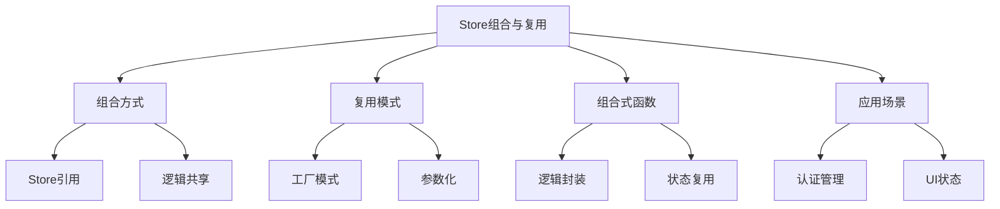

# Store组合与复用

## Store之间的组合

### 基础Store组合

```typescript:c:\project\kphub\src\stores\composition\baseStores.ts
import { defineStore } from 'pinia'
import { ref, computed } from 'vue'

// 用户Store
export const useUserStore = defineStore('user', () => {
  const user = ref({
    id: '',
    name: '',
    permissions: [] as string[]
  })

  const isLoggedIn = computed(() => Boolean(user.value.id))

  function setUser(userData: typeof user.value) {
    user.value = userData
  }

  return {
    user,
    isLoggedIn,
    setUser
  }
})

// 权限Store
export const usePermissionStore = defineStore('permission', () => {
  const userStore = useUserStore()

  const canAccessAdmin = computed(() => 
    userStore.user.permissions.includes('admin')
  )

  function checkPermission(permission: string) {
    return userStore.user.permissions.includes(permission)
  }

  return {
    canAccessAdmin,
    checkPermission
  }
})
```

### 模块化Store设计

```typescript:c:\project\kphub\src\stores\modules\moduleStores.ts
import { defineStore } from 'pinia'
import { ref, computed } from 'vue'

// 基础实体Store
const createEntityStore = <T extends { id: string }>(name: string) => {
  return defineStore(name, () => {
    const items = ref<T[]>([])
    const loading = ref(false)
    const error = ref<Error | null>(null)

    const itemMap = computed(() => 
      new Map(items.value.map(item => [item.id, item]))
    )

    async function fetchItems() {
      loading.value = true
      try {
        const response = await fetch(`/api/${name}`)
        items.value = await response.json()
      } catch (err) {
        error.value = err as Error
      } finally {
        loading.value = false
      }
    }

    return {
      items,
      loading,
      error,
      itemMap,
      fetchItems
    }
  })
}

// 具体业务Store
export const useProductStore = createEntityStore<{
  id: string
  name: string
  price: number
}>('products')

export const useOrderStore = createEntityStore<{
  id: string
  userId: string
  items: { productId: string; quantity: number }[]
}>('orders')
```

## 可复用Store模式

### 参数化Store工厂

```typescript:c:\project\kphub\src\stores\factories\storeFactory.ts
import { defineStore } from 'pinia'
import { ref, computed } from 'vue'

interface PaginationOptions {
  pageSize: number
  initialPage?: number
}

export function createPaginatedStore<T>(
  name: string,
  options: PaginationOptions
) {
  return defineStore(name, () => {
    const items = ref<T[]>([])
    const currentPage = ref(options.initialPage || 1)
    const totalItems = ref(0)

    const pageCount = computed(() => 
      Math.ceil(totalItems.value / options.pageSize)
    )

    const paginatedItems = computed(() => {
      const start = (currentPage.value - 1) * options.pageSize
      return items.value.slice(start, start + options.pageSize)
    })

    async function fetchPage(page: number) {
      currentPage.value = page
      // 实现分页加载逻辑
    }

    return {
      items,
      currentPage,
      totalItems,
      pageCount,
      paginatedItems,
      fetchPage
    }
  })
}

// 使用示例
export const useProductListStore = createPaginatedStore<{
  id: string
  name: string
}>('productList', { pageSize: 10 })
```

## 组合式函数与Store

### Store逻辑封装

```typescript:c:\project\kphub\src\composables\useStoreHelpers.ts
import { ref, computed } from 'vue'
import type { Ref } from 'vue'

// 通用CRUD操作封装
export function useCRUD<T extends { id: string }>(
  storeName: string,
  apiPath: string
) {
  const items = ref<T[]>([]) as Ref<T[]>
  const loading = ref(false)
  const error = ref<Error | null>(null)

  const itemById = computed(() => 
    (id: string) => items.value.find(item => item.id === id)
  )

  async function fetchAll() {
    loading.value = true
    try {
      const response = await fetch(`/api/${apiPath}`)
      items.value = await response.json()
    } catch (err) {
      error.value = err as Error
    } finally {
      loading.value = false
    }
  }

  async function create(item: Omit<T, 'id'>) {
    loading.value = true
    try {
      const response = await fetch(`/api/${apiPath}`, {
        method: 'POST',
        body: JSON.stringify(item)
      })
      const newItem = await response.json()
      items.value.push(newItem)
      return newItem
    } catch (err) {
      error.value = err as Error
      throw err
    } finally {
      loading.value = false
    }
  }

  async function update(id: string, updates: Partial<T>) {
    loading.value = true
    try {
      const response = await fetch(`/api/${apiPath}/${id}`, {
        method: 'PATCH',
        body: JSON.stringify(updates)
      })
      const updated = await response.json()
      const index = items.value.findIndex(item => item.id === id)
      if (index > -1) {
        items.value[index] = updated
      }
      return updated
    } catch (err) {
      error.value = err as Error
      throw err
    } finally {
      loading.value = false
    }
  }

  async function remove(id: string) {
    loading.value = true
    try {
      await fetch(`/api/${apiPath}/${id}`, {
        method: 'DELETE'
      })
      items.value = items.value.filter(item => item.id !== id)
    } catch (err) {
      error.value = err as Error
      throw err
    } finally {
      loading.value = false
    }
  }

  return {
    items,
    loading,
    error,
    itemById,
    fetchAll,
    create,
    update,
    remove
  }
}
```

## 实际应用案例

### 全局UI状态管理

```typescript:c:\project\kphub\src\stores\ui\uiStore.ts
import { defineStore } from 'pinia'
import { ref, computed } from 'vue'

interface Toast {
  id: string
  type: 'success' | 'error' | 'info'
  message: string
}

interface Modal {
  id: string
  component: string
  props?: Record<string, any>
}

export const useUIStore = defineStore('ui', () => {
  const toasts = ref<Toast[]>([])
  const modals = ref<Modal[]>([])
  const theme = ref<'light' | 'dark'>('light')
  
  const activeModal = computed(() => 
    modals.value[modals.value.length - 1]
  )

  function showToast(toast: Omit<Toast, 'id'>) {
    const id = Date.now().toString()
    toasts.value.push({ ...toast, id })
    setTimeout(() => {
      removeToast(id)
    }, 3000)
  }

  function removeToast(id: string) {
    toasts.value = toasts.value.filter(t => t.id !== id)
  }

  function openModal(modal: Omit<Modal, 'id'>) {
    const id = Date.now().toString()
    modals.value.push({ ...modal, id })
  }

  function closeModal(id?: string) {
    if (id) {
      modals.value = modals.value.filter(m => m.id !== id)
    } else {
      modals.value.pop()
    }
  }

  function toggleTheme() {
    theme.value = theme.value === 'light' ? 'dark' : 'light'
  }

  return {
    toasts,
    modals,
    theme,
    activeModal,
    showToast,
    removeToast,
    openModal,
    closeModal,
    toggleTheme
  }
})
```

Store组合与复用的核心概念包括：

1. Store组合：
   - 跨Store引用
   - 逻辑共享
   - 模块化设计
   - 依赖管理

2. 复用模式：
   - 工厂函数
   - 参数配置
   - 动态创建
   - 按需加载

3. 组合式函数：
   - 逻辑封装
   - 状态复用
   - 功能集成
   - 测试策略

4. 应用场景：
   - 认证管理
   - 数据处理
   - 状态管理
   - UI控制



使用建议：

1. 基础使用：
   - 合理组织Store
   - 避免循环依赖
   - 控制复杂度
   - 优化性能

2. 进阶技巧：
   - 抽象共享逻辑
   - 参数化配置
   - 动态Store管理
   - 测试策略

3. 最佳实践：
   - 模块化设计
   - 类型支持
   - 错误处理
   - 性能优化

通过合理的Store组合与复用，我们可以构建出可维护、可扩展的状态管理系统。