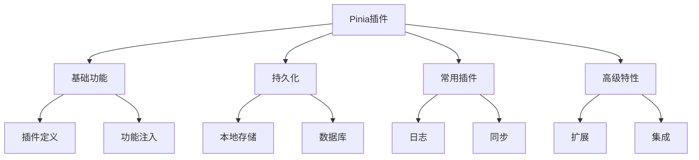

# 持久化与插件

## 插件系统基础

### 基础插件定义

```typescript:c:\project\kphub\src\stores\plugins\basicPlugin.ts
import { PiniaPluginContext } from 'pinia'

export function basicPlugin({ store, options }: PiniaPluginContext) {
  // 扩展store属性
  store.$state.lastUpdated = new Date()

  // 添加新方法
  store.$reset = function() {
    store.$patch((state) => {
      Object.assign(state, options.state())
    })
  }

  // 订阅状态变更
  store.$subscribe((mutation, state) => {
    console.log('状态变更:', {
      type: mutation.type,
      storeId: mutation.storeId,
      payload: mutation.payload
    })
  })

  return { someProperty: 'value' }
}

// 注册插件
import { createPinia } from 'pinia'
const pinia = createPinia()
pinia.use(basicPlugin)
```

## 状态持久化

### LocalStorage持久化实现

```typescript:c:\project\kphub\src\stores\plugins\persistencePlugin.ts
import { PiniaPluginContext } from 'pinia'
import { watch } from 'vue'

interface PersistOptions {
  key?: string
  paths?: string[]
  storage?: Storage
}

export function createPersistPlugin(globalOptions: PersistOptions = {}) {
  return ({ store, options }: PiniaPluginContext) => {
    const {
      key = store.$id,
      paths = null,
      storage = localStorage
    } = globalOptions

    // 恢复状态
    const savedState = storage.getItem(key)
    if (savedState) {
      store.$patch(JSON.parse(savedState))
    }

    // 监听状态变化
    watch(
      () => store.$state,
      (state) => {
        const saveState = paths
          ? paths.reduce((obj, path) => {
              obj[path] = state[path]
              return obj
            }, {})
          : state

        storage.setItem(key, JSON.stringify(saveState))
      },
      { deep: true }
    )
  }
}

// IndexedDB适配器
class IndexedDBStorage {
  private dbName: string
  private storeName: string

  constructor(dbName = 'piniaStore', storeName = 'states') {
    this.dbName = dbName
    this.storeName = storeName
  }

  async getItem(key: string): Promise<string | null> {
    const db = await this.openDB()
    const tx = db.transaction(this.storeName, 'readonly')
    const store = tx.objectStore(this.storeName)
    const result = await store.get(key)
    return result || null
  }

  async setItem(key: string, value: string): Promise<void> {
    const db = await this.openDB()
    const tx = db.transaction(this.storeName, 'readwrite')
    const store = tx.objectStore(this.storeName)
    await store.put(value, key)
  }

  private async openDB(): Promise<IDBDatabase> {
    return new Promise((resolve, reject) => {
      const request = indexedDB.open(this.dbName, 1)

      request.onerror = () => reject(request.error)
      request.onsuccess = () => resolve(request.result)

      request.onupgradeneeded = (event) => {
        const db = (event.target as IDBOpenDBRequest).result
        db.createObjectStore(this.storeName)
      }
    })
  }
}
```

## 常用插件开发

### 日志记录插件

```typescript:c:\project\kphub\src\stores\plugins\loggerPlugin.ts
import { PiniaPluginContext } from 'pinia'

interface LogOptions {
  enabled?: boolean
  filter?: (mutation: any) => boolean
  actionFilter?: (action: string) => boolean
  logger?: typeof console
}

export function createLogger(options: LogOptions = {}) {
  const {
    enabled = true,
    filter = () => true,
    actionFilter = () => true,
    logger = console
  } = options

  return ({ store }: PiniaPluginContext) => {
    if (!enabled) return

    // 状态变更日志
    store.$subscribe((mutation, state) => {
      if (!filter(mutation)) return

      logger.group(`🏪 ${store.$id} - ${mutation.type}`)
      logger.log('prev state:', mutation.oldState)
      logger.log('payload:', mutation.payload)
      logger.log('next state:', state)
      logger.groupEnd()
    })

    // Action执行日志
    const originalActions = {} as Record<string, Function>

    for (const action in store) {
      if (typeof store[action] === 'function') {
        originalActions[action] = store[action]
        store[action] = async function(...args: any[]) {
          if (!actionFilter(action)) {
            return originalActions[action].apply(this, args)
          }

          logger.group(`🎬 ${store.$id} - ${action}`)
          logger.log('args:', args)
          logger.time(action)

          try {
            const result = await originalActions[action].apply(this, args)
            logger.log('result:', result)
            return result
          } catch (error) {
            logger.error('error:', error)
            throw error
          } finally {
            logger.timeEnd(action)
            logger.groupEnd()
          }
        }
      }
    }
  }
}
```

## 高级插件技巧

### 状态同步插件

```typescript:c:\project\kphub\src\stores\plugins\syncPlugin.ts
import { PiniaPluginContext } from 'pinia'
import { ref, watch } from 'vue'

interface SyncOptions {
  syncKey?: string
  broadcastChannel?: string
  storage?: Storage
}

export function createSyncPlugin(options: SyncOptions = {}) {
  const {
    syncKey = 'pinia-sync',
    broadcastChannel = 'pinia-sync-channel',
    storage = sessionStorage
  } = options

  const channel = new BroadcastChannel(broadcastChannel)
  const syncInProgress = ref(false)

  return ({ store }: PiniaPluginContext) => {
    // 监听其他标签页的更新
    channel.onmessage = (event) => {
      if (event.data.storeId === store.$id) {
        syncInProgress.value = true
        store.$patch(event.data.state)
        syncInProgress.value = false
      }
    }

    // 监听本地更新并广播
    watch(
      () => store.$state,
      (state) => {
        if (!syncInProgress.value) {
          channel.postMessage({
            storeId: store.$id,
            state
          })

          // 同步到storage
          storage.setItem(
            `${syncKey}-${store.$id}`,
            JSON.stringify({
              timestamp: Date.now(),
              state
            })
          )
        }
      },
      { deep: true }
    )

    // 页面加载时检查storage
    const savedSync = storage.getItem(`${syncKey}-${store.$id}`)
    if (savedSync) {
      const { timestamp, state } = JSON.parse(savedSync)
      if (Date.now() - timestamp < 30000) { // 30秒内的数据视为有效
        store.$patch(state)
      }
    }

    // 清理函数
    return () => {
      channel.close()
    }
  }
}
```

Pinia插件系统的核心概念包括：

1. 插件基础：
   - 插件定义
   - 状态扩展
   - 功能注入
   - 生命周期

2. 持久化：
   - 本地存储
   - 会话存储
   - 数据库存储
   - 自定义存储

3. 常用插件：
   - 日志记录
   - 状态重置
   - 缓存管理
   - 数据同步

4. 高级特性：
   - 属性扩展
   - 方法包装
   - 状态订阅
   - 系统集成



使用建议：

1. 基础使用：
   - 理解插件机制
   - 选择存储方式
   - 实现基本功能
   - 处理异常情况

2. 进阶技巧：
   - 优化性能
   - 扩展功能
   - 状态同步
   - 调试支持

3. 最佳实践：
   - 模块化设计
   - 错误处理
   - 类型支持
   - 测试策略

通过合理使用Pinia的插件系统，我们可以扩展状态管理的能力，实现更强大的功能。