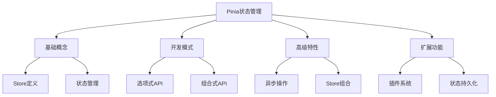

# Pinia状态管理

Pinia是Vue3的官方状态管理库，提供了简单、灵活且类型安全的状态管理解决方案：

## 基础概念与架构
- [Pinia核心概念](./7.1.1-Pinia核心概念.md)：理解Store、State、Getters和Actions等基本概念
- [组合式API风格的Store](./7.1.2-组合式API风格的Store.md)：使用组合式API定义和管理Store

## 高级特性
- [Actions与异步操作](./7.1.3-Actions与异步操作.md)：处理复杂的业务逻辑和异步操作
- [Store组合与复用](./7.1.4-Store组合与复用.md)：组合多个Store并复用通用逻辑
- [持久化与插件](./7.1.5-持久化与插件.md)：扩展Pinia功能并实现状态持久化

主要特点：

1. 核心功能
   - 类型安全
   - 开发工具支持
   - 模块化设计
   - 插件扩展

2. 开发体验
   - 简单直观
   - 灵活组合
   - 代码复用
   - 状态追踪

3. 高级特性
   - 异步处理
   - Store组合
   - 持久化支持
   - 插件系统

学习路径建议：

1. 基础入门
   - 理解核心概念
   - 掌握基本用法
   - 熟悉开发工具
   - 实践简单示例

2. 进阶学习
   - 异步操作处理
   - Store组合技巧
   - 状态持久化
   - 插件开发

3. 最佳实践
   - 项目结构设计
   - 性能优化
   - 测试策略
   - 代码组织

使用场景：

1. 数据管理
   - 用户信息
   - 应用配置
   - 业务数据
   - 缓存管理

2. 状态同步
   - 组件通信
   - 数据共享
   - 状态持久化
   - 多页面同步

3. 业务逻辑
   - 表单处理
   - 数据验证
   - 异步操作
   - 权限控制

通过系统学习Pinia，您将能够：
- 构建可维护的状态管理系统
- 实现复杂的业务逻辑
- 优化应用性能
- 提升开发效率

每个章节都提供了详细的示例和最佳实践，帮助您逐步掌握Pinia的各项功能。建议按照学习路径循序渐进，结合实际项目进行练习。