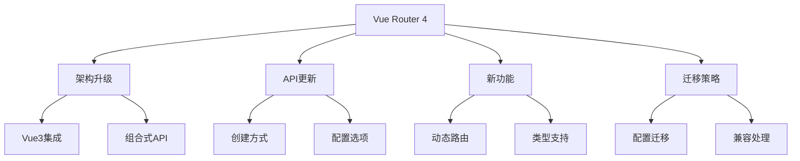

# Vue Router 4新特性

## 架构升级

### 基础路由配置

```typescript:c:\project\kphub\src\router\index.ts
import { createRouter, createWebHistory } from 'vue-router'
import { useUserStore } from '../stores/user'

// 路由配置
const router = createRouter({
  history: createWebHistory(),
  routes: [
    {
      path: '/',
      component: () => import('../views/Home.vue'),
      // 组合式API风格的路由守卫
      beforeEnter: async (to, from) => {
        const userStore = useUserStore()
        if (!userStore.isLoggedIn) {
          return { name: 'login' }
        }
      }
    },
    {
      path: '/about',
      // 动态导入支持 Suspense
      component: () => import('../views/About.vue'),
      // 改进的props传递
      props: route => ({
        id: Number(route.params.id),
        type: route.query.type
      })
    }
  ]
})
```

### 组合式API集成

```typescript:c:\project\kphub\src\composables\useRouting.ts
import { ref, computed } from 'vue'
import { useRouter, useRoute } from 'vue-router'

export function useRouting() {
  const router = useRouter()
  const route = useRoute()
  
  const currentPath = computed(() => route.path)
  const isLoading = ref(false)
  
  // 封装导航方法
  async function navigateTo(path: string) {
    isLoading.value = true
    try {
      await router.push(path)
    } finally {
      isLoading.value = false
    }
  }
  
  // 路由参数处理
  const routeParams = computed(() => ({
    ...route.params,
    ...route.query
  }))
  
  return {
    currentPath,
    isLoading,
    navigateTo,
    routeParams
  }
}
```

## API变化

### 新版路由配置

```typescript:c:\project\kphub\src\router\config.ts
import { RouteRecordRaw } from 'vue-router'

const routes: RouteRecordRaw[] = [
  {
    path: '/users',
    component: () => import('../views/UserList.vue'),
    // 命名视图
    children: [
      {
        path: ':id',
        components: {
          default: () => import('../views/UserProfile.vue'),
          sidebar: () => import('../components/UserSidebar.vue')
        },
        // 改进的props传递
        props: {
          default: true,
          sidebar: route => ({ userId: route.params.id })
        }
      }
    ]
  },
  {
    path: '/products',
    // 动态路由注册
    component: () => import('../views/ProductList.vue'),
    beforeEnter: [checkAuth, checkPermission]
  }
]

// 多重导航守卫
function checkAuth() {
  const userStore = useUserStore()
  if (!userStore.isLoggedIn) {
    return { name: 'login' }
  }
}

function checkPermission(to: any) {
  const userStore = useUserStore()
  if (!userStore.hasPermission(to.meta.requiredPermission)) {
    return false
  }
}

export default routes
```

## 新增功能

### 动态路由管理

```typescript:c:\project\kphub\src\router\dynamic.ts
import { Router } from 'vue-router'

export function setupDynamicRoutes(router: Router) {
  // 动态添加路由
  function addRoute(routeConfig: any) {
    router.addRoute(routeConfig)
  }
  
  // 动态移除路由
  function removeRoute(name: string) {
    router.removeRoute(name)
  }
  
  // 动态更新路由
  function updateRoute(name: string, config: any) {
    removeRoute(name)
    addRoute(config)
  }
  
  // 根据权限动态加载路由
  async function loadAuthRoutes(permissions: string[]) {
    const routes = await fetchAuthRoutes(permissions)
    routes.forEach(route => addRoute(route))
  }
  
  return {
    addRoute,
    removeRoute,
    updateRoute,
    loadAuthRoutes
  }
}

// 模拟获取权限路由
async function fetchAuthRoutes(permissions: string[]) {
  // 实际项目中可能从后端获取
  return [
    {
      path: '/admin',
      component: () => import('../views/Admin.vue'),
      meta: { requiredPermission: 'admin' }
    }
  ]
}
```

## 迁移与兼容性

### 迁移辅助工具

```typescript:c:\project\kphub\src\router\migration.ts
import { Router, RouteLocationNormalized } from 'vue-router'

// 兼容 Vue Router 3 的导航守卫
export function createCompatGuard(router: Router) {
  return (to: RouteLocationNormalized, from: RouteLocationNormalized) => {
    // 处理旧版导航守卫
    const guard = (to: any, from: any, next: any) => {
      // 转换为新版Promise形式
      return new Promise((resolve) => {
        next((path?: any) => {
          resolve(path)
        })
      })
    }
    
    return guard(to, from, () => {})
  }
}

// 路由配置迁移助手
export function migrateRouteConfig(oldConfig: any) {
  return {
    ...oldConfig,
    // 更新组件定义方式
    component: typeof oldConfig.component === 'object'
      ? () => Promise.resolve(oldConfig.component)
      : oldConfig.component,
    // 转换导航守卫
    beforeEnter: oldConfig.beforeEnter
      ? createCompatGuard(oldConfig.beforeEnter)
      : undefined
  }
}
```

Vue Router 4的主要特点包括：

1. 架构升级：
   - Vue3集成
   - 组合式API
   - TypeScript
   - 性能提升

2. API更新：
   - 创建方式
   - 配置选项
   - 导航守卫
   - 路由传参

3. 新功能：
   - 动态路由
   - 命名视图
   - 类型推导
   - 导航控制

4. 迁移策略：
   - 配置更新
   - 兼容处理
   - 渐进升级
   - 问题解决



使用建议：

1. 基础使用：
   - 掌握新API
   - 理解配置项
   - 使用组合式API
   - 处理类型定义

2. 进阶技巧：
   - 动态路由管理
   - 导航守卫优化
   - 性能提升
   - 代码组织

3. 最佳实践：
   - 渐进式迁移
   - 类型安全
   - 代码复用
   - 测试策略

通过合理使用Vue Router 4的新特性，我们可以构建出更强大、更易维护的路由系统。