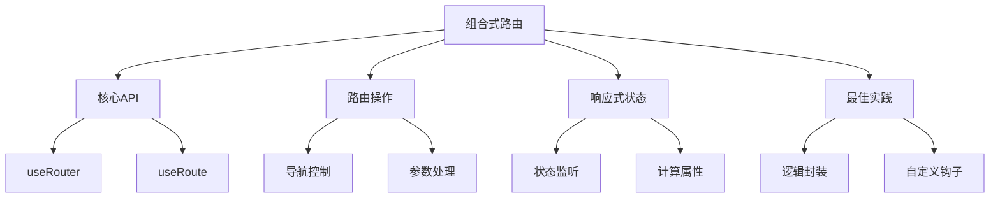

# 组合式API中的路由

## 核心组合式API

### 基础路由使用

```vue:c:\project\kphub\src\components\router\BasicRouting.vue
<script setup lang="ts">
import { useRouter, useRoute } from 'vue-router'
import { computed } from 'vue'

// 获取路由实例和当前路由
const router = useRouter()
const route = useRoute()

// 计算当前路由信息
const currentPath = computed(() => route.path)
const routeParams = computed(() => route.params)
const routeQuery = computed(() => route.query)

// 路由导航方法
async function navigateTo(path: string) {
  try {
    await router.push(path)
  } catch (error) {
    console.error('导航失败:', error)
  }
}
</script>

<template>
  <div class="route-info">
    <p>当前路径: {{ currentPath }}</p>
    <p>路由参数: {{ routeParams }}</p>
    <p>查询参数: {{ routeQuery }}</p>
    
    <button @click="navigateTo('/home')">
      首页
    </button>
  </div>
</template>
```

## 路由操作

### 高级路由控制

```typescript:c:\project\kphub\src\composables\useRouteControl.ts
import { useRouter, useRoute } from 'vue-router'
import { ref, computed } from 'vue'

export function useRouteControl() {
  const router = useRouter()
  const route = useRoute()
  const navigationError = ref<Error | null>(null)
  
  // 导航历史
  const history = ref<string[]>([])
  
  // 编程式导航
  async function navigate(to: string | { path: string; query?: Record<string, any> }) {
    try {
      navigationError.value = null
      const result = await router.push(to)
      history.value.push(typeof to === 'string' ? to : to.path)
      return result
    } catch (error) {
      navigationError.value = error as Error
      throw error
    }
  }
  
  // 参数处理
  const routeParams = computed(() => {
    return Object.entries(route.params).reduce((params, [key, value]) => {
      params[key] = Array.isArray(value) ? value[0] : value
      return params
    }, {} as Record<string, string>)
  })
  
  // 查询参数处理
  function updateQuery(query: Record<string, any>) {
    return router.replace({
      query: {
        ...route.query,
        ...query
      }
    })
  }
  
  // 历史管理
  function goBack() {
    if (history.value.length > 1) {
      history.value.pop()
      return router.back()
    }
    return router.push('/')
  }
  
  return {
    navigate,
    updateQuery,
    goBack,
    routeParams,
    navigationError,
    history
  }
}
```

## 响应式路由状态

### 路由状态监听

```vue:c:\project\kphub\src\components\router\RouteWatcher.vue
<script setup lang="ts">
import { useRoute } from 'vue-router'
import { watch, computed, onMounted } from 'vue'

const route = useRoute()

// 路由参数监听
watch(
  () => route.params,
  (newParams) => {
    console.log('路由参数变化:', newParams)
  },
  { deep: true }
)

// 查询参数监听
watch(
  () => route.query,
  (newQuery) => {
    console.log('查询参数变化:', newQuery)
  },
  { deep: true }
)

// 基于路由的计算属性
const pageTitle = computed(() => {
  return route.meta.title || '默认标题'
})

const isAuthenticated = computed(() => {
  return route.meta.requiresAuth === true
})

// 组件挂载时处理
onMounted(() => {
  // 初始化路由状态
  console.log('当前路由:', route.fullPath)
})
</script>

<template>
  <div class="route-watcher">
    <h1>{{ pageTitle }}</h1>
    <div v-if="isAuthenticated">
      需要认证的页面
    </div>
  </div>
</template>
```

## 最佳实践

### 自定义路由钩子

```typescript:c:\project\kphub\src\composables\useRouteGuard.ts
import { useRouter, useRoute } from 'vue-router'
import { onBeforeRouteLeave, onBeforeRouteUpdate } from 'vue-router'
import { ref } from 'vue'
import { useUserStore } from '../stores/user'

export function useRouteGuard() {
  const hasUnsavedChanges = ref(false)
  const userStore = useUserStore()
  
  // 路由离开守卫
  onBeforeRouteLeave((to, from) => {
    if (hasUnsavedChanges.value) {
      const confirm = window.confirm('有未保存的更改，确定要离开吗？')
      if (!confirm) return false
    }
  })
  
  // 路由更新守卫
  onBeforeRouteUpdate(async (to, from) => {
    // 检查权限
    if (to.meta.requiresAuth && !userStore.isLoggedIn) {
      return { name: 'login', query: { redirect: to.fullPath } }
    }
    
    // 更新组件数据
    if (to.params.id !== from.params.id) {
      await loadData(to.params.id as string)
    }
  })
  
  // 模拟数据加载
  async function loadData(id: string) {
    console.log('加载数据:', id)
  }
  
  return {
    hasUnsavedChanges
  }
}
```

组合式API中的路由主要包括：

1. 核心API：
   - useRouter
   - useRoute
   - 路由实例
   - 当前路由

2. 路由操作：
   - 导航控制
   - 参数处理
   - 查询参数
   - 历史管理

3. 响应式状态：
   - 路由监听
   - 计算属性
   - 状态同步
   - 生命周期

4. 最佳实践：
   - 逻辑封装
   - 自定义钩子
   - 状态集成
   - 代码测试



使用建议：

1. 基础使用：
   - 掌握核心API
   - 理解响应式
   - 处理导航
   - 管理参数

2. 进阶技巧：
   - 封装复用逻辑
   - 优化性能
   - 错误处理
   - 状态同步

3. 最佳实践：
   - 模块化设计
   - 类型支持
   - 测试策略
   - 代码组织

通过合理使用组合式API中的路由功能，我们可以构建出更易维护、更灵活的路由系统。