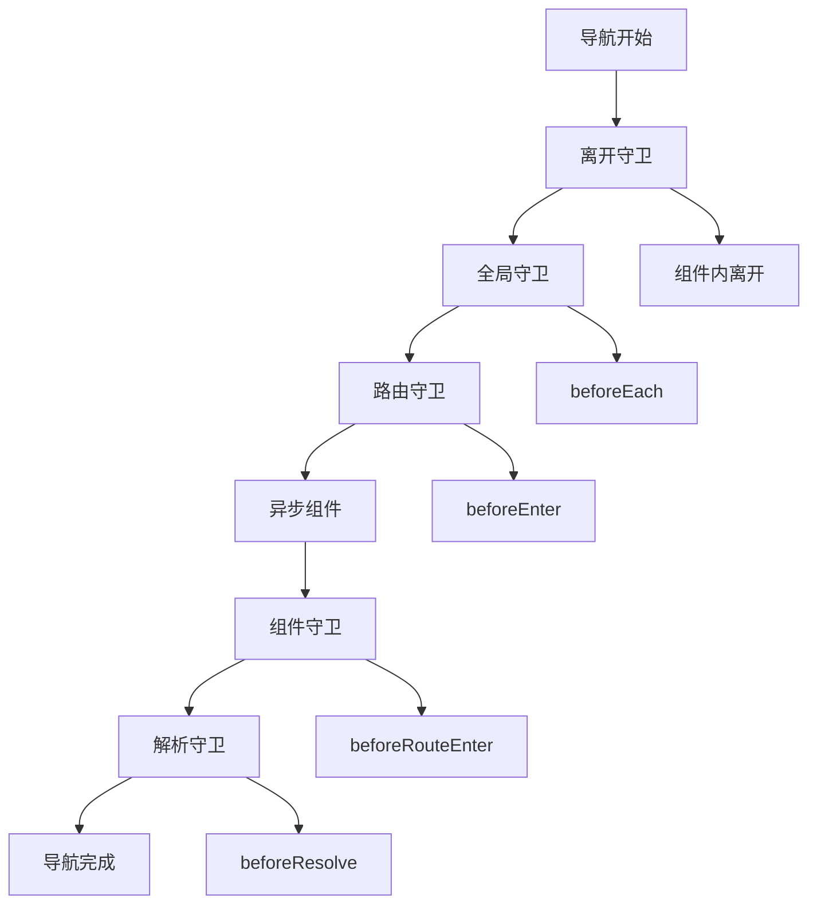

# 导航守卫体系

## 全局导航守卫

### 基础守卫配置

```typescript:c:\project\kphub\src\router\guards\globalGuards.ts
import { Router, RouteLocationNormalized } from 'vue-router'
import { useUserStore } from '../../stores/user'

export function setupGlobalGuards(router: Router) {
  // 全局前置守卫
  router.beforeEach(async (to, from) => {
    const userStore = useUserStore()
    
    // 权限检查
    if (to.meta.requiresAuth && !userStore.isLoggedIn) {
      return {
        path: '/login',
        query: { redirect: to.fullPath }
      }
    }
    
    // 角色检查
    if (to.meta.roles && !userStore.hasRole(to.meta.roles)) {
      return { path: '/403' }
    }
  })

  // 全局解析守卫
  router.beforeResolve(async (to) => {
    try {
      // 处理异步组件和数据
      await loadAsyncComponents(to)
      await loadRouteData(to)
    } catch (error) {
      return false
    }
  })

  // 全局后置钩子
  router.afterEach((to, from) => {
    // 更新页面标题
    document.title = to.meta.title || '默认标题'
    
    // 记录路由历史
    logRouteChange(to, from)
  })
}

// 异步组件加载
async function loadAsyncComponents(to: RouteLocationNormalized) {
  return Promise.all(
    to.matched.map(record => {
      const component = record.components?.default
      return typeof component === 'function'
        ? component()
        : Promise.resolve()
    })
  )
}

// 路由数据预加载
async function loadRouteData(to: RouteLocationNormalized) {
  const dataLoaders = to.matched
    .map(record => record.meta.dataLoader)
    .filter(Boolean)
    
  return Promise.all(
    dataLoaders.map(loader => loader(to))
  )
}

// 路由变更日志
function logRouteChange(
  to: RouteLocationNormalized,
  from: RouteLocationNormalized
) {
  console.log('路由变更:', {
    from: from.fullPath,
    to: to.fullPath,
    timestamp: new Date().toISOString()
  })
}
```

## 路由级别守卫

### 路由独享守卫

```typescript:c:\project\kphub\src\router\guards\routeGuards.ts
import { RouteRecordRaw } from 'vue-router'
import { useUserStore } from '../../stores/user'

// 创建路由守卫
export function createRouteGuard(permission: string) {
  return async function guard(to: any, from: any) {
    const userStore = useUserStore()
    
    if (!userStore.hasPermission(permission)) {
      return { path: '/403' }
    }
  }
}

// 路由配置示例
export const routes: RouteRecordRaw[] = [
  {
    path: '/admin',
    component: () => import('../../views/Admin.vue'),
    beforeEnter: [
      createRouteGuard('admin'),
      async (to) => {
        // 加载管理员数据
        await loadAdminData()
      }
    ]
  },
  {
    path: '/profile',
    component: () => import('../../views/Profile.vue'),
    beforeEnter: async (to) => {
      const userStore = useUserStore()
      
      // 检查用户状态
      if (!userStore.isProfileComplete) {
        return {
          path: '/complete-profile',
          query: { redirect: to.fullPath }
        }
      }
    }
  }
]

// 模拟数据加载
async function loadAdminData() {
  return new Promise(resolve => setTimeout(resolve, 100))
}
```

## 组件内守卫

### 组合式API守卫

```vue:c:\project\kphub\src\components\router\ComponentGuards.vue
<script setup lang="ts">
import { ref } from 'vue'
import { onBeforeRouteLeave, onBeforeRouteUpdate } from 'vue-router'

const hasUnsavedChanges = ref(false)
const formData = ref({})

// 路由离开守卫
onBeforeRouteLeave((to, from) => {
  if (hasUnsavedChanges.value) {
    const answer = window.confirm('有未保存的更改，确定要离开吗？')
    if (!answer) return false
  }
})

// 路由更新守卫
onBeforeRouteUpdate(async (to, from) => {
  // 参数变化时重新加载数据
  if (to.params.id !== from.params.id) {
    await loadData(to.params.id as string)
  }
})

// 数据加载
async function loadData(id: string) {
  try {
    const response = await fetch(`/api/data/${id}`)
    formData.value = await response.json()
  } catch (error) {
    console.error('数据加载失败:', error)
  }
}

// 表单提交
async function submitForm() {
  await saveData()
  hasUnsavedChanges.value = false
}
</script>

<template>
  <form @submit.prevent="submitForm">
    <!-- 表单内容 -->
  </form>
</template>
```

## 完整导航解析流程

### 导航流程管理

```typescript:c:\project\kphub\src\router\guards\navigationProcess.ts
import { Router, RouteLocationNormalized } from 'vue-router'

export function setupNavigationProcess(router: Router) {
  // 导航开始
  let navigationStartTime: number

  // 1. 导航触发
  router.beforeEach((to, from) => {
    navigationStartTime = Date.now()
    console.log('1. 导航开始')
  })

  // 2. 离开组件守卫
  router.beforeEach(async (to, from) => {
    console.log('2. 调用离开组件守卫')
    await runLeaveGuards(from)
  })

  // 3. 全局前置守卫
  router.beforeEach(async (to, from) => {
    console.log('3. 全局前置守卫')
    await checkGlobalConditions(to)
  })

  // 4. 路由独享守卫
  router.beforeEach(async (to, from) => {
    console.log('4. 路由独享守卫')
    await runRouteGuards(to)
  })

  // 5. 解析异步组件
  router.beforeResolve(async (to) => {
    console.log('5. 解析异步组件')
    await loadAsyncComponents(to)
  })

  // 6. 组件内进入守卫
  router.beforeResolve(async (to) => {
    console.log('6. 组件内进入守卫')
    await runEnterGuards(to)
  })

  // 7. 全局解析守卫
  router.beforeResolve(async (to) => {
    console.log('7. 全局解析守卫')
    await finalCheck(to)
  })

  // 8. 导航确认
  router.afterEach((to, from) => {
    const navigationTime = Date.now() - navigationStartTime
    console.log(`8. 导航完成，耗时: ${navigationTime}ms`)
  })
}

// 辅助函数
async function runLeaveGuards(route: RouteLocationNormalized) {
  // 执行组件内的 beforeRouteLeave 守卫
}

async function checkGlobalConditions(route: RouteLocationNormalized) {
  // 检查全局条件
}

async function runRouteGuards(route: RouteLocationNormalized) {
  // 执行路由配置中的 beforeEnter 守卫
}

async function loadAsyncComponents(route: RouteLocationNormalized) {
  // 加载异步组件
}

async function runEnterGuards(route: RouteLocationNormalized) {
  // 执行组件内的 beforeRouteEnter 守卫
}

async function finalCheck(route: RouteLocationNormalized) {
  // 最终检查
}
```

Vue Router的导航守卫系统包括：

1. 全局守卫：
   - beforeEach
   - beforeResolve
   - afterEach
   - 执行顺序

2. 路由守卫：
   - beforeEnter
   - 配置方式
   - 动态守卫
   - 守卫复用

3. 组件守卫：
   - 进入守卫
   - 更新守卫
   - 离开守卫
   - 组合式API

4. 导航流程：
   - 触发导航
   - 守卫检查
   - 组件解析
   - 导航完成



使用建议：

1. 基础使用：
   - 理解执行顺序
   - 选择合适守卫
   - 处理异步逻辑
   - 控制导航流程

2. 进阶技巧：
   - 守卫复用
   - 数据预加载
   - 权限控制
   - 性能优化

3. 最佳实践：
   - 职责划分
   - 错误处理
   - 类型支持
   - 代码组织

通过合理使用导航守卫，我们可以构建出安全、可控的路由系统。