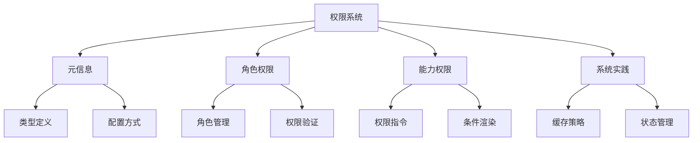

# 路由元信息与权限

## 路由元信息基础

### 类型定义

```typescript:c:\project\kphub\src\router\types\meta.ts
import 'vue-router'

// 扩展路由元信息类型
declare module 'vue-router' {
  interface RouteMeta {
    title?: string
    requiresAuth?: boolean
    roles?: string[]
    permissions?: string[]
    layout?: string
    icon?: string
    order?: number
    breadcrumb?: boolean
    cache?: boolean
  }
}

// 元信息配置接口
export interface MetaConfig {
  title: string
  requiresAuth: boolean
  roles?: string[]
  permissions?: string[]
}
```

### 基础路由配置

```typescript:c:\project\kphub\src\router\routes\index.ts
import { RouteRecordRaw } from 'vue-router'

export const routes: RouteRecordRaw[] = [
  {
    path: '/dashboard',
    component: () => import('../../views/Dashboard.vue'),
    meta: {
      title: '仪表盘',
      requiresAuth: true,
      roles: ['admin', 'user'],
      permissions: ['dashboard:view'],
      layout: 'default',
      icon: 'dashboard',
      order: 1,
      breadcrumb: true,
      cache: true
    },
    children: [
      {
        path: 'analysis',
        component: () => import('../../views/Analysis.vue'),
        meta: {
          title: '分析页',
          permissions: ['dashboard:analysis']
        }
      }
    ]
  }
]
```

## 基于角色的权限控制

### 角色权限管理

```typescript:c:\project\kphub\src\auth\roleBasedAuth.ts
import { useUserStore } from '../stores/user'
import { RouteLocationNormalized } from 'vue-router'

export class RoleBasedAuth {
  // 角色权限映射
  private static rolePermissions = new Map<string, Set<string>>([
    ['admin', new Set(['*'])],
    ['manager', new Set(['user:manage', 'content:manage'])],
    ['user', new Set(['content:view', 'profile:edit'])]
  ])

  // 检查路由访问权限
  static checkRouteAccess(route: RouteLocationNormalized): boolean {
    const userStore = useUserStore()
    const { roles, requiresAuth } = route.meta

    // 不需要认证的路由
    if (!requiresAuth) return true

    // 检查用户角色
    if (roles && roles.length > 0) {
      return roles.some(role => userStore.hasRole(role))
    }

    return true
  }

  // 获取角色权限
  static getRolePermissions(role: string): Set<string> {
    return this.rolePermissions.get(role) || new Set()
  }

  // 验证具体权限
  static hasPermission(permission: string): boolean {
    const userStore = useUserStore()
    return userStore.roles.some(role => {
      const permissions = this.getRolePermissions(role)
      return permissions.has('*') || permissions.has(permission)
    })
  }
}
```

## 基于能力的权限控制

### 权限指令实现

```typescript:c:\project\kphub\src\directives\permission.ts
import { DirectiveBinding } from 'vue'
import { RoleBasedAuth } from '../auth/roleBasedAuth'

export const permission = {
  mounted(el: HTMLElement, binding: DirectiveBinding) {
    const { value } = binding
    
    // 权限验证
    const hasPermission = checkPermission(value)
    
    if (!hasPermission) {
      el.parentNode?.removeChild(el)
    }
  }
}

// 权限检查逻辑
function checkPermission(value: string | string[]): boolean {
  if (typeof value === 'string') {
    return RoleBasedAuth.hasPermission(value)
  }
  
  if (Array.isArray(value)) {
    return value.some(permission => 
      RoleBasedAuth.hasPermission(permission)
    )
  }
  
  return false
}

// 使用示例
/*
<button v-permission="'user:delete'">删除用户</button>
<div v-permission="['content:edit', 'content:publish']">
  内容管理
</div>
*/
```

## 权限系统最佳实践

### 权限管理系统

```typescript:c:\project\kphub\src\auth\permissionManager.ts
import { ref, watch } from 'vue'
import { useRouter } from 'vue-router'
import { useUserStore } from '../stores/user'

export class PermissionManager {
  private static instance: PermissionManager
  private permissionCache = new Map<string, boolean>()
  private router = useRouter()
  private userStore = useUserStore()
  
  // 权限加载状态
  private loading = ref(false)
  
  constructor() {
    // 监听用户状态变化
    watch(
      () => this.userStore.user,
      () => this.clearPermissionCache()
    )
  }
  
  // 单例模式
  static getInstance(): PermissionManager {
    if (!this.instance) {
      this.instance = new PermissionManager()
    }
    return this.instance
  }
  
  // 加载权限数据
  async loadPermissions(): Promise<void> {
    if (this.loading.value) return
    
    this.loading.value = true
    try {
      const permissions = await this.fetchUserPermissions()
      this.updatePermissions(permissions)
    } finally {
      this.loading.value = false
    }
  }
  
  // 检查权限
  checkPermission(permission: string): boolean {
    // 检查缓存
    if (this.permissionCache.has(permission)) {
      return this.permissionCache.get(permission)!
    }
    
    const result = RoleBasedAuth.hasPermission(permission)
    this.permissionCache.set(permission, result)
    return result
  }
  
  // 清除权限缓存
  private clearPermissionCache(): void {
    this.permissionCache.clear()
  }
  
  // 模拟获取用户权限
  private async fetchUserPermissions(): Promise<string[]> {
    return new Promise(resolve => {
      setTimeout(() => {
        resolve(['user:view', 'content:edit'])
      }, 300)
    })
  }
  
  // 更新权限数据
  private updatePermissions(permissions: string[]): void {
    this.userStore.$patch({
      permissions
    })
  }
}
```

路由元信息与权限系统包括：

1. 元信息基础：
   - 类型定义
   - 配置方式
   - 访问方法
   - 继承规则

2. 角色权限：
   - 角色定义
   - 权限配置
   - 访问控制
   - 权限验证

3. 能力权限：
   - 权限定义
   - 指令实现
   - 权限组合
   - 渲染控制

4. 最佳实践：
   - 数据管理
   - 缓存策略
   - 状态更新
   - 用户体验



使用建议：

1. 基础使用：
   - 定义元信息
   - 配置权限
   - 实现验证
   - 处理反馈

2. 进阶技巧：
   - 权限缓存
   - 动态更新
   - 性能优化
   - 用户体验

3. 最佳实践：
   - 模块化设计
   - 错误处理
   - 类型支持
   - 测试策略

通过合理使用路由元信息与权限系统，我们可以构建出安全、可控的应用访问控制系统。