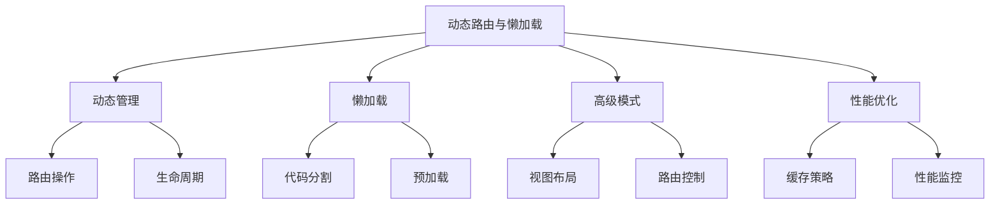

# 动态路由与懒加载

## 动态路由管理

### 动态路由控制器

```typescript:c:\project\kphub\src\router\dynamic\routeManager.ts
import { Router, RouteRecordRaw } from 'vue-router'
import { ref, watch } from 'vue'

export class RouteManager {
  private router: Router
  private dynamicRoutes = ref<RouteRecordRaw[]>([])

  constructor(router: Router) {
    this.router = router
    
    // 监听路由变化
    watch(this.dynamicRoutes, (routes) => {
      console.log('动态路由更新:', routes.length)
    })
  }

  // 添加路由
  async addRoute(route: RouteRecordRaw) {
    try {
      // 检查路由是否已存在
      if (this.router.hasRoute(route.name as string)) {
        console.warn(`路由 ${route.name} 已存在`)
        return false
      }

      // 添加路由
      this.router.addRoute(route)
      this.dynamicRoutes.value.push(route)
      
      return true
    } catch (error) {
      console.error('添加路由失败:', error)
      return false
    }
  }

  // 移除路由
  removeRoute(name: string) {
    try {
      this.router.removeRoute(name)
      this.dynamicRoutes.value = this.dynamicRoutes.value
        .filter(route => route.name !== name)
      
      return true
    } catch (error) {
      console.error('移除路由失败:', error)
      return false
    }
  }

  // 更新路由
  async updateRoute(name: string, newRoute: RouteRecordRaw) {
    this.removeRoute(name)
    return this.addRoute(newRoute)
  }

  // 清理所有动态路由
  clearDynamicRoutes() {
    this.dynamicRoutes.value.forEach(route => {
      if (route.name) {
        this.removeRoute(route.name as string)
      }
    })
    this.dynamicRoutes.value = []
  }
}
```

## 路由懒加载

### Webpack懒加载配置

```typescript:c:\project\kphub\src\router\lazy\webpackRoutes.ts
import { RouteRecordRaw } from 'vue-router'

export const routes: RouteRecordRaw[] = [
  {
    path: '/dashboard',
    // 基础懒加载
    component: () => import(
      /* webpackChunkName: "dashboard" */
      '../../views/Dashboard.vue'
    )
  },
  {
    path: '/users',
    // 带注释的懒加载
    component: () => import(
      /* webpackChunkName: "users" */
      /* webpackPrefetch: true */
      '../../views/Users.vue'
    )
  },
  {
    path: '/settings',
    // 条件懒加载
    component: () => {
      if (process.env.NODE_ENV === 'development') {
        return import(
          /* webpackChunkName: "settings-dev" */
          '../../views/Settings.dev.vue'
        )
      }
      return import(
        /* webpackChunkName: "settings-prod" */
        '../../views/Settings.prod.vue'
      )
    }
  }
]
```

### Vite懒加载实现

```typescript:c:\project\kphub\src\router\lazy\viteRoutes.ts
import { RouteRecordRaw } from 'vue-router'

export const routes: RouteRecordRaw[] = [
  {
    path: '/products',
    component: () => import('../../views/Products.vue'),
    // 嵌套懒加载
    children: [
      {
        path: ':id',
        components: {
          default: () => import('../../views/ProductDetail.vue'),
          sidebar: () => import('../../components/ProductSidebar.vue')
        }
      }
    ]
  },
  {
    path: '/reports',
    // 动态导入带错误处理
    component: async () => {
      try {
        return await import('../../views/Reports.vue')
      } catch (error) {
        console.error('加载报表组件失败:', error)
        return import('../../views/ErrorPage.vue')
      }
    }
  }
]
```

## 高级路由模式

### 命名视图与布局

```typescript:c:\project\kphub\src\router\advanced\layoutRoutes.ts
import { RouteRecordRaw } from 'vue-router'

export const routes: RouteRecordRaw[] = [
  {
    path: '/',
    // 多命名视图布局
    components: {
      default: () => import('../../layouts/DefaultLayout.vue'),
      header: () => import('../../components/Header.vue'),
      sidebar: () => import('../../components/Sidebar.vue')
    },
    children: [
      {
        path: 'profile',
        components: {
          default: () => import('../../views/Profile.vue'),
          sidebar: () => import('../../components/ProfileSidebar.vue')
        },
        // 路由别名
        alias: ['/my-profile', '/user-profile']
      }
    ]
  },
  {
    path: '/old-path',
    // 路由重定向
    redirect: to => {
      return {
        path: '/new-path',
        query: { ...to.query, redirected: 'true' }
      }
    }
  }
]
```

## 性能优化

### 路由性能优化

```typescript:c:\project\kphub\src\router\performance\routeOptimizer.ts
import { Router, RouteLocationNormalized } from 'vue-router'

export class RouteOptimizer {
  private router: Router
  private routeCache = new Map<string, any>()
  private prefetchQueue: string[] = []

  constructor(router: Router) {
    this.router = router
    this.setupPerformanceMonitoring()
  }

  // 性能监控
  private setupPerformanceMonitoring() {
    let navigationStart: number

    this.router.beforeEach(() => {
      navigationStart = performance.now()
    })

    this.router.afterEach((to) => {
      const navigationTime = performance.now() - navigationStart
      this.logNavigation(to, navigationTime)
    })
  }

  // 路由预取
  async prefetchRoute(routePath: string) {
    if (this.routeCache.has(routePath)) {
      return this.routeCache.get(routePath)
    }

    try {
      const route = this.router.resolve(routePath)
      const component = await route.matched[0]?.components?.default()
      this.routeCache.set(routePath, component)
      return component
    } catch (error) {
      console.error('路由预取失败:', error)
    }
  }

  // 智能预取
  setupSmartPrefetch() {
    this.router.beforeEach((to) => {
      // 预取下一级路由
      const childRoutes = to.matched[0]?.children || []
      childRoutes.forEach(route => {
        if (route.path) {
          this.prefetchQueue.push(route.path)
        }
      })

      // 限制队列大小
      if (this.prefetchQueue.length > 10) {
        this.prefetchQueue = this.prefetchQueue.slice(-10)
      }
    })
  }

  // 记录导航性能
  private logNavigation(
    to: RouteLocationNormalized,
    time: number
  ) {
    console.log(`导航到 ${to.path} 耗时: ${time.toFixed(2)}ms`)
  }
}
```

动态路由与懒加载的核心概念包括：

1. 动态路由：
   - 路由添加
   - 路由移除
   - 路由更新
   - 生命周期

2. 懒加载：
   - Webpack配置
   - Vite支持
   - 分包优化
   - 预加载

3. 高级模式：
   - 嵌套路由
   - 命名视图
   - 路由别名
   - 重定向

4. 性能优化：
   - 缓存策略
   - 性能监控
   - 预取机制
   - 代码分割



使用建议：

1. 基础使用：
   - 理解动态路由
   - 实现懒加载
   - 配置高级模式
   - 优化性能

2. 进阶技巧：
   - 智能预取
   - 缓存管理
   - 错误处理
   - 性能监控

3. 最佳实践：
   - 模块化设计
   - 代码组织
   - 类型支持
   - 测试策略

通过合理使用动态路由与懒加载，我们可以构建出高性能、可扩展的路由系统。