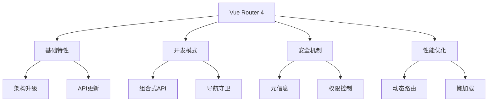

# Vue Router 4

Vue Router 4是Vue3的官方路由库，提供了全面的路由管理解决方案：

## 基础特性与架构
- [Vue Router 4新特性](./7.2.1-Vue-Router-4新特性.md)：了解架构升级、API变化和新增功能
- [组合式API中的路由](./7.2.2-组合式API中的路由.md)：掌握组合式API风格的路由使用方法

## 进阶功能
- [导航守卫体系](./7.2.3-导航守卫体系.md)：深入理解导航守卫的工作机制
- [路由元信息与权限](./7.2.4-路由元信息与权限.md)：实现基于路由的权限控制
- [动态路由与懒加载](./7.2.5-动态路由与懒加载.md)：优化路由性能与加载策略

主要特点：

1. 架构升级
   - Vue3深度集成
   - TypeScript重写
   - 性能优化
   - 开发体验提升

2. 开发模式
   - 组合式API支持
   - 类型安全
   - 导航控制
   - 状态管理

3. 功能增强
   - 动态路由
   - 权限管理
   - 懒加载优化
   - 导航守卫

学习路径建议：

1. 基础入门
   - 了解新特性
   - 掌握基本用法
   - 理解核心概念
   - 实践简单示例

2. 进阶学习
   - 导航守卫系统
   - 权限控制实现
   - 动态路由管理
   - 性能优化策略

3. 最佳实践
   - 项目结构设计
   - 代码组织优化
   - 测试策略制定
   - 性能监控方案

使用场景：

1. 路由管理
   - 页面导航
   - 参数处理
   - 路由嵌套
   - 视图切换

2. 权限控制
   - 访问控制
   - 角色管理
   - 动态权限
   - 导航守卫

3. 性能优化
   - 代码分割
   - 懒加载
   - 预加载
   - 缓存策略

通过系统学习Vue Router 4，您将能够：
- 构建现代化的路由系统
- 实现复杂的导航控制
- 管理应用权限
- 优化应用性能

每个章节都提供了详细的示例和最佳实践，帮助您逐步掌握Vue Router 4的各项功能。建议按照学习路径循序渐进，结合实际项目进行练习。