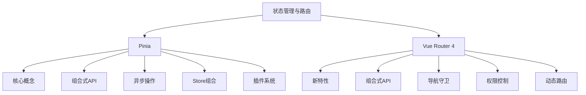

# 状态管理与路由

## Pinia状态管理
Pinia是Vue3的官方状态管理解决方案，提供了简单、灵活且类型安全的API：

- [Pinia核心概念](./7.1-Pinia状态管理/7.1.1-Pinia核心概念.md)：理解Store、State、Getters等基础概念
- [组合式API风格的Store](./7.1-Pinia状态管理/7.1.2-组合式API风格的Store.md)：使用组合式API定义和管理Store
- [Actions与异步操作](./7.1-Pinia状态管理/7.1.3-Actions与异步操作.md)：处理复杂的业务逻辑和异步操作
- [Store组合与复用](./7.1-Pinia状态管理/7.1.4-Store组合与复用.md)：组合多个Store并复用通用逻辑
- [持久化与插件](./7.1-Pinia状态管理/7.1.5-持久化与插件.md)：扩展Pinia功能并实现状态持久化

## Vue Router 4
Vue Router 4是Vue3的官方路由库，提供了全面的路由管理解决方案：

- [Vue Router 4新特性](./7.2-Vue-Router-4/7.2.1-Vue-Router-4新特性.md)：了解架构升级、API变化和新增功能
- [组合式API中的路由](./7.2-Vue-Router-4/7.2.2-组合式API中的路由.md)：掌握组合式API风格的路由使用方法
- [导航守卫体系](./7.2-Vue-Router-4/7.2.3-导航守卫体系.md)：深入理解导航守卫的工作机制
- [路由元信息与权限](./7.2-Vue-Router-4/7.2.4-路由元信息与权限.md)：实现基于路由的权限控制
- [动态路由与懒加载](./7.2-Vue-Router-4/7.2.5-动态路由与懒加载.md)：优化路由性能与加载策略

主要特点：

1. Pinia特性
   - 类型安全
   - 组合式API
   - 模块化设计
   - 插件扩展
   - 开发工具支持

2. Vue Router特性
   - Vue3深度集成
   - 组合式API支持
   - 导航控制
   - 权限管理
   - 性能优化

学习路径建议：

1. Pinia入门
   - 理解核心概念
   - 掌握基本用法
   - 处理异步操作
   - 实现Store组合
   - 使用插件系统

2. Vue Router进阶
   - 了解新特性
   - 使用组合式API
   - 配置导航守卫
   - 实现权限控制
   - 优化路由性能

应用场景：

1. 状态管理
   - 用户信息管理
   - 全局配置管理
   - 数据缓存管理
   - 多组件状态共享
   - 复杂业务逻辑

2. 路由控制
   - 页面导航
   - 权限控制
   - 动态路由
   - 路由懒加载
   - 导航守卫

通过系统学习本章节，您将能够：
- 构建可维护的状态管理系统
- 实现灵活的路由控制
- 处理复杂的业务逻辑
- 优化应用性能
- 提升开发效率

建议按照学习路径循序渐进，结合实际项目进行练习，加深对状态管理和路由系统的理解。