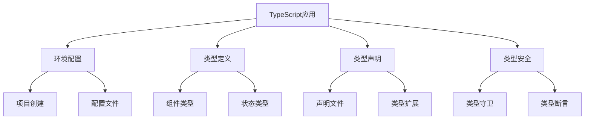

# TypeScript在Vue3中的应用

## 环境搭建

### 项目初始化

```bash:c:\project\kphub
npm create vue@latest
```

### TypeScript配置

```json:c:\project\kphub\tsconfig.json
{
  "compilerOptions": {
    "target": "esnext",
    "module": "esnext",
    "strict": true,
    "jsx": "preserve",
    "moduleResolution": "node",
    "skipLibCheck": true,
    "esModuleInterop": true,
    "allowSyntheticDefaultImports": true,
    "forceConsistentCasingInFileNames": true,
    "useDefineForClassFields": true,
    "sourceMap": true,
    "baseUrl": ".",
    "paths": {
      "@/*": ["src/*"]
    },
    "lib": ["esnext", "dom", "dom.iterable", "scripthost"]
  },
  "include": [
    "src/**/*.ts",
    "src/**/*.tsx",
    "src/**/*.vue",
    "tests/**/*.ts",
    "tests/**/*.tsx"
  ],
  "exclude": ["node_modules"]
}
```

## 基础类型定义

### 组件类型定义

```typescript:c:\project\kphub\src\types\components.ts
// Props类型定义
interface UserProps {
  id: number
  name: string
  age?: number
  role: 'admin' | 'user'
  settings: Record<string, unknown>
}

// 事件类型定义
interface UserEvents {
  (e: 'update', id: number, data: Partial<UserProps>): void
  (e: 'delete', id: number): void
}

// 组件暴露的方法类型
interface UserMethods {
  reload(): Promise<void>
  validate(): boolean
}
```

### 组件使用示例

```vue:c:\project\kphub\src\components\UserProfile.vue
<script setup lang="ts">
import { ref, computed } from 'vue'
import type { UserProps, UserEvents, UserMethods } from '../types/components'

// Props定义
const props = defineProps<UserProps>()

// 事件定义
const emit = defineEmits<UserEvents>()

// 响应式状态
const isEditing = ref<boolean>(false)
const formData = ref<Partial<UserProps>>({})

// 计算属性
const displayName = computed<string>(() => {
  return `${props.name} (${props.role})`
})

// 方法定义
const methods: UserMethods = {
  async reload() {
    // 实现重新加载逻辑
  },
  validate() {
    return true
  }
}

// 暴露方法
defineExpose(methods)

// 事件处理
function handleUpdate() {
  emit('update', props.id, formData.value)
}
</script>

<template>
  <div class="user-profile">
    <h2>{{ displayName }}</h2>
    <button @click="handleUpdate">更新</button>
  </div>
</template>
```

## 类型声明文件

### 全局类型声明

```typescript:c:\project\kphub\src\types\global.d.ts
declare global {
  // 全局类型定义
  interface Window {
    __APP_VERSION__: string
    __USER_SETTINGS__: Record<string, unknown>
  }

  // 自定义类型
  type JsonPrimitive = string | number | boolean | null
  type JsonValue = JsonPrimitive | JsonObject | JsonArray
  interface JsonObject {
    [key: string]: JsonValue
  }
  interface JsonArray extends Array<JsonValue> {}
}

// 确保文件被视为模块
export {}
```

### 模块类型声明

```typescript:c:\project\kphub\src\types\modules.d.ts
// Vue组件模块声明
declare module '*.vue' {
  import type { DefineComponent } from 'vue'
  const component: DefineComponent<{}, {}, any>
  export default component
}

// 资源模块声明
declare module '*.svg' {
  const content: string
  export default content
}

declare module '*.png' {
  const content: string
  export default content
}

// JSON模块声明
declare module '*.json' {
  const value: any
  export default value
}
```

## 类型安全实践

### 类型守卫与断言

```typescript:c:\project\kphub\src\utils\typeGuards.ts
import type { UserProps } from '../types/components'

// 类型守卫
export function isUserProps(obj: unknown): obj is UserProps {
  if (!obj || typeof obj !== 'object') return false
  
  return (
    'id' in obj &&
    'name' in obj &&
    'role' in obj &&
    (obj as UserProps).role in ['admin', 'user']
  )
}

// 泛型类型守卫
export function isArrayOf<T>(
  arr: unknown,
  guard: (item: unknown) => item is T
): arr is T[] {
  return Array.isArray(arr) && arr.every(guard)
}

// 安全的类型断言
export function assertUserProps(obj: unknown): asserts obj is UserProps {
  if (!isUserProps(obj)) {
    throw new Error('Invalid UserProps object')
  }
}
```

### 实践应用示例

```typescript:c:\project\kphub\src\composables\useUser.ts
import { ref, computed } from 'vue'
import type { UserProps } from '../types/components'
import { isUserProps, assertUserProps } from '../utils/typeGuards'

export function useUser() {
  const user = ref<UserProps | null>(null)
  
  // 类型安全的计算属性
  const isAdmin = computed(() => user.value?.role === 'admin')
  
  // 使用类型守卫
  async function loadUser(data: unknown) {
    if (isUserProps(data)) {
      user.value = data
    } else {
      console.error('Invalid user data')
    }
  }
  
  // 使用类型断言
  function updateUser(data: unknown) {
    try {
      assertUserProps(data)
      user.value = data
    } catch (error) {
      console.error('User update failed:', error)
    }
  }
  
  // 泛型方法
  async function fetchUserList<T extends UserProps>(
    filter: Partial<T>
  ): Promise<T[]> {
    const response = await fetch('/api/users')
    const data = await response.json()
    return data.filter((item: T) => {
      return Object.entries(filter).every(
        ([key, value]) => item[key] === value
      )
    })
  }
  
  return {
    user,
    isAdmin,
    loadUser,
    updateUser,
    fetchUserList
  }
}
```

TypeScript在Vue3中的应用主要包括：

1. 环境配置：
   - 项目创建
   - TS配置
   - 工具支持
   - 类型检查

2. 类型定义：
   - Props类型
   - 事件类型
   - 状态类型
   - 方法类型

3. 类型声明：
   - 全局声明
   - 模块声明
   - 类型扩展
   - 库类型

4. 类型安全：
   - 类型守卫
   - 类型断言
   - 泛型应用
   - 错误处理



使用建议：

1. 基础使用：
   - 掌握配置
   - 理解类型
   - 使用声明
   - 保证安全

2. 进阶技巧：
   - 类型推导
   - 泛型应用
   - 类型守卫
   - 断言优化

3. 最佳实践：
   - 类型完整
   - 代码健壮
   - 错误处理
   - 性能优化

通过合理使用TypeScript，我们可以构建出类型安全、可维护的Vue3应用。