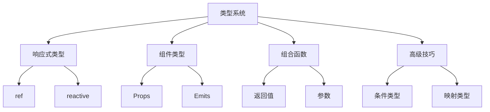

# 组合式API的类型系统

## 响应式API类型

### 基础响应式类型

```typescript:c:\project\kphub\src\types\reactive.ts
import { ref, reactive, readonly, computed, Ref, UnwrapRef } from 'vue'

// ref类型定义
const count = ref<number>(0)
const message = ref<string | null>(null)
const user = ref<{ name: string; age: number }>({
  name: 'John',
  age: 25
})

// reactive类型定义
interface State {
  count: number
  message: string
  user: {
    name: string
    age: number
    settings: Record<string, unknown>
  }
}

const state = reactive<State>({
  count: 0,
  message: '',
  user: {
    name: 'John',
    age: 25,
    settings: {}
  }
})

// readonly类型
const readonlyState = readonly(state)

// computed类型
const doubleCount = computed(() => count.value * 2)
const userInfo = computed(() => {
  return `${user.value.name} (${user.value.age})`
})
```

### 类型推导与断言

```typescript:c:\project\kphub\src\utils\typeUtils.ts
import { isRef, unref, UnwrapRef } from 'vue'

// 类型安全的ref解包
export function safeUnref<T>(value: T | Ref<T>): T {
  return unref(value)
}

// 类型断言工具
export function assertType<T>(
  value: unknown,
  message = 'Type assertion failed'
): asserts value is T {
  if (!value) {
    throw new TypeError(message)
  }
}

// 类型守卫
export function isRefOf<T>(
  value: unknown
): value is Ref<T> {
  return isRef(value)
}
```

## 组件类型定义

### 组件类型增强

```typescript:c:\project\kphub\src\components\UserProfile.vue
<script setup lang="ts">
import { defineProps, defineEmits, defineExpose } from 'vue'

// Props类型定义
interface Props {
  id: number
  name: string
  role: 'admin' | 'user'
  settings?: Record<string, unknown>
}

const props = defineProps<Props>()

// Emits类型定义
interface Emits {
  (e: 'update', id: number, data: Partial<Props>): void
  (e: 'delete', id: number): void
}

const emit = defineEmits<Emits>()

// 暴露的API类型
interface ExposedAPI {
  validate: () => boolean
  reset: () => void
  getData: () => Partial<Props>
}

const exposed: ExposedAPI = {
  validate: () => true,
  reset: () => {},
  getData: () => ({ id: props.id, name: props.name })
}

defineExpose(exposed)
</script>
```

## 组合式函数类型

### 类型安全的组合式函数

```typescript:c:\project\kphub\src\composables\useAsync.ts
import { ref, Ref } from 'vue'

interface AsyncState<T> {
  data: Ref<T | null>
  loading: Ref<boolean>
  error: Ref<Error | null>
}

interface AsyncOptions<T> {
  immediate?: boolean
  onSuccess?: (data: T) => void
  onError?: (error: Error) => void
}

export function useAsync<T>(
  asyncFn: () => Promise<T>,
  options: AsyncOptions<T> = {}
): AsyncState<T> & { execute: () => Promise<void> } {
  const data = ref<T | null>(null)
  const loading = ref(false)
  const error = ref<Error | null>(null)

  async function execute() {
    loading.value = true
    error.value = null
    
    try {
      data.value = await asyncFn()
      options.onSuccess?.(data.value)
    } catch (err) {
      error.value = err as Error
      options.onError?.(error.value)
    } finally {
      loading.value = false
    }
  }

  if (options.immediate) {
    execute()
  }

  return {
    data,
    loading,
    error,
    execute
  }
}
```

## 高级类型技巧

### 高级类型应用

```typescript:c:\project\kphub\src\types\advanced.ts
// 条件类型
type IsRef<T> = T extends Ref<any> ? true : false
type UnwrapRefType<T> = T extends Ref<infer U> ? U : T

// 映射类型
type ReadonlyProps<T> = {
  readonly [K in keyof T]: T[K]
}

type OptionalProps<T> = {
  [K in keyof T]?: T[K]
}

// 递归类型
type DeepReadonly<T> = {
  readonly [K in keyof T]: T[K] extends object
    ? DeepReadonly<T[K]>
    : T[K]
}

// 类型工具函数
function createTypedComputed<T, R>(
  getter: (state: T) => R
) {
  return computed(getter)
}

// 类型推导优化
type InferPropType<T> = T extends { type: infer U }
  ? U extends { (): infer V } | { new (...args: any[]): infer V }
    ? V
    : U
  : T
```

组合式API的类型系统包括：

1. 响应式类型：
   - ref类型
   - reactive类型
   - readonly类型
   - computed类型

2. 组件类型：
   - Props类型
   - Emits类型
   - Expose类型
   - 插槽类型

3. 组合函数：
   - 返回值类型
   - 参数类型
   - 泛型应用
   - 类型安全

4. 高级技巧：
   - 条件类型
   - 映射类型
   - 工具函数
   - 类型推导



使用建议：

1. 基础使用：
   - 掌握响应式类型
   - 理解组件类型
   - 应用组合函数
   - 使用类型工具

2. 进阶技巧：
   - 类型推导
   - 类型断言
   - 类型守卫
   - 泛型应用

3. 最佳实践：
   - 类型完整性
   - 代码可维护性
   - 错误处理
   - 性能优化

通过合理使用组合式API的类型系统，我们可以构建出类型安全、可维护的Vue3应用。