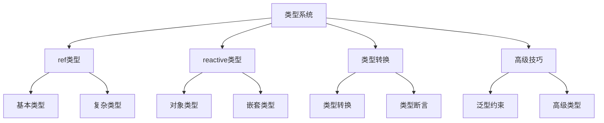

# ref与reactive类型定义

## ref类型系统

### 基础类型定义

```typescript:c:\project\kphub\src\types\ref.ts
import { ref, Ref } from 'vue'

// 基本类型ref
const count = ref<number>(0)
const message = ref<string>('Hello')
const isActive = ref<boolean>(false)

// 复杂对象ref
interface UserInfo {
  id: number
  name: string
  age: number
  settings: Record<string, unknown>
}

const user = ref<UserInfo>({
  id: 1,
  name: 'John',
  age: 25,
  settings: {}
})

// 数组ref
const list = ref<string[]>([])
const users = ref<UserInfo[]>([])

// 可选类型ref
const nullable = ref<string | null>(null)
const optional = ref<number | undefined>(undefined)

// 类型推导示例
const inferredRef = ref('auto inferred as string')
const inferredNumber = ref(100) // 自动推导为number
```

### 复杂类型处理

```typescript:c:\project\kphub\src\composables\useRefTypes.ts
import { ref, Ref } from 'vue'

// 泛型ref组合函数
export function useList<T>() {
  const items = ref<T[]>([]) as Ref<T[]>
  const selectedItem = ref<T | null>(null)
  
  function addItem(item: T) {
    items.value.push(item)
  }
  
  function removeItem(index: number) {
    items.value.splice(index, 1)
    if (selectedItem.value === items.value[index]) {
      selectedItem.value = null
    }
  }
  
  return {
    items,
    selectedItem,
    addItem,
    removeItem
  }
}

// 使用示例
interface TodoItem {
  id: number
  text: string
  completed: boolean
}

const { items: todos, addItem: addTodo } = useList<TodoItem>()
```

## reactive类型系统

### 响应式对象类型

```typescript:c:\project\kphub\src\types\reactive.ts
import { reactive, DeepReadonly, UnwrapNestedRefs } from 'vue'

// 基础响应式对象
interface State {
  count: number
  message: string
  nested: {
    value: number
    list: string[]
  }
}

const state = reactive<State>({
  count: 0,
  message: '',
  nested: {
    value: 0,
    list: []
  }
})

// 只读响应式对象
const readonlyState: DeepReadonly<State> = reactive({
  count: 0,
  message: '',
  nested: {
    value: 0,
    list: []
  }
}) as DeepReadonly<State>

// 解包嵌套引用
type UnwrappedState = UnwrapNestedRefs<{
  ref1: Ref<string>
  ref2: Ref<number>
  nested: {
    ref3: Ref<boolean>
  }
}>
```

### 类型处理工具

```typescript:c:\project\kphub\src\utils\typeHelpers.ts
import { reactive, UnwrapNestedRefs, isRef, unref } from 'vue'

// 类型安全的reactive创建
export function createStore<T extends object>(
  initialState: T
): UnwrapNestedRefs<T> {
  return reactive(initialState)
}

// 类型安全的深度克隆
export function deepClone<T>(obj: T): T {
  if (isRef(obj)) {
    return unref(obj) as T
  }
  
  if (Array.isArray(obj)) {
    return obj.map(deepClone) as unknown as T
  }
  
  if (obj && typeof obj === 'object') {
    return Object.fromEntries(
      Object.entries(obj).map(
        ([key, value]) => [key, deepClone(value)]
      )
    ) as T
  }
  
  return obj
}
```

## 类型转换与断言

### 类型转换工具

```typescript:c:\project\kphub\src\utils\typeConversion.ts
import { ref, unref, toRef, toRefs, isRef, Ref } from 'vue'

// 安全的ref解包
export function safeUnref<T>(value: T | Ref<T>): T {
  return unref(value)
}

// 确保值为ref
export function ensureRef<T>(value: T | Ref<T>): Ref<T> {
  return isRef(value) ? value : ref(value)
}

// 类型安全的toRef
export function safeToRef<T extends object, K extends keyof T>(
  object: T,
  key: K
): Ref<T[K]> {
  return toRef(object, key)
}

// 带类型检查的toRefs
export function safeToRefs<T extends object>(
  object: T
): { [K in keyof T]: Ref<T[K]> } {
  return toRefs(object)
}
```

## 高级类型技巧

### 高级类型应用

```typescript:c:\project\kphub\src\types\advanced.ts
import { ref, Ref } from 'vue'

// 泛型约束
type ValidRefType = string | number | boolean | object

export function createValidRef<T extends ValidRefType>(
  value: T
): Ref<T> {
  return ref(value)
}

// 条件类型
type RefValue<T> = T extends Ref<infer U> ? U : T

// 递归类型
type DeepRef<T> = T extends object
  ? { [K in keyof T]: DeepRef<T[K]> }
  : Ref<T>

// 联合类型
type StringOrNumberRef = Ref<string> | Ref<number>

// 交叉类型
type RefWithMethods<T> = Ref<T> & {
  reset: () => void
  update: (value: T) => void
}

// 工具类型实现
export function createRefWithMethods<T>(
  initialValue: T
): RefWithMethods<T> {
  const value = ref(initialValue)
  
  return Object.assign(value, {
    reset: () => value.value = initialValue,
    update: (newValue: T) => value.value = newValue
  })
}
```

ref与reactive的类型系统包括：

1. ref类型：
   - 基本类型
   - 复杂对象
   - 数组类型
   - 类型推导

2. reactive类型：
   - 对象类型
   - 嵌套类型
   - 只读类型
   - 类型解包

3. 类型转换：
   - 解包转换
   - ref转换
   - 类型断言
   - 类型守卫

4. 高级技巧：
   - 泛型约束
   - 条件类型
   - 递归类型
   - 组合类型



使用建议：

1. 基础使用：
   - 掌握类型定义
   - 理解类型推导
   - 使用类型转换
   - 处理类型断言

2. 进阶技巧：
   - 泛型应用
   - 类型组合
   - 类型守卫
   - 性能优化

3. 最佳实践：
   - 类型完整性
   - 代码健壮性
   - 错误处理
   - 类型复用

通过合理使用Vue3的类型系统，我们可以构建出类型安全、可维护的应用。