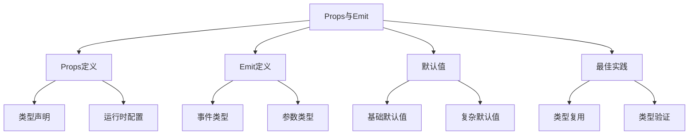

# props与emit类型定义

## defineProps类型定义

### 基础类型声明

```typescript:c:\project\kphub\src\components\UserProfile.vue
<script setup lang="ts">
// 使用类型声明
interface Props {
  id: number
  name: string
  age?: number
  role: 'admin' | 'user'
  tags: string[]
  meta: Record<string, any>
}

// 使用defineProps
const props = defineProps<Props>()

// 使用类型字面量
const literalProps = defineProps<{
  title: string
  count: number
  isActive?: boolean
}>()

// 使用运行时声明
const runtimeProps = defineProps({
  message: {
    type: String,
    required: true
  },
  level: {
    type: Number,
    default: 1,
    validator: (value: number) => value > 0
  }
})
</script>
```

### 复杂Props类型

```typescript:c:\project\kphub\src\types\props.ts
// 可复用的Props类型
export interface BaseProps {
  id: number | string
  name: string
}

export interface UserProps extends BaseProps {
  email: string
  role: 'admin' | 'user'
  permissions: string[]
  settings: {
    theme: 'light' | 'dark'
    notifications: boolean
    preferences: Record<string, unknown>
  }
}

export interface ValidationProps {
  rules?: {
    required?: boolean
    min?: number
    max?: number
    pattern?: RegExp
  }
  validateOn?: 'input' | 'blur' | 'submit'
  immediate?: boolean
}
```

## defineEmits类型定义

### 事件类型声明

```typescript:c:\project\kphub\src\components\UserForm.vue
<script setup lang="ts">
// 事件类型定义
interface Events {
  (e: 'update', id: number, data: Partial<UserProps>): void
  (e: 'delete', id: number): void
  (e: 'statusChange', status: boolean): void
}

// 使用defineEmits
const emit = defineEmits<Events>()

// 使用类型字面量
const literalEmits = defineEmits<{
  (e: 'increment', value: number): void
  (e: 'decrement', value: number): void
  (e: 'reset'): void
}>()

// 事件处理函数
function handleUpdate(data: Partial<UserProps>) {
  emit('update', props.id, data)
}

function handleDelete() {
  emit('delete', props.id)
}

function handleStatusChange(status: boolean) {
  emit('statusChange', status)
}
</script>
```

## withDefaults辅助函数

### 默认值处理

```typescript:c:\project\kphub\src\components\ConfigPanel.vue
<script setup lang="ts">
interface Props {
  title?: string
  settings?: {
    theme: 'light' | 'dark'
    showSidebar: boolean
    columns: number
  }
  items?: string[]
  callback?: (value: string) => void
}

// 使用withDefaults
const props = withDefaults(defineProps<Props>(), {
  title: 'Default Title',
  settings: () => ({
    theme: 'light',
    showSidebar: true,
    columns: 2
  }),
  items: () => [],
  callback: (value: string) => console.log(value)
})

// 复杂默认值处理
function createDefaultSettings() {
  return {
    theme: 'light' as const,
    showSidebar: true,
    columns: 2
  }
}

const complexProps = withDefaults(defineProps<Props>(), {
  settings: createDefaultSettings
})
</script>
```

## 最佳实践

### 类型定义与验证

```typescript:c:\project\kphub\src\utils\propValidation.ts
import { PropType } from 'vue'

// 类型守卫
export function isValidRole(role: unknown): role is 'admin' | 'user' {
  return role === 'admin' || role === 'user'
}

// 可复用的Props配置
export const userProps = {
  id: {
    type: [String, Number] as PropType<string | number>,
    required: true
  },
  role: {
    type: String as PropType<'admin' | 'user'>,
    required: true,
    validator: isValidRole
  },
  permissions: {
    type: Array as PropType<string[]>,
    default: () => []
  }
} as const

// 类型安全的Props工具函数
export function createProp<T>(
  options: {
    type: PropType<T>
    required?: boolean
    default?: T | (() => T)
    validator?: (value: T) => boolean
  }
) {
  return options
}

// 使用示例
export const advancedProps = {
  value: createProp<number>({
    type: Number,
    required: true,
    validator: (value) => value >= 0
  }),
  settings: createProp<Record<string, unknown>>({
    type: Object,
    default: () => ({})
  })
}
```

Props与Emit的类型系统包括：

1. Props定义：
   - 类型声明
   - 运行时配置
   - 默认值
   - 类型验证

2. Emit定义：
   - 事件类型
   - 参数类型
   - 验证函数
   - 事件处理

3. 默认值：
   - 基础默认值
   - 复杂默认值
   - 类型推导
   - 默认函数

4. 最佳实践：
   - 类型复用
   - 类型验证
   - 文档化
   - 错误处理



使用建议：

1. 基础使用：
   - 选择合适的声明方式
   - 定义清晰的类型
   - 处理默认值
   - 实现类型验证

2. 进阶技巧：
   - 类型复用
   - 默认值处理
   - 验证函数
   - 类型推导

3. 最佳实践：
   - 类型完整性
   - 代码可维护性
   - 错误处理
   - 性能优化

通过合理使用Props与Emit的类型系统，我们可以构建出类型安全、可维护的Vue3组件。