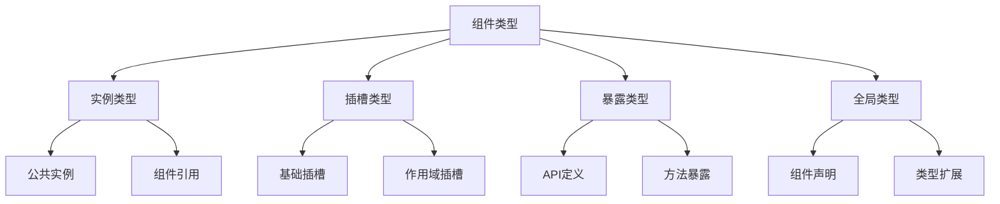

# 组件类型声明

## 组件实例类型

### 基础实例类型

```typescript:c:\project\kphub\src\types\component.ts
import { ComponentPublicInstance, ref } from 'vue'

// 组件实例基础接口
interface ComponentCustomProperties {
  $loading: boolean
  $api: Record<string, Function>
}

// 扩展组件实例类型
type CustomComponentInstance = ComponentPublicInstance & ComponentCustomProperties

// 组件ref类型
interface ComponentMethods {
  reload(): Promise<void>
  validate(): boolean
  reset(): void
}

// 类型安全的组件引用
const componentRef = ref<ComponentMethods | null>(null)
```

### 组件实例使用

```vue:c:\project\kphub\src\components\DataTable.vue
<script setup lang="ts">
import { ref, onMounted } from 'vue'
import type { ComponentMethods } from '../types/component'

// 定义组件方法
const methods: ComponentMethods = {
  async reload() {
    // 重新加载数据
    await loadData()
  },
  validate() {
    // 验证表单
    return true
  },
  reset() {
    // 重置表单
    form.value = initialForm
  }
}

// 暴露方法给父组件
defineExpose(methods)

// 组件内部状态
const form = ref(initialForm)
const loading = ref(false)

// 初始化数据
async function loadData() {
  loading.value = true
  try {
    // 加载数据逻辑
  } finally {
    loading.value = false
  }
}

onMounted(() => {
  loadData()
})
</script>
```

## 插槽类型

### 插槽类型定义

```typescript:c:\project\kphub\src\types\slots.ts
import { Slot, Slots } from 'vue'

// 基础插槽内容类型
interface DefaultSlotProps {
  item: unknown
  index: number
}

// 作用域插槽类型
interface ScopedSlots {
  default: (props: DefaultSlotProps) => any
  header: (props: { title: string }) => any
  footer: (props: { total: number }) => any
}

// 动态插槽类型
type DynamicSlotNames = 'header' | 'body' | 'footer'
type DynamicSlots = {
  [K in DynamicSlotNames]?: Slot
}

// 插槽Props类型
interface SlotProps<T> {
  data: T
  loading: boolean
  error: Error | null
}
```

### 插槽使用示例

```vue:c:\project\kphub\src\components\ListView.vue
<script setup lang="ts">
import type { ScopedSlots, SlotProps } from '../types/slots'

interface ListItem {
  id: number
  title: string
  description: string
}

// 定义Props
interface Props {
  items: ListItem[]
  loading?: boolean
}

const props = defineProps<Props>()

// 使用withDefaults设置默认值
withDefaults(defineProps<Props>(), {
  loading: false
})
</script>

<template>
  <div class="list-view">
    <!-- 默认插槽 -->
    <slot
      v-for="(item, index) in items"
      :item="item"
      :index="index"
    />
    
    <!-- 作用域插槽 -->
    <slot
      name="header"
      :title="'列表标题'"
    />
    
    <!-- 条件插槽 -->
    <slot
      name="empty"
      v-if="items.length === 0"
    />
    
    <!-- 动态插槽 -->
    <template v-for="name in ['header', 'body', 'footer']">
      <slot
        :name="name"
        v-bind="getSlotProps(name)"
      />
    </template>
  </div>
</template>
```

## 组件暴露类型

### 暴露API定义

```typescript:c:\project\kphub\src\types\expose.ts
// 组件暴露的API类型
export interface ComponentAPI {
  // 数据操作方法
  getData(): Promise<unknown>
  setData(data: unknown): void
  
  // 状态控制
  loading: boolean
  error: Error | null
  
  // 表单方法
  validate(): Promise<boolean>
  reset(): void
  submit(): Promise<void>
  
  // 公共属性
  readonly isValid: boolean
  readonly isDirty: boolean
}

// 组件ref类型
export type ComponentRef = ComponentAPI | null

// 类型安全的组件通信接口
export interface ComponentCommunication {
  // 父子通信方法
  notify(type: string, data: unknown): void
  
  // 状态同步
  sync(): Promise<void>
  
  // 事件处理
  handleEvent(event: string, handler: Function): void
}
```

### 组件通信示例

```vue:c:\project\kphub\src\components\Form.vue
<script setup lang="ts">
import { ref } from 'vue'
import type { ComponentAPI, ComponentCommunication } from '../types/expose'

// 组件API实现
const api: ComponentAPI = {
  async getData() {
    return formData.value
  },
  setData(data) {
    formData.value = data
  },
  loading: false,
  error: null,
  async validate() {
    // 验证逻辑
    return true
  },
  reset() {
    formData.value = initialData
  },
  async submit() {
    // 提交逻辑
  },
  get isValid() {
    return true
  },
  get isDirty() {
    return true
  }
}

// 暴露API
defineExpose(api)

// 内部状态
const formData = ref(initialData)
const initialData = {}
</script>
```

## 全局组件类型

### 全局类型声明

```typescript:c:\project\kphub\src\types\global.d.ts
import { DefineComponent } from 'vue'

// 全局组件类型声明
declare module '@vue/runtime-core' {
  export interface GlobalComponents {
    'k-button': DefineComponent<{
      type?: 'primary' | 'secondary'
      size?: 'small' | 'medium' | 'large'
      disabled?: boolean
    }>
    'k-input': DefineComponent<{
      value?: string
      type?: 'text' | 'password' | 'number'
      placeholder?: string
    }>
    'k-form': DefineComponent<{
      model: Record<string, any>
      rules?: Record<string, any>
    }>
  }
}

// 扩展全局属性
declare module '@vue/runtime-core' {
  interface ComponentCustomProperties {
    $http: {
      get(url: string): Promise<any>
      post(url: string, data: any): Promise<any>
    }
    $auth: {
      isLoggedIn: boolean
      user: Record<string, any>
    }
  }
}
```

组件类型声明系统包括：

1. 实例类型：
   - 公共实例
   - 组件引用
   - 方法定义
   - 类型扩展

2. 插槽类型：
   - 基础插槽
   - 作用域插槽
   - 动态插槽
   - 插槽Props

3. 暴露类型：
   - API定义
   - 方法暴露
   - 属性访问
   - 组件通信

4. 全局类型：
   - 组件声明
   - 类型扩展
   - 自定义类型
   - 类型集成



使用建议：

1. 基础使用：
   - 定义实例类型
   - 处理插槽类型
   - 暴露组件API
   - 声明全局类型

2. 进阶技巧：
   - 类型扩展
   - 类型复用
   - 类型推导
   - 类型约束

3. 最佳实践：
   - 类型完整性
   - 代码可维护性
   - 错误处理
   - 性能优化

通过合理使用组件类型声明，我们可以构建出类型安全、可维护的Vue3组件系统。