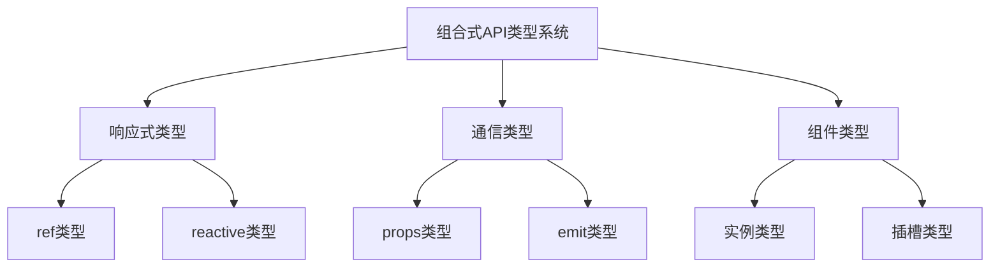

# 组合式API的类型系统

Vue3的组合式API提供了完整的TypeScript类型支持，帮助开发者构建类型安全的应用：

## 响应式数据类型
- [ref与reactive类型定义](./8.2.1-ref与reactive类型定义.md)：掌握响应式API的类型系统
  - ref类型系统
  - reactive类型系统
  - 类型转换
  - 高级类型技巧

## 组件通信类型
- [props与emit类型定义](./8.2.2-props与emit类型定义.md)：了解组件通信的类型定义
  - defineProps类型
  - defineEmits类型
  - withDefaults使用
  - 类型最佳实践

## 组件系统类型
- [组件类型声明](./8.2.3-组件类型声明.md)：深入组件系统的类型声明
  - 实例类型
  - 插槽类型
  - 暴露类型
  - 全局类型

主要特点：

1. 响应式系统：
   - 类型安全
   - 类型推导
   - 类型转换
   - 高级类型

2. 组件通信：
   - Props定义
   - 事件类型
   - 默认值
   - 类型验证

3. 组件系统：
   - 实例类型
   - 插槽类型
   - API暴露
   - 全局声明

学习路径建议：

1. 基础入门：
   - 理解类型系统
   - 掌握基本用法
   - 熟悉类型定义
   - 实践类型声明

2. 进阶学习：
   - 类型推导机制
   - 高级类型应用
   - 类型安全实践
   - 性能优化

3. 最佳实践：
   - 类型设计模式
   - 代码组织优化
   - 错误处理策略
   - 测试方案制定

使用场景：

1. 响应式数据：
   - 状态管理
   - 数据转换
   - 类型推导
   - 类型保护

2. 组件开发：
   - 属性定义
   - 事件处理
   - 插槽管理
   - API设计

3. 应用架构：
   - 类型声明
   - 接口定义
   - 全局配置
   - 插件开发

通过系统学习Vue3组合式API的类型系统，您将能够：
- 构建类型安全的应用
- 提高代码可维护性
- 减少运行时错误
- 优化开发体验

每个章节都提供了详细的示例和实践指南，建议按照学习路径循序渐进，结合实际项目进行练习。通过合理运用类型系统，我们可以构建出更加健壮和可维护的Vue3应用。