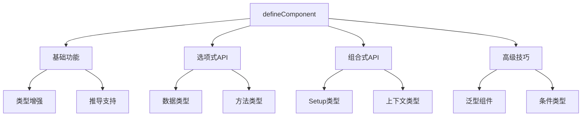

# defineComponent与类型推导

## defineComponent基础

### 基础用法示例

```typescript:c:\project\kphub\src\components\BasicComponent.ts
import { defineComponent } from 'vue'

// 基础组件定义
const BasicComponent = defineComponent({
  name: 'BasicComponent',
  props: {
    title: String,
    count: Number
  },
  data() {
    return {
      message: 'Hello'
    }
  }
})

// 组合式API风格
const CompositionComponent = defineComponent({
  name: 'CompositionComponent',
  props: {
    data: Object
  },
  setup(props) {
    // props 获得完整类型推导
    const { data } = props
    return { data }
  }
})

// 直接导出对比（不推荐）
const UntypedComponent = {
  name: 'UntypedComponent',
  props: ['title'], // 无类型推导
  data() {
    return {
      count: 0 // 类型推导有限
    }
  }
}
```

## 选项式API类型推导

### 完整类型定义

```typescript:c:\project\kphub\src\components\OptionsAPI.ts
import { defineComponent } from 'vue'

interface User {
  id: number
  name: string
  email: string
}

export default defineComponent({
  name: 'UserManager',
  
  // props类型推导
  props: {
    initialUsers: {
      type: Array as () => User[],
      required: true
    },
    maxUsers: {
      type: Number,
      default: 10
    }
  },
  
  // data类型推导
  data() {
    return {
      users: [] as User[],
      selectedUser: null as User | null,
      loading: false
    }
  },
  
  // computed类型推导
  computed: {
    userCount() {
      return this.users.length
    },
    canAddMore(): boolean {
      return this.users.length < this.maxUsers
    }
  },
  
  // methods类型推导
  methods: {
    async fetchUsers() {
      this.loading = true
      try {
        const response = await fetch('/api/users')
        this.users = await response.json()
      } finally {
        this.loading = false
      }
    },
    
    selectUser(user: User) {
      this.selectedUser = user
    }
  },
  
  // 生命周期钩子类型
  mounted() {
    this.fetchUsers()
  },
  
  beforeUnmount() {
    this.selectedUser = null
  }
})
```

## 组合式API类型推导

### Setup函数类型系统

```typescript:c:\project\kphub\src\components\CompositionAPI.ts
import { defineComponent, ref, computed, onMounted } from 'vue'

interface Props {
  initialCount: number
  step: number
}

export default defineComponent({
  name: 'Counter',
  
  props: {
    initialCount: {
      type: Number,
      required: true
    },
    step: {
      type: Number,
      default: 1
    }
  },
  
  setup(props, context) {
    // props类型完整推导
    const count = ref(props.initialCount)
    
    // computed类型推导
    const doubleCount = computed(() => count.value * 2)
    
    // 方法类型推导
    const increment = () => {
      count.value += props.step
    }
    
    const decrement = () => {
      count.value -= props.step
    }
    
    // 生命周期钩子
    onMounted(() => {
      console.log('Initial count:', count.value)
    })
    
    // 暴露给模板的类型推导
    return {
      count,
      doubleCount,
      increment,
      decrement
    }
  }
})
```

## 高级类型推导技巧

### 泛型组件实现

```typescript:c:\project\kphub\src\components\GenericComponent.ts
import { defineComponent, PropType } from 'vue'

// 泛型数据接口
interface DataItem<T> {
  id: number
  value: T
  metadata?: Record<string, unknown>
}

// 泛型组件定义
export default defineComponent({
  name: 'GenericList',
  
  props: {
    items: {
      type: Array as PropType<DataItem<unknown>[]>,
      required: true
    },
    
    // 泛型函数类型
    itemFormatter: {
      type: Function as PropType<
        <T>(item: DataItem<T>) => string
      >,
      required: true
    }
  },
  
  setup(props) {
    // 条件类型应用
    type ItemType<T> = T extends DataItem<infer U> ? U : never
    
    // 类型推导调试
    type PropsType = typeof props
    type ItemsType = typeof props.items
    
    return {
      // 类型安全的方法
      getItemValue<T>(item: DataItem<T>): T {
        return item.value
      }
    }
  }
})
```

defineComponent的类型系统包括：

1. 基础功能：
   - 类型增强
   - 推导支持
   - 返回值类型
   - API兼容

2. 选项式API：
   - 数据类型
   - 方法类型
   - 计算属性
   - 生命周期

3. 组合式API：
   - Setup类型
   - 上下文类型
   - 返回值类型
   - 响应式类型

4. 高级技巧：
   - 泛型组件
   - 条件类型
   - 类型调试
   - 限制处理



使用建议：

1. 基础使用：
   - 掌握类型增强
   - 理解类型推导
   - 选择API风格
   - 处理返回值

2. 进阶技巧：
   - 泛型应用
   - 类型调试
   - 条件类型
   - 限制处理

3. 最佳实践：
   - 类型完整性
   - 代码可维护性
   - 错误处理
   - 性能优化

通过合理使用defineComponent，我们可以构建出类型安全、可维护的Vue3组件。