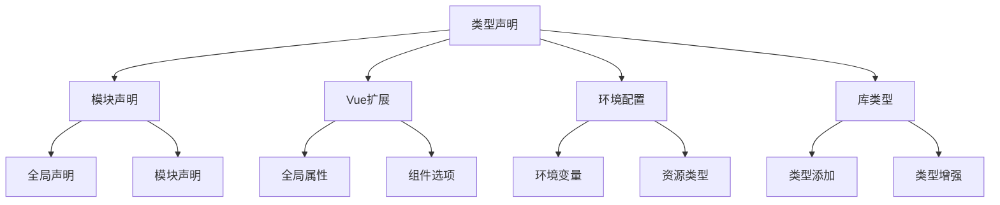

# 自定义类型声明

## 模块类型声明

### 基础类型声明

```typescript:c:\project\kphub\src\types\global.d.ts
// 全局类型声明
declare global {
  // 全局接口
  interface Window {
    __APP_VERSION__: string
    __USER_CONFIG__: Record<string, unknown>
  }

  // 全局类型
  type JsonPrimitive = string | number | boolean | null
  type JsonValue = JsonPrimitive | JsonObject | JsonArray
  
  interface JsonObject {
    [key: string]: JsonValue
  }
  
  interface JsonArray extends Array<JsonValue> {}
}

// 确保文件被视为模块
export {}
```

### 模块声明示例

```typescript:c:\project\kphub\src\types\modules.d.ts
// 声明模块
declare module '*.vue' {
  import type { DefineComponent } from 'vue'
  const component: DefineComponent<{}, {}, any>
  export default component
}

// 资源模块声明
declare module '*.svg' {
  const content: string
  export default content
}

declare module '*.png' {
  const content: string
  export default content
}

// JSON模块声明
declare module '*.json' {
  const value: any
  export default value
}

// 命名空间声明
declare namespace API {
  interface Response<T = any> {
    code: number
    data: T
    message: string
  }

  interface Pagination {
    current: number
    pageSize: number
    total: number
  }
}
```

## Vue相关类型扩展

### Vue类型扩展

```typescript:c:\project\kphub\src\types\vue.d.ts
import 'vue'
import { AxiosInstance } from 'axios'

// 扩展全局属性
declare module 'vue' {
  interface ComponentCustomProperties {
    $http: AxiosInstance
    $api: {
      get<T>(url: string): Promise<T>
      post<T>(url: string, data: any): Promise<T>
    }
    $auth: {
      isLoggedIn: boolean
      user: Record<string, any>
    }
  }

  // 扩展组件选项
  interface ComponentCustomOptions {
    permissions?: string[]
    layout?: string
    cache?: boolean
  }

  // 扩展全局组件类型
  interface GlobalComponents {
    'k-button': typeof import('./components')['KButton']
    'k-input': typeof import('./components')['KInput']
    'k-form': typeof import('./components')['KForm']
  }
}
```

### 插件类型定义

```typescript:c:\project\kphub\src\plugins\types.ts
import { App } from 'vue'

// 插件选项接口
export interface PluginOptions {
  prefix?: string
  importAll?: boolean
  components?: string[]
}

// 插件类型定义
export interface Plugin {
  install: (app: App, options?: PluginOptions) => void
}

// 插件工厂函数
export function createPlugin(options: PluginOptions): Plugin {
  return {
    install(app: App) {
      // 插件安装逻辑
    }
  }
}
```

## 环境类型声明

### Vite环境配置

```typescript:c:\project\kphub\src\types\env.d.ts
/// <reference types="vite/client" />

interface ImportMetaEnv {
  readonly VITE_APP_TITLE: string
  readonly VITE_API_BASE_URL: string
  readonly VITE_APP_MODE: 'development' | 'production'
  readonly VITE_ENABLE_PWA: boolean
}

interface ImportMeta {
  readonly env: ImportMetaEnv
}

// CSS模块
declare module '*.module.css' {
  const classes: { [key: string]: string }
  export default classes
}

declare module '*.module.scss' {
  const classes: { [key: string]: string }
  export default classes
}

// 客户端类型
declare const __CLIENT__: boolean
declare const __SERVER__: boolean
```

## 第三方库类型处理

### 类型声明增强

```typescript:c:\project\kphub\src\types\vendor.d.ts
// 为无类型库添加声明
declare module 'untyped-lib' {
  export interface Options {
    debug?: boolean
    timeout?: number
  }

  export function initialize(options?: Options): void
  export function destroy(): void
}

// 增强现有类型
import 'axios'

declare module 'axios' {
  export interface AxiosRequestConfig {
    _retry?: boolean
    _retryCount?: number
  }
  
  export interface AxiosResponse<T = any> {
    _timestamp?: number
  }
}

// 模块扩充
import 'vue-router'

declare module 'vue-router' {
  interface RouteMeta {
    permissions?: string[]
    title?: string
    icon?: string
    cache?: boolean
  }
}
```

类型声明系统包括：

1. 模块声明：
   - 全局声明
   - 模块声明
   - 命名空间
   - 类型导出

2. Vue扩展：
   - 全局属性
   - 组件选项
   - 插件类型
   - 组件类型

3. 环境配置：
   - 环境变量
   - 资源类型
   - 样式类型
   - 运行环境

4. 库类型：
   - 类型添加
   - 类型增强
   - 类型合并
   - 模块扩充



使用建议：

1. 基础使用：
   - 掌握声明语法
   - 理解类型扩展
   - 处理环境配置
   - 管理库类型

2. 进阶技巧：
   - 类型合并
   - 模块扩充
   - 声明优化
   - 类型复用

3. 最佳实践：
   - 类型完整性
   - 代码可维护性
   - 错误处理
   - 性能优化

通过合理使用类型声明系统，我们可以构建出类型安全、可维护的Vue3应用。