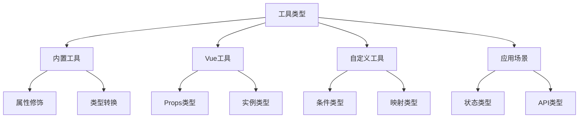

# TypeScript工具类型

## 内置工具类型

### 基础工具类型

```typescript:c:\project\kphub\src\types\utils.ts
// 基础接口
interface User {
  id: number
  name: string
  email: string
  age: number
  role: 'admin' | 'user'
}

// Partial - 所有属性可选
type PartialUser = Partial<User>
// 结果: { id?: number; name?: string; ... }

// Required - 所有属性必选
type RequiredUser = Required<PartialUser>
// 结果: { id: number; name: string; ... }

// Readonly - 所有属性只读
type ReadonlyUser = Readonly<User>
// 结果: { readonly id: number; readonly name: string; ... }

// Record - 键值对类型
type UserRoles = Record<'admin' | 'user', User>
// 结果: { admin: User; user: User }

// Pick - 选择属性
type UserBasic = Pick<User, 'id' | 'name'>
// 结果: { id: number; name: string }

// Omit - 排除属性
type UserPublic = Omit<User, 'email' | 'role'>
// 结果: { id: number; name: string; age: number }
```

## Vue特有工具类型

### Vue类型工具

```typescript:c:\project\kphub\src\types\vue-utils.ts
import { PropType, ExtractPropTypes, ComponentPublicInstance } from 'vue'

// PropType使用
interface ComplexType {
  value: string
  label: string
  children?: ComplexType[]
}

const props = {
  simple: String,
  complex: {
    type: Array as PropType<ComplexType[]>,
    required: true
  },
  callback: Function as PropType<(value: string) => void>
}

// ExtractPropTypes使用
type Props = ExtractPropTypes<typeof props>

// ComponentPublicInstance使用
interface CustomProperties {
  $api: {
    request<T>(url: string): Promise<T>
  }
}

type CustomInstance = ComponentPublicInstance & CustomProperties
```

## 自定义工具类型

### 高级类型工具

```typescript:c:\project\kphub\src\types\custom-utils.ts
// 条件类型
type IsString<T> = T extends string ? true : false
type IsStringResult = IsString<'hello'> // true
type IsStringResult2 = IsString<123> // false

// 映射类型
type Nullable<T> = { [P in keyof T]: T[P] | null }
type Optional<T> = { [P in keyof T]?: T[P] }
type Mutable<T> = { -readonly [P in keyof T]: T[P] }

// 索引类型
type PropType<T, Path extends string> = 
  Path extends keyof T 
    ? T[Path] 
    : Path extends `${infer K}.${infer R}`
      ? K extends keyof T
        ? PropType<T[K], R>
        : never
      : never

// 类型推断
type UnpackPromise<T> = T extends Promise<infer U> ? U : T
type UnpackArray<T> = T extends Array<infer U> ? U : T
```

## 实际应用场景

### 状态管理类型

```typescript:c:\project\kphub\src\store\types.ts
// 状态类型
interface State {
  user: {
    id: number
    name: string
    settings: Record<string, unknown>
  }
  app: {
    theme: 'light' | 'dark'
    language: string
  }
}

// 派生类型
type UserState = State['user']
type AppSettings = Partial<State['app']>
type StateKeys = keyof State
type DeepPartial<T> = {
  [P in keyof T]?: T[P] extends object ? DeepPartial<T[P]> : T[P]
}

// API响应类型
interface ApiResponse<T> {
  code: number
  data: T
  message: string
}

type UserResponse = ApiResponse<User>
type ListResponse<T> = ApiResponse<{
  items: T[]
  total: number
  page: number
}>
```

### 表单与路由类型

```typescript:c:\project\kphub\src\types\form-router.ts
// 表单验证类型
interface ValidationRule {
  required?: boolean
  min?: number
  max?: number
  pattern?: RegExp
  message?: string
  validator?: (value: any) => boolean | Promise<boolean>
}

type FormRules<T> = {
  [P in keyof T]?: ValidationRule | ValidationRule[]
}

// 路由参数类型
interface RouteParams {
  id: string
  type?: string
}

type RouterQuery = Partial<{
  page: string
  limit: string
  sort: 'asc' | 'desc'
  [key: string]: string | undefined
}>

// 组件Props类型
interface ComponentProps<T = any> {
  data?: T
  loading?: boolean
  error?: Error | null
  onUpdate?: (value: T) => void
  onError?: (error: Error) => void
}

type RequiredProps<T> = Required<Pick<ComponentProps<T>, 'data' | 'onUpdate'>>
```

TypeScript工具类型系统包括：

1. 内置工具：
   - 属性修饰
   - 类型转换
   - 类型选择
   - 类型构造

2. Vue工具：
   - Props类型
   - 实例类型
   - 插槽类型
   - 内部类型

3. 自定义工具：
   - 条件类型
   - 映射类型
   - 索引类型
   - 类型推断

4. 应用场景：
   - 状态类型
   - API类型
   - 表单类型
   - 路由类型



使用建议：

1. 基础使用：
   - 掌握内置工具
   - 理解Vue工具
   - 应用自定义工具
   - 处理实际场景

2. 进阶技巧：
   - 类型组合
   - 类型推导
   - 类型约束
   - 类型优化

3. 最佳实践：
   - 类型完整性
   - 代码可维护性
   - 错误处理
   - 性能优化

通过合理使用TypeScript工具类型，我们可以构建出类型安全、可维护的Vue3应用。