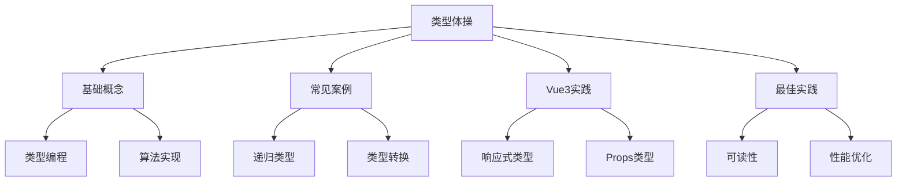

# 类型体操实践

## 类型体操基础

### 基础概念与实践

```typescript:c:\project\kphub\src\types\basic-types.ts
// 类型体操基础示例
type Length<T extends any[]> = T['length']
type First<T extends any[]> = T extends [infer F, ...any[]] ? F : never
type Last<T extends any[]> = T extends [...any[], infer L] ? L : never

// 类型级别算法
type Fibonacci<N extends number, Acc extends any[] = [1], Pre extends any[] = [], Cur extends any[] = [1]> = 
  N extends 1 | 2 
    ? Length<Acc>
    : Fibonacci<
        Subtract<N, 1>,
        [...Acc, Length<[...Pre, ...Cur]>],
        Cur,
        [...Pre, ...Cur]
      >

// 类型约束与边界
type NonEmptyArray<T> = [T, ...T[]]
type ValidNumber = number & { __brand: 'valid' }
type PositiveNumber = number & { __brand: 'positive' }
```

## 常见类型体操案例

### 高级类型操作

```typescript:c:\project\kphub\src\types\advanced-types.ts
// 递归类型
type DeepReadonly<T> = {
  readonly [P in keyof T]: T[P] extends object 
    ? DeepReadonly<T[P]> 
    : T[P]
}

// 联合转交叉
type UnionToIntersection<U> = 
  (U extends any 
    ? (k: U) => void 
    : never) extends ((k: infer I) => void) 
      ? I 
      : never

// 字符串操作
type CamelCase<S extends string> = 
  S extends `${infer P1}_${infer P2}${infer P3}`
    ? `${P1}${Uppercase<P2>}${CamelCase<P3>}`
    : S

// 数组操作
type Reverse<T extends any[]> = 
  T extends [infer First, ...infer Rest]
    ? [...Reverse<Rest>, First]
    : []

// 函数类型变换
type FunctionKeys<T> = {
  [K in keyof T]: T[K] extends Function ? K : never
}[keyof T]
```

## Vue3中的类型体操

### Vue3类型实践

```typescript:c:\project\kphub\src\types\vue-types.ts
import { Ref, UnwrapRef, ComponentPublicInstance } from 'vue'

// 响应式类型转换
type ToRefs<T> = {
  [K in keyof T]: T[K] extends Ref ? T[K] : Ref<UnwrapRef<T[K]>>
}

// Props类型推导
type InferProps<T> = T extends { props: infer P } ? P : never
type ExtractPropTypes<T> = {
  [K in keyof T]: T[K] extends { type: infer Type }
    ? Type extends { (): infer Return }
      ? Return
      : Type extends new (...args: any[]) => infer Instance
        ? Instance
        : Type
    : any
}

// 复杂状态类型
type StoreState<S> = {
  [K in keyof S]: S[K] extends (...args: any[]) => infer R
    ? R extends Promise<infer P>
      ? Ref<P | null>
      : Ref<R>
    : Ref<S[K]>
}

// 事件系统类型
type EventHandler<T> = (event: T) => void
type EventMap<T> = {
  [K in keyof T]: EventHandler<T[K]>
}
```

### 插件类型体操

```typescript:c:\project\kphub\src\types\plugin-types.ts
import { App, Plugin } from 'vue'

// 插件类型体操
type PluginInstallFunction<T> = (app: App, ...options: any[]) => T

interface PluginOptions<T = any> {
  install: PluginInstallFunction<T>
  [key: string]: any
}

// 插件工厂类型
type PluginFactory<Options, API> = (options?: Options) => Plugin & API

// 类型安全的插件注册
type SafePlugin<T> = T & {
  installed?: boolean
  install: PluginInstallFunction<void>
}

// 插件配置类型
interface PluginConfig<T = any> {
  name: string
  version?: string
  install: PluginInstallFunction<T>
  options?: Record<string, unknown>
}
```

## 类型体操最佳实践

### 实践指南

```typescript:c:\project\kphub\src\types\best-practices.ts
// 可读性优化
type Readable<T> = T extends (...args: infer Args) => infer Return
  ? `Function(${Args extends [] ? 'void' : Args}) => ${Return}`
  : T extends object
    ? { [K in keyof T]: Readable<T[K]> }
    : T

// 类型测试
type Assert<T extends true> = T
type Equal<X, Y> = (<T>() => T extends X ? 1 : 2) extends
  (<T>() => T extends Y ? 1 : 2) ? true : false

// 性能优化
type CacheKey<T> = T extends object ? keyof T : T
type Cache<T> = {
  __cache: Map<CacheKey<T>, T>
  get: (key: CacheKey<T>) => T | undefined
  set: (key: CacheKey<T>, value: T) => void
}

// 团队协作
type Documented<T> = T & {
  __docs: {
    description: string
    example?: string
    deprecated?: boolean
    since?: string
  }
}
```

类型体操系统包括：

1. 基础概念：
   - 类型编程
   - 算法实现
   - 类型约束
   - 边界处理

2. 常见案例：
   - 递归类型
   - 类型转换
   - 字符串操作
   - 数组处理

3. Vue3实践：
   - 响应式类型
   - Props类型
   - 状态类型
   - 事件类型

4. 最佳实践：
   - 代码可读性
   - 类型测试
   - 性能优化
   - 团队协作



使用建议：

1. 基础使用：
   - 理解类型体操
   - 掌握基本技巧
   - 应用常见案例
   - 处理边界情况

2. 进阶技巧：
   - 类型算法
   - 类型转换
   - 类型推导
   - 性能优化

3. 最佳实践：
   - 保持可读性
   - 编写测试
   - 优化性能
   - 团队协作

通过合理使用类型体操，我们可以构建出类型安全、可维护的TypeScript应用。