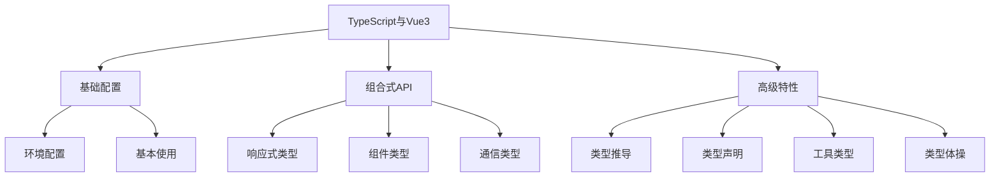

# TypeScript与Vue3

## 基础配置与应用
- [TypeScript在Vue3中的应用](./8.1-TypeScript在Vue3中的应用.md)：了解TypeScript与Vue3的集成配置和基本使用

## 组合式API类型系统
- [组合式API的类型系统](./8.2-组合式API的类型系统.md)：掌握Vue3组合式API的类型系统
  - [ref与reactive类型定义](./8.2-组合式API的类型系统/8.2.1-ref与reactive类型定义.md)：响应式API的类型定义
  - [props与emit类型定义](./8.2-组合式API的类型系统/8.2.2-props与emit类型定义.md)：组件通信的类型定义
  - [组件类型声明](./8.2-组合式API的类型系统/8.2.3-组件类型声明.md)：Vue组件的类型声明

## 高级类型特性
- [defineComponent与类型推导](./8.3-defineComponent与类型推导.md)：深入理解组件定义与类型推导
- [自定义类型声明](./8.4-自定义类型声明.md)：学习自定义类型声明的方法
- [TypeScript工具类型](./8.5-TypeScript工具类型.md)：掌握实用的TypeScript工具类型
- [类型体操实践](./8.6-类型体操实践.md)：探索高级类型编程技巧

主要特点：

1. 基础配置：
   - TypeScript配置
   - Vue3集成
   - 开发环境
   - 类型检查

2. 组合式API：
   - 响应式类型
   - 组件类型
   - 通信类型
   - 类型推导

3. 高级特性：
   - 类型声明
   - 工具类型
   - 类型体操
   - 最佳实践

学习路径建议：

1. 基础入门：
   - 环境搭建
   - 基本语法
   - 类型定义
   - 简单应用

2. 进阶学习：
   - 组合式API
   - 组件开发
   - 类型推导
   - 工具使用

3. 高级实践：
   - 类型编程
   - 性能优化
   - 最佳实践
   - 工程化应用

使用场景：

1. 项目开发：
   - 组件开发
   - 状态管理
   - 路由系统
   - 插件开发

2. 类型系统：
   - 类型定义
   - 类型推导
   - 类型检查
   - 类型优化

3. 工程实践：
   - 代码质量
   - 团队协作
   - 性能优化
   - 维护性提升

通过系统学习TypeScript在Vue3中的应用，您将能够：
- 构建类型安全的应用
- 提高代码质量
- 增强开发体验
- 提升项目可维护性

每个章节都提供了详细的示例和最佳实践，建议按照学习路径循序渐进，结合实际项目进行练习。通过合理运用TypeScript，我们可以构建出更加健壮和可维护的Vue3应用。