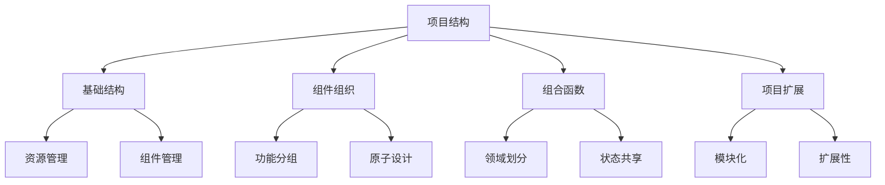

# 基于组合式API的目录结构

## 基础目录结构

### 标准目录布局

```plaintext:c:\project\kphub\src
src/
├── assets/               # 静态资源
│   ├── images/          # 图片资源
│   ├── styles/          # 全局样式
│   └── fonts/           # 字体文件
├── components/          # 通用组件
│   ├── base/           # 基础组件
│   ├── form/           # 表单组件
│   └── layout/         # 布局组件
├── composables/         # 组合式函数
│   ├── core/           # 核心功能
│   ├── features/       # 业务功能
│   └── utils/          # 工具函数
├── views/               # 页面组件
│   ├── dashboard/      # 仪表盘
│   ├── user/           # 用户相关
│   └── settings/       # 设置相关
├── router/             # 路由配置
│   ├── index.ts        # 路由入口
│   └── routes/         # 路由模块
├── stores/             # 状态管理
│   ├── modules/        # 状态模块
│   └── index.ts        # 状态入口
├── utils/              # 工具函数
│   ├── http.ts         # HTTP工具
│   └── validate.ts     # 验证工具
└── api/                # API接口
    ├── user.ts         # 用户接口
    └── system.ts       # 系统接口
```

## 组件目录组织

### 功能域分组示例

```plaintext:c:\project\kphub\src\components
components/
├── base/               # 基础组件
│   ├── Button/
│   │   ├── index.vue
│   │   ├── types.ts
│   │   └── README.md
│   └── Input/
│       ├── index.vue
│       └── types.ts
├── form/               # 表单组件
│   ├── FormItem/
│   └── FormValidation/
├── layout/            # 布局组件
│   ├── Header/
│   └── Sidebar/
└── business/          # 业务组件
    ├── UserCard/
    └── OrderList/
```

### 原子设计实现

```typescript:c:\project\kphub\src\components\atomic.ts
// 原子级组件
export { default as KButton } from './atoms/Button.vue'
export { default as KInput } from './atoms/Input.vue'

// 分子级组件
export { default as KFormItem } from './molecules/FormItem.vue'
export { default as KSearchBar } from './molecules/SearchBar.vue'

// 有机体组件
export { default as KUserForm } from './organisms/UserForm.vue'
export { default as KDataTable } from './organisms/DataTable.vue'

// 模板组件
export { default as KDashboardLayout } from './templates/DashboardLayout.vue'
export { default as KPageLayout } from './templates/PageLayout.vue'
```

## 组合式函数目录

### 领域驱动组织

```typescript:c:\project\kphub\src\composables\user\useUserProfile.ts
import { ref, computed } from 'vue'
import type { User } from '@/types'

export function useUserProfile() {
  const user = ref<User | null>(null)
  const isAdmin = computed(() => user.value?.role === 'admin')
  
  async function loadProfile() {
    // 加载用户信息
  }
  
  function updateProfile(data: Partial<User>) {
    // 更新用户信息
  }
  
  return {
    user,
    isAdmin,
    loadProfile,
    updateProfile
  }
}
```

### 共享状态组合

```typescript:c:\project\kphub\src\composables\shared\useSharedState.ts
import { ref, readonly } from 'vue'

export function useSharedState<T>(initialState: T) {
  const state = ref(initialState)
  
  function setState(newState: Partial<T>) {
    Object.assign(state.value, newState)
  }
  
  return {
    state: readonly(state),
    setState
  }
}
```

## 大型项目扩展结构

### 多模块架构

```plaintext:c:\project\kphub
src/
├── modules/           # 业务模块
│   ├── user/         # 用户模块
│   │   ├── components/
│   │   ├── composables/
│   │   ├── views/
│   │   └── index.ts
│   └── order/        # 订单模块
│       ├── components/
│       ├── composables/
│       ├── views/
│       └── index.ts
├── shared/           # 共享资源
│   ├── components/   # 共享组件
│   ├── composables/  # 共享组合式函数
│   └── utils/        # 共享工具
└── core/            # 核心功能
    ├── auth/        # 认证
    ├── http/        # 网络请求
    └── store/       # 状态管理
```

### 国际化资源

```typescript:c:\project\kphub\src\locales\index.ts
import { createI18n } from 'vue-i18n'

const i18n = createI18n({
  legacy: false,
  locale: 'zh-CN',
  messages: {
    'zh-CN': {
      // 中文语言包
    },
    'en-US': {
      // 英文语言包
    }
  }
})

export default i18n
```

目录结构设计原则：

1. 基础结构：
   - 清晰的职责划分
   - 模块化组织
   - 可扩展性
   - 易维护性

2. 组件组织：
   - 功能分组
   - 原子设计
   - 命名规范
   - 文档化

3. 组合函数：
   - 领域划分
   - 状态共享
   - 逻辑复用
   - 工具函数

4. 项目扩展：
   - 模块化
   - 微前端
   - 国际化
   - 主题化



使用建议：

1. 基础使用：
   - 遵循约定
   - 保持一致性
   - 合理分层
   - 职责明确

2. 进阶技巧：
   - 模块化设计
   - 组件复用
   - 状态管理
   - 性能优化

3. 最佳实践：
   - 代码组织
   - 团队协作
   - 扩展性
   - 可维护性

通过合理的目录结构设计，我们可以构建出易于维护和扩展的Vue3应用。