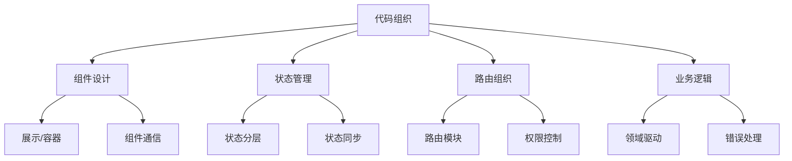

# 代码组织策略

## 组件设计策略

### 展示型与容器型组件

```vue:c:\project\kphub\src\components\display\UserCard.vue
<!-- 展示型组件 -->
<template>
  <div class="user-card">
    
    <h3>{{ name }}</h3>
    <p>{{ role }}</p>
  </div>
</template>

<script setup lang="ts">
defineProps<{
  avatar: string
  name: string
  role: string
}>()
</script>
```

```vue:c:\project\kphub\src\components\container\UserList.vue
<!-- 容器型组件 -->
<template>
  <div class="user-list">
    <user-card
      v-for="user in users"
      :key="user.id"
      v-bind="user"
      @click="handleUserSelect(user)"
    />
  </div>
</template>

<script setup lang="ts">
import { ref, onMounted } from 'vue'
import { useUsers } from '@/composables/useUsers'
import UserCard from '../display/UserCard.vue'

const { users, fetchUsers, selectUser } = useUsers()

onMounted(fetchUsers)

function handleUserSelect(user) {
  selectUser(user)
}
</script>
```

### 组件通信策略

```typescript:c:\project\kphub\src\composables\useComponentCommunication.ts
import { provide, inject } from 'vue'

// 组件通信上下文
export const userKey = Symbol('user')
export const themeKey = Symbol('theme')

export function useProvideUser(user) {
  provide(userKey, user)
}

export function useInjectUser() {
  return inject(userKey)
}

// 事件总线
export function createEventBus() {
  const listeners = new Map()

  return {
    on(event, callback) {
      if (!listeners.has(event)) {
        listeners.set(event, new Set())
      }
      listeners.get(event).add(callback)
    },
    emit(event, data) {
      if (listeners.has(event)) {
        listeners.get(event).forEach(callback => callback(data))
      }
    }
  }
}
```

## 状态管理策略

### 状态分层设计

```typescript:c:\project\kphub\src\stores\modules\user.ts
import { defineStore } from 'pinia'

export const useUserStore = defineStore('user', {
  state: () => ({
    profile: null,
    preferences: null,
    permissions: []
  }),
  
  actions: {
    // 本地状态操作
    updateProfile(profile) {
      this.profile = profile
    },
    
    // 持久化状态
    async savePreferences(preferences) {
      this.preferences = preferences
      await localStorage.setItem('preferences', JSON.stringify(preferences))
    },
    
    // 服务端状态同步
    async syncPermissions() {
      const response = await fetch('/api/permissions')
      this.permissions = await response.json()
    }
  },
  
  getters: {
    isAdmin: state => state.permissions.includes('admin')
  }
})
```

## 路由组织策略

### 模块化路由配置

```typescript:c:\project\kphub\src\router\index.ts
import { createRouter, createWebHistory } from 'vue-router'
import type { RouteRecordRaw } from 'vue-router'

// 路由模块
const routes: RouteRecordRaw[] = [
  {
    path: '/',
    component: () => import('@/layouts/DefaultLayout.vue'),
    children: [
      {
        path: '',
        name: 'home',
        component: () => import('@/views/Home.vue'),
        meta: {
          title: '首页',
          auth: false
        }
      }
    ]
  },
  {
    path: '/dashboard',
    component: () => import('@/layouts/DashboardLayout.vue'),
    meta: { auth: true },
    children: [
      {
        path: '',
        name: 'dashboard',
        component: () => import('@/views/Dashboard.vue'),
        meta: {
          title: '仪表盘',
          permissions: ['admin']
        }
      }
    ]
  }
]

// 路由守卫
router.beforeEach(async (to, from, next) => {
  // 权限检查
  if (to.meta.auth && !isAuthenticated()) {
    next('/login')
    return
  }
  
  // 权限控制
  if (to.meta.permissions) {
    const hasPermission = await checkPermissions(to.meta.permissions)
    if (!hasPermission) {
      next('/403')
      return
    }
  }
  
  next()
})
```

## 业务逻辑组织

### 领域驱动设计

```typescript:c:\project\kphub\src\domain\user\UserService.ts
import { User } from './User'
import { UserRepository } from './UserRepository'
import { UserValidator } from './UserValidator'

export class UserService {
  private repository: UserRepository
  private validator: UserValidator

  constructor() {
    this.repository = new UserRepository()
    this.validator = new UserValidator()
  }

  async createUser(userData: Partial<User>): Promise<User> {
    // 验证
    this.validator.validate(userData)
    
    // 业务规则
    const user = new User(userData)
    user.setDefaultRole()
    
    // 持久化
    return this.repository.save(user)
  }

  async updateUser(id: string, changes: Partial<User>): Promise<User> {
    // 错误处理
    try {
      const user = await this.repository.findById(id)
      if (!user) {
        throw new Error('User not found')
      }
      
      Object.assign(user, changes)
      return this.repository.save(user)
    } catch (error) {
      // 错误日志
      logger.error('Failed to update user', {
        userId: id,
        error: error.message
      })
      throw error
    }
  }
}
```

代码组织策略包括：

1. 组件设计：
   - 展示/容器分离
   - 粒度控制
   - 通信策略
   - 复用模式

2. 状态管理：
   - 状态分层
   - 持久化
   - 状态同步
   - 状态测试

3. 路由组织：
   - 模块化
   - 懒加载
   - 权限控制
   - 路由元数据

4. 业务逻辑：
   - 领域驱动
   - 逻辑分层
   - API封装
   - 错误处理



使用建议：

1. 基础使用：
   - 组件拆分
   - 状态管理
   - 路由配置
   - 业务封装

2. 进阶技巧：
   - 性能优化
   - 代码复用
   - 错误处理
   - 测试策略

3. 最佳实践：
   - 代码组织
   - 团队协作
   - 可维护性
   - 可扩展性

通过合理的代码组织策略，我们可以构建出易于维护和扩展的Vue3应用。