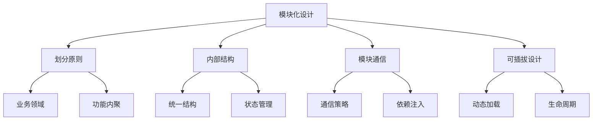

# 模块化设计

## 模块划分原则

### 业务领域划分

```typescript:c:\project\kphub\src\modules\user\index.ts
// 用户模块入口
export interface UserModule {
  name: 'user'
  components: Record<string, Component>
  store: typeof userStore
  routes: RouteRecordRaw[]
}

// 模块注册
export function install(app: App) {
  // 注册组件
  Object.entries(components).forEach(([name, component]) => {
    app.component(name, component)
  })
  
  // 注册状态
  app.use(userStore)
  
  // 注册路由
  router.addRoute(routes)
}
```

### 功能内聚示例

```typescript:c:\project\kphub\src\modules\order\OrderModule.ts
// 订单模块内聚设计
export class OrderModule {
  private api: OrderAPI
  private store: OrderStore
  private service: OrderService
  
  constructor() {
    // 初始化模块依赖
    this.api = new OrderAPI()
    this.store = new OrderStore()
    this.service = new OrderService(this.api)
  }
  
  // 模块公共接口
  async createOrder(data: OrderData): Promise<Order> {
    const order = await this.service.create(data)
    await this.store.addOrder(order)
    return order
  }
  
  // 模块内部方法
  private async validateOrder(data: OrderData) {
    // 订单验证逻辑
  }
}
```

## 模块内部结构

### 标准模块结构

```plaintext:c:\project\kphub\src\modules\product
product/
├── components/          # 模块组件
│   ├── ProductList.vue
│   └── ProductDetail.vue
├── composables/         # 组合式函数
│   ├── useProduct.ts
│   └── useCategory.ts
├── store/              # 状态管理
│   ├── index.ts
│   └── types.ts
├── api/                # API封装
│   ├── product.ts
│   └── category.ts
├── utils/              # 工具函数
│   └── formatter.ts
├── types/              # 类型定义
│   └── index.ts
└── index.ts            # 模块入口
```

### 模块状态管理

```typescript:c:\project\kphub\src\modules\product\store\index.ts
import { defineStore } from 'pinia'
import type { Product, Category } from '../types'

export const useProductStore = defineStore('product', {
  state: () => ({
    products: [] as Product[],
    categories: [] as Category[],
    currentProduct: null as Product | null
  }),
  
  actions: {
    // 内部状态管理
    setProducts(products: Product[]) {
      this.products = products
    },
    
    // 对外暴露的方法
    async loadProducts() {
      const products = await api.getProducts()
      this.setProducts(products)
    }
  },
  
  getters: {
    productsByCategory: (state) => (categoryId: string) => {
      return state.products.filter(p => p.categoryId === categoryId)
    }
  }
})
```

## 模块间通信

### 通信策略实现

```typescript:c:\project\kphub\src\core\communication\index.ts
import { inject, provide } from 'vue'
import type { InjectionKey } from 'vue'

// 依赖注入
export const createModuleToken = <T>(key: string): InjectionKey<T> => {
  return Symbol(key) as InjectionKey<T>
}

// 事件总线
export class EventBus {
  private events = new Map<string, Set<Function>>()
  
  on(event: string, callback: Function) {
    if (!this.events.has(event)) {
      this.events.set(event, new Set())
    }
    this.events.get(event)!.add(callback)
  }
  
  emit(event: string, data?: any) {
    const callbacks = this.events.get(event)
    if (callbacks) {
      callbacks.forEach(callback => callback(data))
    }
  }
}

// 模块API封装
export class ModuleAPI {
  private modules = new Map<string, any>()
  
  register(name: string, api: any) {
    this.modules.set(name, api)
  }
  
  get(name: string) {
    return this.modules.get(name)
  }
}
```

## 可插拔模块设计

### 动态模块加载

```typescript:c:\project\kphub\src\core\module-loader\index.ts
import type { App } from 'vue'
import type { Module, ModuleConfig } from './types'

export class ModuleLoader {
  private app: App
  private modules = new Map<string, Module>()
  
  constructor(app: App) {
    this.app = app
  }
  
  // 注册模块
  async register(config: ModuleConfig) {
    const module = await this.loadModule(config)
    this.modules.set(config.name, module)
    
    // 初始化模块
    await module.install?.(this.app)
  }
  
  // 动态加载模块
  private async loadModule(config: ModuleConfig): Promise<Module> {
    const module = await import(`@/modules/${config.name}`)
    return module.default || module
  }
  
  // 获取模块实例
  getModule(name: string) {
    return this.modules.get(name)
  }
  
  // 模块生命周期
  async initializeModules() {
    for (const module of this.modules.values()) {
      await module.initialize?.()
    }
  }
  
  async destroyModules() {
    for (const module of this.modules.values()) {
      await module.destroy?.()
    }
  }
}
```

模块化设计包括：

1. 划分原则：
   - 业务领域
   - 功能内聚
   - 低耦合
   - 边界定义

2. 内部结构：
   - 统一结构
   - 组件组织
   - 状态管理
   - API封装

3. 模块通信：
   - 状态通信
   - 事件总线
   - 依赖注入
   - API设计

4. 可插拔设计：
   - 动态加载
   - 注册机制
   - 生命周期
   - 扩展设计



使用建议：

1. 基础使用：
   - 遵循原则
   - 统一结构
   - 清晰接口
   - 合理通信

2. 进阶技巧：
   - 动态加载
   - 扩展设计
   - 性能优化
   - 测试策略

3. 最佳实践：
   - 代码组织
   - 团队协作
   - 可维护性
   - 可扩展性

通过合理的模块化设计，我们可以构建出易于维护和扩展的Vue3应用。