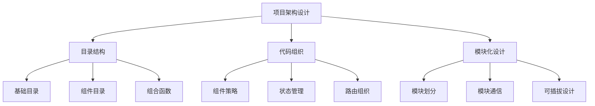

# 项目架构设计

## 目录结构与组织
- [基于组合式API的目录结构](./9.1.1-基于组合式API的目录结构.md)：掌握Vue3项目的标准目录结构
  - 基础目录布局
  - 组件目录组织
  - 组合式函数目录
  - 大型项目扩展结构

## 代码组织与策略
- [代码组织策略](./9.1.2-代码组织策略.md)：学习代码组织的最佳实践
  - 组件设计策略
  - 状态管理策略
  - 路由组织策略
  - 业务逻辑组织

## 模块化设计
- [模块化设计](./9.1.3-模块化设计.md)：深入理解模块化架构
  - 模块划分原则
  - 模块内部结构
  - 模块间通信
  - 可插拔模块设计

架构设计要点：

1. 目录结构：
   - 清晰的层次划分
   - 功能模块分组
   - 资源统一管理
   - 扩展性考虑

2. 代码组织：
   - 组件设计原则
   - 状态管理策略
   - 路由组织方法
   - 业务逻辑封装

3. 模块化设计：
   - 模块划分原则
   - 内部结构规范
   - 通信机制设计
   - 扩展性支持

学习路径建议：

1. 基础入门：
   - 了解目录结构
   - 掌握基本原则
   - 实践简单项目
   - 理解核心概念

2. 进阶学习：
   - 深入组件设计
   - 状态管理实践
   - 模块化开发
   - 性能优化

3. 高级应用：
   - 架构设计模式
   - 可扩展性设计
   - 性能优化策略
   - 工程化实践

使用场景：

1. 项目初期：
   - 架构规划
   - 技术选型
   - 目录设计
   - 规范制定

2. 开发阶段：
   - 代码组织
   - 模块划分
   - 组件设计
   - 状态管理

3. 项目扩展：
   - 架构升级
   - 性能优化
   - 模块重构
   - 维护优化

通过系统学习项目架构设计，您将能够：
- 构建清晰的项目结构
- 实现高效的代码组织
- 设计可扩展的模块
- 提升项目可维护性

每个章节都提供了详细的示例和最佳实践，建议按照学习路径循序渐进，结合实际项目进行练习。通过合理的架构设计，我们可以构建出更加健壮和可维护的Vue3应用。