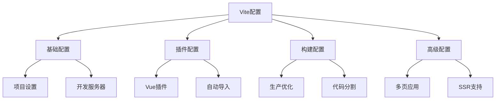

# Vite配置最佳实践

## 基础配置

### 项目基础配置

```typescript:c:\project\kphub\vite.config.ts
import { defineConfig } from 'vite'
import vue from '@vitejs/plugin-vue'
import path from 'path'

export default defineConfig({
  // 项目根目录配置
  root: process.cwd(),
  base: '/',
  
  // 开发服务器设置
  server: {
    host: '0.0.0.0',
    port: 3000,
    open: true,
    cors: true,
    proxy: {
      '/api': {
        target: 'http://localhost:8080',
        changeOrigin: true,
        rewrite: (path) => path.replace(/^\/api/, '')
      }
    }
  },
  
  // 路径别名
  resolve: {
    alias: {
      '@': path.resolve(__dirname, 'src'),
      '@components': path.resolve(__dirname, 'src/components'),
      '@assets': path.resolve(__dirname, 'src/assets')
    }
  }
})
```

### 环境变量配置

```plaintext:c:\project\kphub\.env
VITE_APP_TITLE=KnowledgeHub
VITE_API_BASE_URL=http://localhost:8080
VITE_APP_ENV=development
```

```plaintext:c:\project\kphub\.env.production
VITE_APP_TITLE=KnowledgeHub
VITE_API_BASE_URL=https://api.example.com
VITE_APP_ENV=production
```

## 插件配置

### 核心插件设置

```typescript:c:\project\kphub\vite.config.ts
import vue from '@vitejs/plugin-vue'
import vueJsx from '@vitejs/plugin-vue-jsx'
import AutoImport from 'unplugin-auto-import/vite'
import Components from 'unplugin-vue-components/vite'
import { ElementPlusResolver } from 'unplugin-vue-components/resolvers'

export default defineConfig({
  plugins: [
    vue(),
    vueJsx(),
    
    // 自动导入API
    AutoImport({
      imports: ['vue', 'vue-router', 'pinia'],
      dts: 'src/auto-imports.d.ts',
      resolvers: [ElementPlusResolver()]
    }),
    
    // 自动导入组件
    Components({
      dirs: ['src/components'],
      extensions: ['vue'],
      dts: 'src/components.d.ts',
      resolvers: [ElementPlusResolver()]
    })
  ]
})
```

### ESLint与Prettier配置

```javascript:c:\project\kphub\.eslintrc.js
module.exports = {
  root: true,
  env: {
    node: true,
    browser: true
  },
  extends: [
    'plugin:vue/vue3-recommended',
    'eslint:recommended',
    '@vue/typescript/recommended',
    '@vue/prettier'
  ],
  parserOptions: {
    ecmaVersion: 2020
  },
  rules: {
    'no-console': process.env.NODE_ENV === 'production' ? 'warn' : 'off',
    'no-debugger': process.env.NODE_ENV === 'production' ? 'warn' : 'off'
  }
}
```

## 构建配置

### 生产环境优化

```typescript:c:\project\kphub\vite.config.ts
export default defineConfig({
  build: {
    // 构建目标配置
    target: 'es2015',
    
    // 代码分割策略
    rollupOptions: {
      output: {
        manualChunks: {
          'vendor': ['vue', 'vue-router', 'pinia'],
          'ui': ['element-plus'],
        }
      }
    },
    
    // 资源处理
    assetsDir: 'assets',
    assetsInlineLimit: 4096,
    
    // CSS代码分割
    cssCodeSplit: true,
    
    // 预构建配置
    commonjsOptions: {
      include: [/node_modules/]
    },
    
    // 压缩配置
    minify: 'terser',
    terserOptions: {
      compress: {
        drop_console: true,
        drop_debugger: true
      }
    }
  }
})
```

## 高级配置

### 多页应用配置

```typescript:c:\project\kphub\vite.config.ts
export default defineConfig({
  build: {
    rollupOptions: {
      input: {
        main: path.resolve(__dirname, 'index.html'),
        admin: path.resolve(__dirname, 'admin.html')
      }
    }
  }
})
```

### SSR配置

```typescript:c:\project\kphub\vite.config.ts
export default defineConfig({
  ssr: {
    // SSR配置
    noExternal: ['element-plus'],
    
    // 外部化依赖
    external: ['lodash'],
    
    // 优化依赖
    optimizeDeps: {
      include: ['vue', 'vue-router']
    }
  }
})
```

### 自定义插件

```typescript:c:\project\kphub\plugins\vite-plugin-custom.ts
import type { Plugin } from 'vite'

export default function customPlugin(): Plugin {
  return {
    name: 'vite-plugin-custom',
    
    configureServer(server) {
      // 开发服务器钩子
    },
    
    transform(code, id) {
      // 代码转换
      return code
    },
    
    generateBundle(options, bundle) {
      // 打包钩子
    }
  }
}
```

Vite配置系统包括：

1. 基础配置：
   - 项目设置
   - 开发服务器
   - 环境变量
   - 路径别名

2. 插件配置：
   - Vue插件
   - 自动导入
   - 代码规范
   - 类型支持

3. 构建配置：
   - 生产优化
   - 代码分割
   - 资源处理
   - 兼容性

4. 高级配置：
   - 多页应用
   - SSR支持
   - 自定义插件
   - 测试环境



使用建议：

1. 基础使用：
   - 项目配置
   - 开发环境
   - 路径管理
   - 环境变量

2. 进阶技巧：
   - 插件使用
   - 构建优化
   - 代码分割
   - 资源处理

3. 最佳实践：
   - 性能优化
   - 代码组织
   - 开发体验
   - 部署策略

通过合理的Vite配置，我们可以构建出高性能、易维护的Vue3应用。