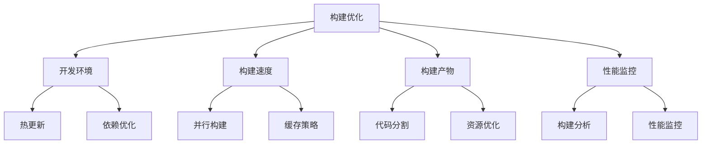

# 构建优化策略

## 开发环境优化

### 热更新与依赖优化

```typescript:c:\project\kphub\vite.config.ts
import { defineConfig } from 'vite'
import vue from '@vitejs/plugin-vue'

export default defineConfig({
  // 开发服务器配置
  server: {
    hmr: {
      // 热更新优化
      overlay: false,
      clientPort: 3000,
      timeout: 5000
    },
    
    // 开发服务器性能
    watch: {
      usePolling: false,
      interval: 100
    },
    
    // 源码映射
    sourcemap: 'cheap-module-source-map'
  },
  
  // 依赖优化
  optimizeDeps: {
    // 预构建包含
    include: [
      'vue',
      'vue-router',
      'pinia',
      'axios',
      'lodash-es'
    ],
    // 强制预构建
    force: false,
    // 预构建缓存
    cacheDir: 'node_modules/.vite'
  }
})
```

## 构建速度优化

### 并行构建与缓存

```typescript:c:\project\kphub\vite.config.ts
export default defineConfig({
  build: {
    // 并行构建
    minify: 'esbuild',
    target: 'es2015',
    
    // 构建缓存
    cache: {
      dir: 'node_modules/.vite/cache'
    },
    
    // ESBuild优化
    esbuild: {
      jsxFactory: 'h',
      jsxFragment: 'Fragment',
      target: 'es2015',
      minify: true,
      treeShaking: true
    }
  }
})
```

### CI/CD优化配置

```yaml:c:\project\kphub\.github\workflows\build.yml
name: Build and Deploy

on:
  push:
    branches: [ main ]

jobs:
  build:
    runs-on: ubuntu-latest
    
    steps:
    - uses: actions/checkout@v2
    
    - name: Setup Node.js
      uses: actions/setup-node@v2
      with:
        node-version: '16'
        cache: 'npm'
    
    - name: Install Dependencies
      run: npm ci
    
    - name: Build
      run: npm run build
      env:
        NODE_ENV: production
        
    - name: Cache Build
      uses: actions/cache@v2
      with:
        path: |
          dist
          node_modules/.vite
        key: ${{ runner.os }}-build-${{ hashFiles('**/package-lock.json') }}
```

## 构建产物优化

### 代码分割与懒加载

```typescript:c:\project\kphub\vite.config.ts
export default defineConfig({
  build: {
    // 代码分割
    rollupOptions: {
      output: {
        manualChunks: {
          'vendor': ['vue', 'vue-router', 'pinia'],
          'ui': ['element-plus'],
          'utils': ['lodash-es', 'axios']
        }
      }
    },
    
    // 资源优化
    assetsInlineLimit: 4096,
    chunkSizeWarningLimit: 500,
    cssCodeSplit: true,
    
    // 压缩配置
    minify: 'terser',
    terserOptions: {
      compress: {
        drop_console: true,
        drop_debugger: true
      }
    }
  }
})
```

### 资源优化配置

```typescript:c:\project\kphub\vite.config.ts
import imagemin from 'vite-plugin-imagemin'

export default defineConfig({
  plugins: [
    // 图片优化
    imagemin({
      gifsicle: {
        optimizationLevel: 7,
        interlaced: false
      },
      optipng: {
        optimizationLevel: 7
      },
      mozjpeg: {
        quality: 80
      },
      pngquant: {
        quality: [0.8, 0.9],
        speed: 4
      },
      svgo: {
        plugins: [
          {
            name: 'removeViewBox'
          }
        ]
      }
    })
  ],
  
  // CSS优化
  css: {
    postcss: {
      plugins: [
        require('autoprefixer'),
        require('cssnano')
      ]
    },
    preprocessorOptions: {
      scss: {
        additionalData: `@import "@/styles/variables.scss";`
      }
    }
  }
})
```

## 性能监控与分析

### 性能分析工具

```typescript:c:\project\kphub\scripts\analyze.ts
import { analyze } from 'rollup-plugin-analyzer'
import { visualizer } from 'rollup-plugin-visualizer'

export default defineConfig({
  plugins: [
    // 包大小分析
    analyze({
      summaryOnly: true,
      limit: 10
    }),
    
    // 可视化分析
    visualizer({
      filename: 'stats.html',
      open: true,
      gzipSize: true
    })
  ],
  
  build: {
    // 性能预算
    chunkSizeWarningLimit: 500,
    
    // 性能报告
    reportCompressedSize: true,
    sourcemap: true
  }
})
```

构建优化策略包括：

1. 开发环境：
   - 热更新优化
   - 依赖预构建
   - 服务器配置
   - 内存优化

2. 构建速度：
   - 并行构建
   - 缓存策略
   - ESBuild优化
   - CI/CD配置

3. 构建产物：
   - 代码分割
   - 资源优化
   - 压缩策略
   - 懒加载

4. 性能监控：
   - 构建分析
   - 包大小监控
   - 性能预算
   - 持续优化



使用建议：

1. 基础优化：
   - 开发环境配置
   - 构建速度提升
   - 基本资源优化
   - 简单监控分析

2. 进阶优化：
   - 深度依赖优化
   - 高级构建配置
   - 复杂分割策略
   - 完整监控体系

3. 最佳实践：
   - 性能基准设定
   - 持续优化流程
   - 监控报警机制
   - 团队协作规范

通过合理的构建优化策略，我们可以显著提升Vue3应用的开发体验和生产性能。