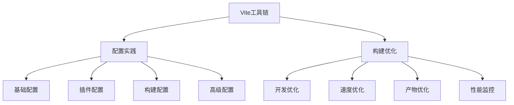

# Vite开发工具链

## Vite配置实践
- [Vite配置最佳实践](./9.2.1-Vite配置最佳实践.md)：掌握Vite的核心配置方法
  - 基础配置：项目配置、开发服务器、环境变量
  - 插件配置：Vue插件、TypeScript、ESLint集成
  - 构建配置：生产环境优化、代码分割
  - 高级配置：多页应用、SSR、PWA支持

## 构建优化方案
- [构建优化策略](./9.2.2-构建优化策略.md)：学习Vite构建优化技巧
  - 开发环境优化：热更新、依赖预构建
  - 构建速度优化：并行构建、缓存策略
  - 构建产物优化：代码分割、资源压缩
  - 性能监控分析：构建分析、持续优化

主要特点：

1. 配置实践：
   - 项目配置管理
   - 开发环境设置
   - 插件系统集成
   - 高级特性支持

2. 构建优化：
   - 开发体验提升
   - 构建效率优化
   - 产物质量改进
   - 性能监控体系

学习路径建议：

1. 基础入门：
   - 了解Vite特性
   - 掌握基本配置
   - 环境变量使用
   - 插件系统认知

2. 进阶学习：
   - 深入配置实践
   - 构建流程优化
   - 性能监控方案
   - 工程化实践

3. 高级应用：
   - 自定义插件开发
   - 构建策略优化
   - 性能优化方案
   - 工具链扩展

使用场景：

1. 开发阶段：
   - 环境配置
   - 开发体验
   - 调试效率
   - 热更新优化

2. 构建阶段：
   - 构建速度
   - 产物优化
   - 资源处理
   - 部署准备

3. 持续优化：
   - 性能监控
   - 问题诊断
   - 优化策略
   - 工具升级

通过系统学习Vite开发工具链，您将能够：
- 配置高效开发环境
- 优化构建流程
- 提升应用性能
- 改善开发体验

每个章节都提供了详细的示例和最佳实践，建议按照学习路径循序渐进，结合实际项目进行练习。通过合理运用Vite工具链，我们可以构建出更加高效和可维护的Vue3应用。