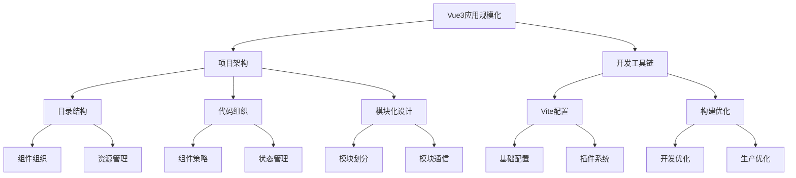

# Vue3应用规模化

## 项目架构设计
- [项目架构设计](./9.1-项目架构设计/)：掌握大型Vue3应用的架构设计方法
  - [基于组合式API的目录结构](./9.1-项目架构设计/9.1.1-基于组合式API的目录结构.md)：学习现代化的项目目录组织
  - [代码组织策略](./9.1-项目架构设计/9.1.2-代码组织策略.md)：了解代码组织的最佳实践
  - [模块化设计](./9.1-项目架构设计/9.1.3-模块化设计.md)：深入模块化架构设计方法

## 开发工具链
- [Vite开发工具链](./9.2-Vite开发工具链/)：构建高效的开发和构建环境
  - [Vite配置最佳实践](./9.2-Vite开发工具链/9.2.1-Vite配置最佳实践.md)：掌握Vite的核心配置方法
  - [构建优化策略](./9.2-Vite开发工具链/9.2.2-构建优化策略.md)：学习构建过程的优化技巧

主要特点：

1. 架构设计：
   - 目录结构规范
   - 代码组织方法
   - 模块化架构
   - 扩展性设计

2. 工具链配置：
   - 开发环境优化
   - 构建流程管理
   - 性能优化策略
   - 工程化实践

学习路径建议：

1. 基础入门：
   - 了解项目结构
   - 掌握基本配置
   - 熟悉开发工具
   - 理解核心概念

2. 进阶学习：
   - 深入架构设计
   - 优化开发体验
   - 提升构建效率
   - 实践最佳方案

3. 高级应用：
   - 定制化架构
   - 性能优化
   - 工具链扩展
   - 持续集成

应用场景：

1. 项目启动：
   - 架构设计
   - 技术选型
   - 规范制定
   - 工具配置

2. 开发阶段：
   - 代码组织
   - 模块开发
   - 团队协作
   - 质量控制

3. 项目维护：
   - 性能优化
   - 架构升级
   - 工具更新
   - 持续改进

通过系统学习Vue3应用规模化，您将能够：
- 设计可扩展的架构
- 组织高质量代码
- 配置高效开发环境
- 优化应用性能

每个章节都提供了详细的示例和最佳实践，建议按照学习路径循序渐进，结合实际项目进行练习。通过合理运用这些知识，我们可以构建出更加健壮和可维护的Vue3企业级应用。