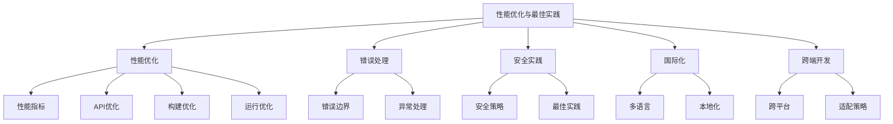

# Vue3性能优化与最佳实践

## 性能优化
- [性能优化](./10.1-性能优化/)：全面的Vue3应用性能优化指南
  - [性能指标与监控](./10.1-性能优化/10.1.1-性能指标与监控.md)：了解关键性能指标和监控方法
  - [组合式API性能优化](./10.1-性能优化/10.1.2-组合式API性能优化.md)：优化组合式API的使用
  - [构建层面优化](./10.1-性能优化/10.1.3-构建层面优化.md)：从构建角度提升性能
  - [运行时优化](./10.1-性能优化/10.1.4-运行时优化.md)：优化应用运行时性能

## 错误处理与安全
- [错误处理](./10.2-错误处理/)：Vue3应用的错误处理机制
  - [错误边界](./10.2-错误处理/10.2.1-错误边界.md)：优雅处理组件错误
- [安全实践](./10.3-安全实践/)：Vue3应用安全最佳实践
  - [安全最佳实践](./10.3-安全实践/10.3.1-安全最佳实践.md)：保护应用安全

## 国际化与跨端
- [国际化方案](./10.4-国际化方案/)：Vue3应用国际化解决方案
  - [Vue3国际化实现](./10.4-国际化方案/10.4.1-Vue3国际化实现.md)：实现多语言支持
- [跨端开发实践](./10.5-跨端开发实践/)：Vue3跨端开发指南
  - [跨端解决方案](./10.5-跨端开发实践/10.5.1-跨端解决方案.md)：跨平台开发策略

主要特点：

1. 性能优化：
   - 性能指标监控
   - API使用优化
   - 构建过程优化
   - 运行时优化

2. 错误处理：
   - 错误边界设计
   - 异常捕获处理
   - 错误恢复机制
   - 调试与诊断

3. 安全实践：
   - XSS防护
   - CSRF防护
   - 数据验证
   - 安全配置

4. 国际化：
   - 多语言支持
   - 本地化处理
   - 动态语言切换
   - 时区处理

5. 跨端开发：
   - 响应式设计
   - 平台适配
   - 性能优化
   - 体验统一

学习路径建议：

1. 基础优化：
   - 掌握性能指标
   - 了解基本优化
   - 错误处理机制
   - 安全基础知识

2. 进阶实践：
   - 深入性能优化
   - 完善错误处理
   - 加强安全防护
   - 国际化实现

3. 高级应用：
   - 自动化优化
   - 监控告警
   - 跨端适配
   - 持续改进

应用场景：

1. 性能提升：
   - 首屏加载优化
   - 运行时优化
   - 资源加载优化
   - 交互响应优化

2. 质量保障：
   - 错误监控
   - 异常处理
   - 安全防护
   - 用户体验

3. 业务拓展：
   - 多语言市场
   - 跨平台部署
   - 性能优化
   - 体验统一

通过系统学习Vue3性能优化与最佳实践，您将能够：
- 构建高性能应用
- 保障应用质量
- 提升用户体验
- 支持业务拓展

每个章节都提供了详细的示例和实践指南，建议按照学习路径循序渐进，结合实际项目进行练习。通过合理应用这些知识，我们可以构建出更加高效、安全、可靠的Vue3应用。